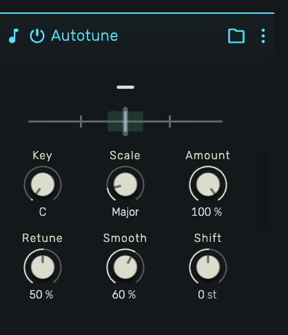
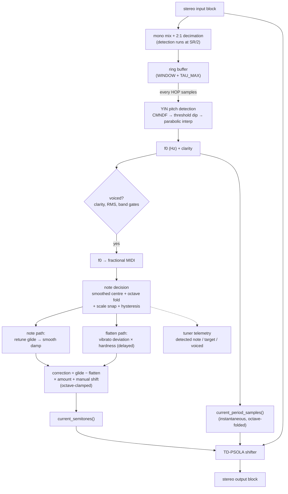

# Autotune — Concept, Technical Reference & openDAW Implementation Guide

The **Autotune** audio-effect device performs real-time, monophonic **pitch
correction**: it listens to a sung (or played) monophonic signal, works out what
note is being sung, decides what note it *should* be given a musical key and
scale, and re-pitches the audio onto that note — continuously, at low latency,
inside the live insert chain.

This document explains the whole thing end to end: the concept, every DSP stage
and why it is built the way it is, the parameters, and a step-by-step recipe for
how such a device is wired into openDAW's Rust→WASM engine architecture.



## Feature set

- **Real-time monophonic pitch correction** as a stock audio-effect insert —
  YIN pitch detection driving a TD-PSOLA pitch shifter (no doppler/"tape speed"
  artefact; duration and formants preserved).
- **Key & scale snapping** — root pitch class (C…B) × 8 scales (Chromatic, Major,
  Minor, Major/Minor Pentatonic, Blues, Dorian, Mixolydian).
- **Amount** — square-law-tapered correction depth for fine control in the light
  correction range where an in-tune voice actually sits.
- **Retune** — one knob sweeping natural → hard-tune: sets both the note-glide
  speed (500 ms → 2 ms) and the vibrato-flatten depth (the robotic "T-Pain"
  character at the top end).
- **Smooth** — damps the correction ratio for steady, S-curved note transitions
  without touching the sung vibrato.
- **Shift** — manual transpose (−12…+12 st) composed after the snap.
- **Live tuner strip** — detected note, target note, and a cents needle streamed
  from the audio thread via the broadcast telemetry path (same mechanism as the
  peak meters).
- **Rust DSP** — the detector, correction core, and PSOLA shifter are
  `no_std`, zero-allocation Rust compiled to WASM; no TypeScript audio path.
- **Stability guards proven on real vocals** — octave fold, note-decision
  hysteresis (diatonic scales; chromatic always snaps the nearest semitone),
  voicing debounce/hangover, and a bounded vibrato-flatten path; detection
  accuracy verified at ≈98.6 % agreement (<50 cents) against CREPE (neural)
  ground truth on recorded vocals.

> **Scope.** This is the single-shifter Autotune that ships today: **YIN**
> detection driving a **TD-PSOLA** pitch shifter. An earlier experimental second
> device ("Autotune 2", phase-vocoder shifter) has been removed; only the PSOLA
> path remains.

---

## 1. The concept

Pitch correction is four cooperating problems, solved in a strict pipeline:

```
  audio in ──► 1. DETECT ──► 2. DECIDE ──► 3. GLIDE ──► 4. SHIFT ──► audio out
              (what pitch    (what note   (how fast &   (re-pitch the
               is this?)      should it    how hard to   waveform by the
                              snap to?)     move there)   chosen amount)
```

1. **Detect** the fundamental frequency of the incoming voice.
2. **Decide** the target note by snapping the detected pitch to the nearest
   allowed note of a key/scale — while *stabilising* that decision so vibrato and
   detector noise don't make the target flicker.
3. **Glide** the correction toward the target with musically controllable
   dynamics (how quickly it retunes, how hard it flattens vibrato, how steady it
   holds).
4. **Shift** the actual audio by the resulting semitone offset, using a shifter
   that changes pitch *without* changing duration or formants and *without* the
   "tape speed" doppler artefact.

A crucial architectural point: **stages 1–3 produce a control signal only.** They
compute *how many semitones* to move the pitch and *what period* the input is at.
They never touch the audio samples. Stage 4 is the only stage that reads and
writes audio. This separation keeps the control math exact and portable, and lets
the shifter be swapped or tuned independently.

The whole core is **zero-allocation** — all state lives in fixed-size arrays sized
for the 44.1/48 kHz design point — because it runs on the real-time audio thread
where heap allocation is forbidden.

---

## 2. Signal flow



Per audio block the device does exactly this (see the device crate's
`process_audio`):

```
core.feed(in_left, in_right)                       // stage 1–3: update the control core
psola.set_period(core.current_period_samples())    // hand the shifter the input period
psola.set_ratio_semitones(core.current_semitones())// ...and the correction ratio
psola.process(in → out)                            // stage 4: re-pitch the audio
broadcast(detected_midi, target_note, voiced)      // UI tuner telemetry
```

---

## 3. Engine architecture & determinism

All DSP runs in openDAW's **Rust → WebAssembly engine** — there is no TypeScript
audio path:

| Layer | Language | Files |
| --- | --- | --- |
| DSP (control core + shifter) | Rust (`no_std`, zero-allocation) | `crates/dsp/src/autotune.rs`, `crates/dsp/src/psola.rs` |
| Device (params, telemetry, block wiring) | Rust → WASM side-module | `crates/stock-devices/device-autotune/` |
| Parameter layer (UI/automation) | TypeScript adapter | `packages/studio/adapters/src/devices/audio-effects/AutotuneDeviceBoxAdapter.ts` |

Two determinism guarantees are load-bearing:

- **Every decision** — which note to snap to, when to engage, the octave fold — is
  computed in **f64 with pinned rounding points** and deterministic tie-breaks, so
  the note sequence for a given input is reproducible. This is guarded by the
  `golden_decision_sequence` fixture test in `autotune.rs`.
- **Parameter mapping parity** — the value the WASM device stores for a unit
  automation value must match the TS adapter's `valueMapping` for the same field.
  This is guarded per-device by `packages/app/wasm/test/param-mapping-parity.test.ts`,
  which includes an `autotune` case.

---

## 4. Stage 1 — Pitch detection (YIN)

The detector answers *"what is the fundamental frequency right now?"* using the
**YIN** algorithm (de Cheveigné & Kawahara, 2002), a robust autocorrelation-family
method well suited to monophonic voice.

### 4.1 Front-end: mono + decimation + ring buffer

- The stereo block is summed to **mono** and **decimated 2:1** (box-average of
  sample pairs), so detection runs at `detect_rate = sample_rate / 2` (24 kHz at
  48 kHz). Pitch lives well below 1.1 kHz, so half-rate is lossless for this
  purpose and **halves the cost** of the O(WINDOW × TAU) autocorrelation.
- Decimated samples flow into a ring buffer of `WINDOW + TAU_MAX` samples. A new
  **detection frame** runs every `HOP` decimated samples.

Key constants (`crates/dsp/src/autotune.rs`):

| Constant | Value | Meaning |
| --- | --- | --- |
| `DECIMATION` | 2 | detection at SR/2 |
| `WINDOW` | 640 | YIN analysis window (decimated samples) |
| `TAU_MAX` | 300 | max lag → f0 floor = 24000/300 = **80 Hz** |
| `HOP` | 128 | decimated samples per frame (~5.3 ms at 48 kHz) |
| `F0_MIN_HZ` / `F0_MAX_HZ` | 80 / 1100 | accepted pitch band |

The window and hop are kept **deliberately small**. Because correction is
feed-forward (§1), any lag between the true pitch and the detected pitch leaves a
residual wobble that no downstream smoothing can cancel. 640 gives ~13 ms centre
latency (vs ~21 ms at 1024) and still spans ~2 periods at the 80 Hz floor.

### 4.2 The YIN difference function

For each candidate lag `τ`, YIN computes the squared difference of the signal
against itself shifted by `τ`:

```
d(τ) = Σ_{i=0..WINDOW} ( x[i] − x[i+τ] )²
```

then the **cumulative mean normalised difference function** (CMNDF), which is the
step that makes YIN robust — it flattens the `τ=0` trivial minimum and normalises
away amplitude:

```
d'(τ) = d(τ) · τ / Σ_{j=1..τ} d(j)          with  d'(0) = 1
```

This is stored in `self.dprime[0..=TAU_MAX]`.

### 4.3 Picking the period

- Scan from `tau_min` (the lag for `F0_MAX_HZ`) upward and take the **first local
  minimum** whose `d'(τ)` falls below `YIN_THRESHOLD = 0.15`. Taking the *first*
  qualifying dip (not the global minimum) is what makes YIN prefer the true
  fundamental over stronger sub-multiples.
- If nothing crosses the threshold, fall back to the **global minimum** of `d'`.
- Refine the integer lag to sub-sample precision by **parabolic interpolation**
  through the three points around the chosen dip:

  ```
  δ = 0.5·(d'[τ−1] − d'[τ+1]) / (d'[τ−1] − 2·d'[τ] + d'[τ+1])   (clamped ±0.5)
  period = τ + δ ,   f0 = detect_rate / period
  ```

### 4.4 Voicing gates

A frame only *engages correction* when it is confidently voiced. Three gates:

- **In band:** `80 Hz ≤ f0 ≤ 1100 Hz` and `RMS > −55 dBFS` (`RMS_FLOOR`).
- **Clarity:** the chosen dip's `d'(τ)` must be below `CLARITY_MAX = 0.15`.
- **Debounce & hangover:** `VOICED_DEBOUNCE = 2` consecutive voiced frames are
  required to *engage*; once engaged, the target survives up to `HANGOVER_FRAMES = 8`
  frames of momentary clarity loss before disengaging. This bridges consonants and
  brief breathiness without dropping the note.

The **tuner display** uses a looser gate (`TUNER_CLARITY_MAX = 0.5`) so the UI can
show the sung pitch even in moments where correction itself won't engage.

---

## 5. Stage 2 — Note decision (scale snapping + stabilisation)

The detected `f0` becomes a fractional MIDI note:

```
m = 69 + 12·log2(f0 / 440)
```

The job now is to choose an integer target note — and, critically, to keep that
choice **stable**.

### 5.1 Scales as 12-bit pitch-class masks

Each scale is a 12-bit mask (bit `n` = semitone `n` above the root is allowed).
Bit 0 (the root) is always set, so a nearest allowed note always exists:

```rust
// 0 Chrom  1 Major  2 Minor  3 MajPent  4 MinPent  5 Blues  6 Dorian  7 Mixo
pub const SCALE_MASKS: [u32; 8] = [0xFFF, 0xAB5, 0x5AD, 0x295, 0x4A9, 0x4E9, 0x6AD, 0x6B5];
```

A note is allowed iff `(mask >> ((pitchClass − key) mod 12)) & 1`. `nearest_allowed`
searches ±`SEARCH_SEMITONES = 7` around the rounded pitch and returns the closest
allowed note, breaking ties toward the *currently held* note.

### 5.2 Snapping the smoothed centre, not the instant pitch

If the target were snapped from the *instantaneous* pitch, vibrato that crosses a
scale-note boundary would flip the target every cycle — an audible warble. Instead
the decision tracks a **smoothed sung centre** `m_slow`, a one-pole low-pass of the
detected pitch with `NOTE_TAU_SECONDS = 0.120` (averages out ~5 Hz vibrato while
still following genuine note changes).

### 5.3 Octave fold

Before smoothing, the detected pitch is **folded by whole octaves** toward the
running centre whenever it is more than a half-octave away
(`OCTAVE_CLAMP_SEMITONES = 6.0`):

```
while folded − m_slow >  6.0 { folded −= 12.0 }
while folded − m_slow < −6.0 { folded += 12.0 }
```

This does two jobs at once: it corrects the detector's occasional **octave slips**,
and it keeps all pitch movement inside the current octave (a deliberate octave leap
is intentionally *not* chased by the corrector).

### 5.4 Hysteresis deadband (diatonic scales only)

Even with a smoothed centre, a note sitting exactly between two scale notes can
dither. A `DEADBAND_SEMITONES = 0.35` (35-cent) hysteresis holds the current note
until the centre moves *decisively* closer to a neighbour:

```
keep_current  if  |m_slow − prev| − |m_slow − new| ≤ 0.35
```

**Chromatic mode skips the hysteresis.** With every semitone a legal target, note
boundaries sit at 50 cents, and the deadband would keep correcting toward the
*previous* semitone until the centre is 67.5 cents past it — audibly not the
nearest note. Chromatic therefore always snaps to the nearest semitone; vibrato
stability still comes from the 120 ms smoothed centre.

---

## 6. Stage 3 — Correction dynamics

The decision produces a **note offset** (target minus the sung centre) and a
**vibrato deviation** (instant pitch minus the sung centre). These travel on two
*separate* paths so the knobs can shape them independently, then are composed into
the final semitone offset.

### 6.1 Note path — `retune` glide, then `smooth` damp

```
note_target = target − m_slow                        // the note offset to move to
note_glide  += (note_target − note_glide) · retune_α  // one-pole, τ set by `retune`
correction  += (note_glide − correction) · smooth_α   // extra one-pole, τ set by `smooth`
```

- **`retune`** sets the glide time constant, sweeping natural→hard:
  `TAU_SLOW = 0.5 s` at retune 0 (a slow, human portamento) down to
  `TAU_FAST = 0.002 s` at retune 1 (near-instant, the robotic hard-tune snap). The
  mapping is geometric: `τ = 0.5 · (0.002/0.5)^retune`.
- **`smooth`** is an *extra* cascaded one-pole (`τ = smooth² · 0.300 s`) that rounds
  note changes into an S-curve and damps detection jitter, so the shift ratio stays
  steady (no audible speeding up/down). It damps the *correction*; it does **not**
  remove sung vibrato.

### 6.2 Flatten path — vibrato flattening (the hard-tune character)

The "robotic" auto-tune sound comes from **flattening the vibrato** onto the grid
note. That must *not* go through the retune/smooth one-poles — they would low-pass
the ~5 Hz anti-vibrato modulation away. So the vibrato deviation is carried on its
own path:

```
deviation = clamp(folded − m_slow, −1.5, +1.5)   // FLATTEN_MAX_DEVIATION
flatten   = hardness · deviation(delayed 1 frame) // hardness == the retune knob
```

- The deviation is **bounded to ±1.5 semitones** (`FLATTEN_MAX_DEVIATION`). This is
  the single most important guard in the correction: note changes and detector
  octave-wobble can swing `folded − m_slow` up to the ±6 fold limit; without the
  cap, at full hardness those swings would drive the shift ratio ±6 st with
  near-octave frame-to-frame jumps, which the shifter renders as
  period-doubled/octave-collapse bursts. Large moves belong to the note path (which
  glides smoothly); the flatten must only ever chase vibrato-sized wobble.
- It is **delayed one frame** (`FLATTEN_DELAY_FRAMES = 1`) so the anti-vibrato
  modulation lines up in time with the audio the shifter actually emits. (Empirically
  swept 0–4 frames through core+PSOLA on a 5.5 Hz ±34 c vibrato: residual
  5.9/3.8/4.7/8.7/11.9 cents RMS — one frame wins.)

### 6.3 Composition — amount, shift, octave clamp

```
corrected = clamp(correction − flatten, −6, +6)      // octave clamp
current_semitones = amount · corrected + shift        // depth + manual transpose
```

- **`amount`** is the correction depth, **square-law tapered** (`stored = knob²`) so
  the lower half of the knob gives fine control over light correction — where an
  in-tune voice actually sits — while 100 % still reaches full strength.
- **`shift`** is a manual transpose (−12..+12 st) added *after* the snap.

### 6.4 The period feed (why the shifter gets the *instant* pitch)

Separately from the semitone offset, the core hands PSOLA the input's
**instantaneous** fundamental period (`current_period_samples()`), octave-folded
into the centre's octave to reject detector slips. PSOLA must place its analysis
grains on the input's *actual* waveform periods; feeding the smoothed centre here
would misplace grains whenever the pitch moves (vibrato/slides) and smear the
overlap-add — this was the original source of a warble artefact, fixed by feeding
the instantaneous period instead of the smoothed one.

---

## 7. Stage 4 — The pitch shifter (TD-PSOLA)

The audible re-pitching uses **TD-PSOLA** (Time-Domain Pitch-Synchronous
Overlap-Add), in `crates/dsp/src/psola.rs`.

### 7.1 Why PSOLA (and not resampling)

A naïve pitch shifter resamples a swept delay line — but that changes playback
*speed*, so a moving ratio sounds like tape speeding up/down (doppler). PSOLA
instead copies whole **waveform periods** and overlap-adds them at a *new spacing*:
pitch changes while **duration and formants do not**, and a moving ratio produces
no doppler. That is exactly what pitch correction needs.

### 7.2 How it works

1. **Analysis marks** are placed one period apart (period fed from the detector),
   each refined by **cross-correlation** against the previous grain (search ±¼
   period) so successive marks sit at the *same phase* of the waveform every period.
   (An earlier "loudest sample" anchoring drifted in phase on real vocals → warble;
   correlation locks phase and self-corrects the period estimate.)
2. **Synthesis grains** are emitted at spacing `period / ratio`. For each synthesis
   position, the **nearest analysis mark** supplies the source grain.
3. Each grain is a **Hann-windowed** segment `2·period` long, overlap-added into the
   output; a running `window_sum` normalises the overlap amplitude.
4. A fixed **lookahead latency** of `2·MAX_PERIOD` samples (~26.7 ms at 48 kHz) lets
   every synthesis grain see its full extent before output is read.

Constants: `MAX_PERIOD = 640` (~75 Hz floor), `MIN_PERIOD = 40` (~1200 Hz),
`MARKS = 64`, ratio clamped to `[0.5, 2.0]` (below 0.5, the 2P grains would leave
gaps in the overlap-add).

---

## 8. Parameters

Defined in the box schema (`schema/devices/audio-effects/AutotuneDeviceBox.ts`) and
consumed identically by both engines:

| # | Name | Type | Range / mapping | Default | Unit | Role |
| --- | --- | --- | --- | --- | --- | --- |
| 10 | `key` | int32 | 0–11 | 0 | — | root pitch class (C…B) |
| 11 | `scale` | int32 | 0–7 | 1 (Major) | — | Chrom / Major / Minor / MajPent / MinPent / Blues / Dorian / Mixo |
| 12 | `amount` | float | 0–1 unipolar (square-law) | 1.0 | % | correction depth |
| 13 | `retune` | float | 0–1 unipolar | 0.50 | % | natural→hard: glide speed **and** vibrato-flatten depth |
| 14 | `shift` | float | −12…+12 linear | 0.0 | st | manual transpose, added after the snap |
| 15 | `smooth` | float | 0–1 unipolar | 0.60 | % | damps the correction ratio (steadier), does not flatten vibrato |

**Tuner telemetry** is broadcast (not a parameter) at the device address
`.append(0)` as three floats: `[detected_midi, target_note, voiced]`, updated every
block for the UI tuner strip.

---

## 9. Implementing a device like this in openDAW — step by step

openDAW's box-graph is a code-generated, visitor-dispatched device model. Adding
(or, in reverse, removing) a device touches a predictable set of layers. Here is
the full recipe, in dependency order.

### 9.1 Author the DSP core

1. **Write the Rust DSP** in `crates/dsp/src/` as `#![no_std]`-friendly,
   **zero-allocation** code (fixed arrays, initialise-in-place via a `prepare()`
   that takes `sample_rate`). Keep *decisions* in `f64` with pinned rounding.
   Export the module in `crates/dsp/src/lib.rs` (`pub mod autotune;`).
2. **Add a golden-fixture test** (a fixed input → the exact decision sequence) so
   any future behavioral drift trips immediately.

### 9.2 Declare the box schema → generate the boxes

3. **Add a schema** `packages/studio/forge-boxes/src/schema/devices/audio-effects/<Name>DeviceBox.ts`
   via `DeviceFactory.createAudioEffect(...)`, numbering your parameter fields
   (10, 11, … — 0 is reserved for broadcast telemetry). Register it in that folder's
   `schema/devices/index.ts` `DeviceDefinitions` array.
4. **Regenerate the box layer:** `npm run build -w @opendaw/studio-forge-boxes`.
   The forge reads the schemas and *generates* `packages/studio/boxes/src/*` (the
   box classes + `visitor.ts`) **and** the Rust `crates/studio-boxes/src/registry.rs`.
   These files carry `// @generated by box-forge — do not edit`. Never hand-edit
   them.

### 9.3 The Rust (WASM) device

5. **Create the device crate** `crates/stock-devices/device-<name>/` implementing
   `abi::AudioEffect`: `init` (call `prepare`, `bind_parameter` each field,
   `bind_broadcast` telemetry), `parameter_changed` (map ids → core setters),
   `reset`, and `process_audio` (feed core → configure shifter → render → broadcast).
   The crate is picked up by the `crates/Cargo.toml` glob workspace automatically.
6. **Add the crate to the WASM build:** append its name to `DEVICE_CRATES` in
   `packages/studio/core-wasm/src/build-wasm.sh`.
7. **Map the box type → wasm module** in
   `packages/studio/core-wasm/src/engine-modules.ts`
   (`{url: "/wasm/plugins/device_<name>.wasm", boxType: "<Name>DeviceBox"}`).
   ⚠️ **This map ships via `core-wasm`'s `build:api`, not the raw binary build.**
   Always rebuild with the full `npm run build -w @opendaw/studio-core-wasm`
   (binaries **and** api) and restart the dev server — the common failure mode is a
   new device that silently no-ops because only the binaries were rebuilt.

### 9.4 The parameter adapter

8. **Adapter:** `packages/studio/adapters/src/devices/audio-effects/<Name>DeviceBoxAdapter.ts`
   (exposes the box's parameters — value mappings, names, units — to the UI and
   automation). It is auto-exported by the adapters' `generate-exports.mjs`, and
   dispatched from the `visitXxxDeviceBox` case in `BoxAdapters.ts`.

### 9.5 UI + registration

9. **Editor UI:** `packages/app/studio/src/ui/devices/audio-effects/<Name>DeviceEditor.tsx`
   (knobs + any telemetry display), dispatched from `DeviceEditorFactory.tsx`'s
   `visitXxxDeviceBox`.
10. **Effect factory & menu:** add an `EffectFactory` entry in
    `packages/studio/core/src/EffectFactories.ts`, include it in the `AudioNamed`
    export, and add the box to the `EffectBox` union in `EffectBox.ts`.
11. **Manual URL** (optional): `packages/studio/adapters/src/DeviceManualUrls.ts`.

### 9.6 Build, test, verify

12. **Build order:** Rust dsp (`cargo build -p dsp`) → forge → the TS packages in
    dependency order (`@opendaw/studio-boxes` → `-adapters` → `-core`) → full
    `npm run build -w @opendaw/studio-core-wasm`.
13. **Parity test:** `npm run test:parity` in `packages/app/wasm` compares each
    WASM device's parameter mapping against its TS adapter — add a `CASES` entry
    for the new device.
14. **Run it:** start the studio dev server and confirm the device instantiates,
    the editor renders, and there are no console errors. Because the WASM engine only
    reloads on a full page reload, reload after rebuilding.

### Layer checklist

| Layer | File(s) |
| --- | --- |
| DSP core (Rust) | `crates/dsp/src/<name>.rs` (+ `lib.rs` export) |
| Schema | `forge-boxes/src/schema/devices/audio-effects/<Name>DeviceBox.ts` (+ `schema/devices/index.ts`) |
| Generated boxes | `studio/boxes/src/*`, `crates/studio-boxes/src/registry.rs` *(regenerated)* |
| Rust device | `crates/stock-devices/device-<name>/` (+ `build-wasm.sh`, `engine-modules.ts`) |
| TS adapter | `adapters/src/devices/audio-effects/<Name>DeviceBoxAdapter.ts` (+ `BoxAdapters.ts`) |
| Editor UI | `app/studio/src/ui/devices/audio-effects/<Name>DeviceEditor.tsx` (+ `DeviceEditorFactory.tsx`) |
| Registration | `core/src/EffectFactories.ts`, `core/src/EffectBox.ts` |
| Tests | Rust golden fixture + `app/wasm` parity `CASES` |

---

## 10. Design decisions & lessons

- **Feed-forward, low-latency detection.** Because nothing reads the shifter's
  output, detector lag becomes uncancellable wobble — hence the small window/hop and
  the instantaneous-period feed. Latency here is a correctness property, not just a
  performance one.
- **Feed the shifter the instantaneous period, not the smoothed centre.** The
  original warble was traced to handing PSOLA the smoothed period; grains landed off
  the real waveform periods and smeared. Feeding the instantaneous folded pitch
  dropped the warble from ~31 % of frames to ~1 %.
- **Bound the flatten deviation (±1.5 st).** On large note leaps the raw
  `folded − m_slow` sits on the ±6 octave-fold boundary and can chatter an octave
  frame-to-frame; unbounded and scaled by hardness, that drives the shift ratio into
  period-doubled/octave-collapse bursts. The cap confines the flatten to
  vibrato-sized motion; genuine note moves belong to the (smoothly glided) note path.
- **Two separate paths for note vs vibrato.** The retune/smooth one-poles would
  low-pass the ~5 Hz anti-vibrato modulation away, so the flatten term is applied
  *outside* them and delayed one frame to align with the shifter's output.
- **Decisions in f64 with pinned rounding.** Deterministic rounding points and
  tie-breaks make the note sequence reproducible for a given input — the golden
  fixture pins it against regressions.

---

## 11. File map (quick reference)

| Concern | File |
| --- | --- |
| Detection + decision + dynamics | `crates/dsp/src/autotune.rs` |
| PSOLA shifter | `crates/dsp/src/psola.rs` |
| Device node (Rust → WASM) | `crates/stock-devices/device-autotune/src/lib.rs` |
| Box schema | `packages/studio/forge-boxes/src/schema/devices/audio-effects/AutotuneDeviceBox.ts` |
| Parameter adapter | `packages/studio/adapters/src/devices/audio-effects/AutotuneDeviceBoxAdapter.ts` |
| Editor UI | `packages/app/studio/src/ui/devices/audio-effects/AutotuneDeviceEditor.tsx` |
| Tests | `#[test] golden_decision_sequence` (autotune.rs), `packages/app/wasm/test/param-mapping-parity.test.ts` |
