# Korpus presets — authoring reference

Korpus currently ships **without built-in presets**. This file keeps the 18 presets it used to ship, with every
value exactly as it was, plus what each knob does, so presets can be rebuilt or new ones made. Restored as they are,
they sound exactly as before: none of them used a knob that has since gained a job (their bow, pick and wind
entries keep Object B Off, and vibrato, air, couple and the pick strings sit at the values that keep the old sound).

## Where presets live

- Presets are entries in the `Factory` list in
  `packages/studio/adapters/src/devices/instruments/KorpusPresets.ts`. Each entry is a name plus the 19 knob values.
- While the list is empty, the preset selector beside object A and the device menu's **Presets** item are hidden.
  Both come back automatically as soon as the list has an entry.
- Loading a preset is one undoable edit, and it cuts any notes that are sounding.
- After editing the file, rebuild the adapters package (`npm run build -w @opendaw/studio-adapters`) and reload the app;
  the app reads that package from its build output.

## Knobs

| Knob | Preset key | Box field | Values | Default | Has an effect with |
|---|---|---|---|---|---|
| Exciter | `exciter` | 10 | 0 Strike · 1 Breath · 2 Bow · 3 Pick · 4 Wind | 0 | every exciter |
| Intensity | `intensity` | 11 | 0–1 | 0.5 | every exciter |
| Air | `air` | 28 | 0–1 (0.5 is the natural balance) | 0.5 | every exciter (Strike and Pick: above 0.5) |
| Position | `position` | 12 | 0–1 | 0.35 | every exciter |
| Vibrato | `vibrato` | 13 | 0–1 | 0 | every exciter |
| Stroke | `stroke` | 31 | 0–1 (0.5 is today's stroke) | 0.5 | Strike, Bow and Pick |
| A · Object | `objectA` | 14 | 0 Marimba · 1 Vibraphone · 2 Bell · 3 Membrane · 4 Plate · 5 Piano Wire; the panel names strings/pipes for Pick/Wind | 0 | every exciter |
| A · Damping | `dampingA` | 15 | 0–1 | 0.5 | every exciter |
| A · Tune | `tuneA` | 16 | −24 … +24 semitones, whole steps | 0 | every exciter |
| A · Width | `widthA` | 17 | 0–1 | 0.6 | every exciter |
| A · Level | `levelA` | 30 | 0–1 (0.5 is unity) | 0.5 | every exciter |
| B · Object | `objectB` | 18 | as object A, plus 6 Off | 6 (Off) | every exciter |
| B · Damping | `dampingB` | 19 | 0–1 | 0.5 | every exciter, with B on |
| B · Tune | `tuneB` | 29 | −24 … +24 semitones; cents are the decimals (0.07 is 7 cents) | 0 | every exciter, with B on |
| B · Width | `widthB` | 22 | 0–1 | 0.8 | every exciter, with B on |
| B · Level | `levelB` | 23 | 0–1 | 0.5 | every exciter, with B on |
| Routing | `routing` | 24 | 0 Parallel · 1 Serial | 0 | every exciter, with B on |
| Couple | `couple` | 25 | 0–1 | 0 | every exciter, with B on |
| Volume | `volume` | 26 | decibels | −9 | every exciter |

The panel shows 0–1 knobs as percentages; the preset file stores the raw 0–1 value. With Object B Off, its row,
Routing and Couple have no effect and the panel dims exactly those; Stroke likewise dims when the exciter is
Breath or Wind, which ignore it.

### What the shared knobs mean per exciter

- **Intensity** — Strike: mallet hardness. Breath: how bright the air is. Bow: bow pressure. Pick: pick colour.
  Wind: blowing pressure.
- **Air** — the noise of the playing, 0.5 being natural. Strike: past 0.5, the mallet's contact knock. Breath: air over
  the resonance. Bow: rosin hiss. Pick: past 0.5, a pick scrape. Wind: breath through and around the pipe.
- **Stroke** — the stroke behind the note. Strike: mallet weight. Bow: bow speed (live on a sounding note).
  Pick: pluck depth, with a tension twang on deep plucks. Breath and Wind ignore it.
- **Vibrato** — Strike: a vibraphone motor tremolo shared by every note. Breath: a pulsing breath after the attack.
  Bow: pitch vibrato once the note locks. Pick: finger vibrato after the pluck. Wind: breath-led vibrato.
- **Position** — where the object is struck, bowed or plucked, which decides which overtones speak.
  Wind: the embouchure, from round and stable toward a breathier edge.
- **A · Object** — Strike, Breath and Bow: the material. Pick: the string, named on the knob — Nylon, Steel,
  Chime, Banjo, Guitar (steel-string acoustic) and Wire (stiff piano wire). Wind: the pipe — Bamboo, Silver,
  Whistle (metal), Husky, Breathy and Reed. The stored index is the same in every case.
- **A · Damping** — how long the object rings. Wind: the pipe's loss and how fast the note releases. Pick: past
  70 % the string opens toward a free one and rings out for many seconds.
- **A · Width** — stereo spread. Pick: how far apart the string's two vibration planes sit. Wind: how wide the air sounds.
- **A · Level** — how loud object A sits in the mix, 0.5 being unity; at 0 only object B is heard. In Serial, B
  still rings from A's full sound.
- **B · Object** — a second resonating object for every exciter. Parallel: the exciter plays it too (the bow's rosin,
  the same pick, the breath). Serial: A's sound plays it; with held bow and wind notes it sings where its resonances
  meet the note, so tune it to an interval or lower B · Damping for a broader body.
- **B · Tune** — semitones and cents on one knob. Dragging pauses at each whole semitone; hold Shift to drag
  without the pauses, or Alt for finer steps.
- **B · Level** — Parallel: how hard the exciter drives object B. Serial: how loud object B's answer is.
- **Couple** — pushes B's resonances away from A's overtones so the pair beats. Strike and Breath in Parallel move
  both objects; everywhere else only B moves, and in Serial B also rings less in sympathy.

## Matching loudness

The former presets were level-matched: each one's Volume was set so a single A3 note at velocity 0.9 plays at
about the same loudness as every other preset. When making new presets, get the sound with the other knobs
first, then compare against an existing sound and adjust only Volume.

## The 18 former presets

| # | Preset | Exciter | Object A | Object B | Sound |
|---|---|---|---|---|---|
| 1 | Velvet Gamelan | Strike | Marimba | Vibraphone | Struck marimba with a vibraphone 7 cents apart, lightly coupled — slow gamelan-style beating |
| 2 | Log & Skin | Strike | Marimba | Membrane | Marimba bar driving a drumhead an octave down — a woody log drum with skin bloom |
| 3 | Foundry Kit | Strike | Plate | Off | Hard mallet on a loose plate — metallic junkyard percussion |
| 4 | Twin Nylon | Pick | Nylon | Off | Plucked nylon-like string — a warm nylon-guitar pluck |
| 5 | Rosin & Ivory | Bow | Piano Wire | Off | Bowed piano wire with delayed vibrato |
| 6 | Glass Chapel | Bow | Vibraphone | Off | Lightly bowed vibraphone — glass-harmonica pad |
| 7 | Ocarina Moon | Breath | Marimba | Off | Breath through a marimba bar — ocarina-like lead |
| 8 | Cathedral of Wires | Strike | Bell | Piano Wire | Bell ringing into piano wires an octave up — a sympathetic bell cloud |
| 9 | Seance Drum | Bow | Membrane | Off | Bowed drumhead — a singing friction drum |
| 10 | Vesper Choir | Breath | Vibraphone | Vibraphone | Breath through two vibraphones 5 cents apart — a breathing choir pad |
| 11 | Pan Flute | Wind | Bamboo | Off | Blown bamboo pipe — bright, airy pan flute |
| 12 | Shakuhachi | Wind | Husky | Off | Blown husky pipe with deep vibrato and heavy air |
| 13 | Silver Flute | Wind | Silver | Off | Blown silver pipe — a clear concert-flute tone |
| 14 | Whistle Wind | Breath | Plate | Off | Loud breath through a loose plate, wide — a pitched wind wash |
| 15 | Koto Steps | Pick | Wire | Off | Plucked stiff wire — koto-like |
| 16 | Moon Bow | Bow | Bell | Off | Softly bowed bell with vibrato |
| 17 | Tank Drum | Strike | Bell | Off | Soft mallet on a bell — steel tongue drum |
| 18 | First Frost | Strike | Vibraphone | Vibraphone | Felt mallet on a vibraphone with an octave-up vibraphone — shimmering keys |

### Panels

Each image is the Korpus panel with that preset loaded, so every knob can be dialed in by eye; the printed value
under each knob is exact. A faded B row, Routing and Couple mean Object B is Off; a faded Stroke knob means the
exciter is Breath or Wind. The tables below repeat the same values as text.

#### 1. Velvet Gamelan

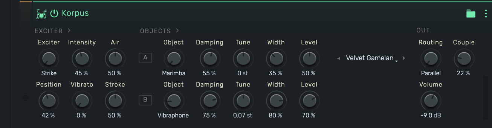

#### 2. Log & Skin

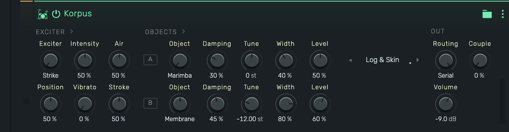

#### 3. Foundry Kit

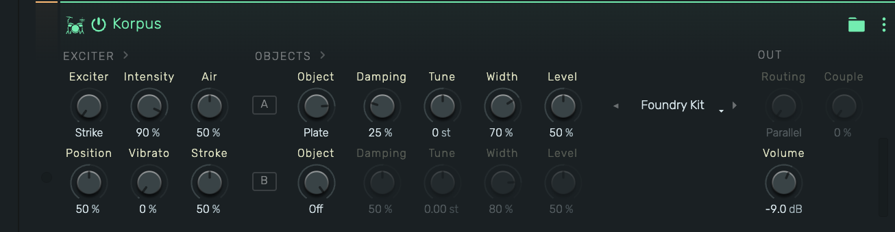

#### 4. Twin Nylon


#### 5. Rosin & Ivory

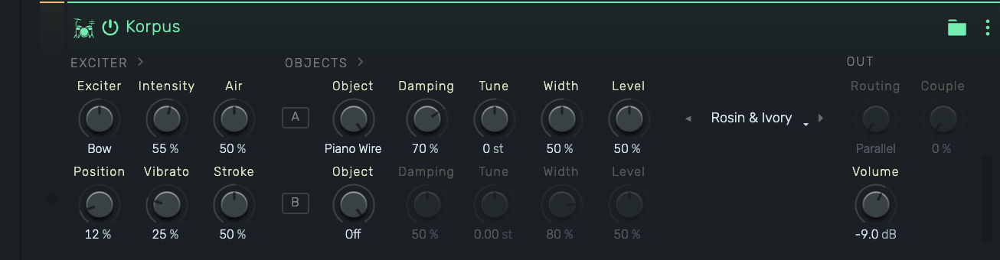

#### 6. Glass Chapel

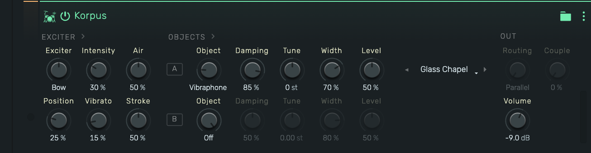

#### 7. Ocarina Moon

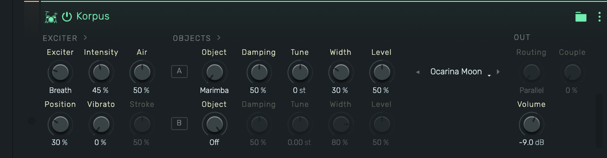

#### 8. Cathedral of Wires

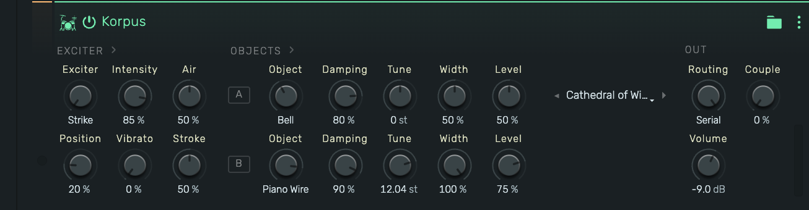

#### 9. Seance Drum

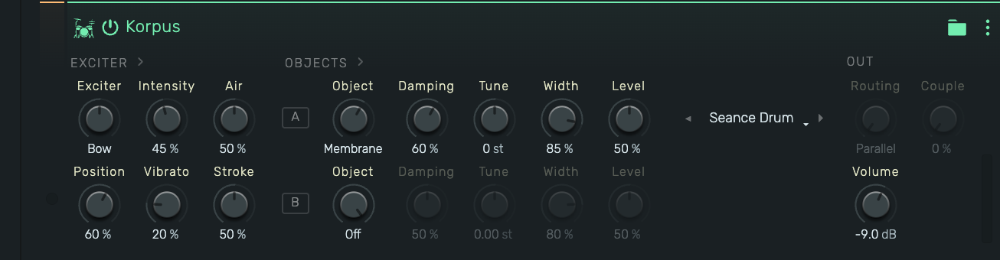

#### 10. Vesper Choir

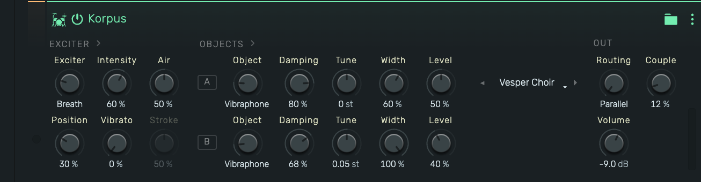

#### 11. Pan Flute

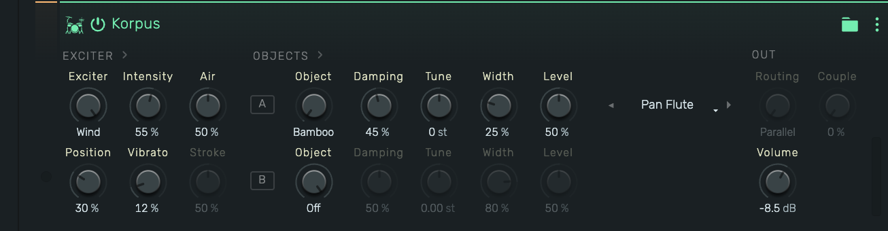

#### 12. Shakuhachi

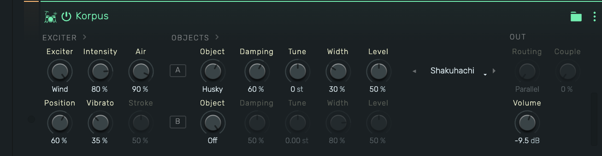

#### 13. Silver Flute

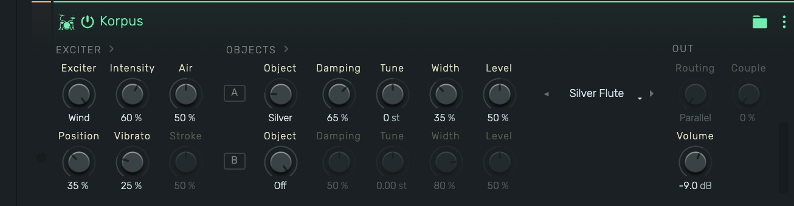

#### 14. Whistle Wind

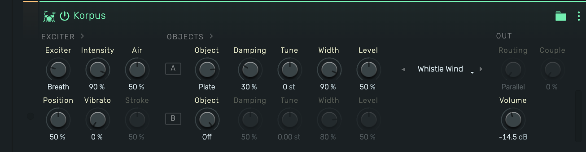

#### 15. Koto Steps


#### 16. Moon Bow

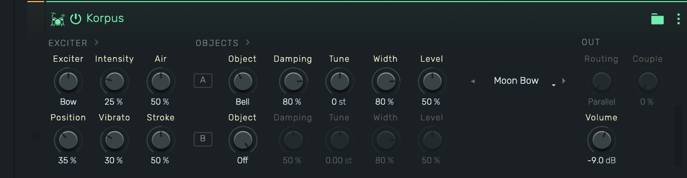

#### 17. Tank Drum

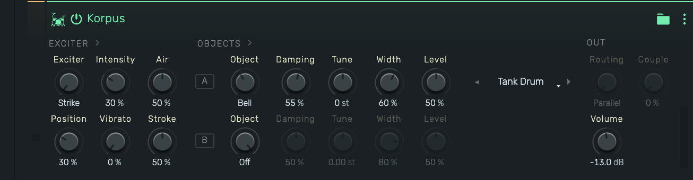

#### 18. First Frost

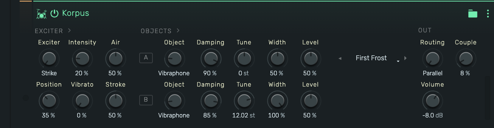

### Values

Values in parentheses are stored in the preset but have **no effect**: that preset's Object B is Off, or, for
Stroke, its exciter is Breath or Wind.

| Knob | Velvet Gamelan | Log & Skin | Foundry Kit | Twin Nylon | Rosin & Ivory | Glass Chapel |
|---|---|---|---|---|---|---|
| Exciter | Strike | Strike | Strike | Pick | Bow | Bow |
| Intensity | 45 % | 50 % | 90 % | 68 % | 55 % | 30 % |
| Air | 50 % | 50 % | 50 % | 50 % | 50 % | 50 % |
| Position | 42 % | 50 % | 50 % | 18 % | 12 % | 25 % |
| Vibrato | 0 % | 0 % | 0 % | 0 % | 25 % | 15 % |
| Stroke | 50 % | 50 % | 50 % | 50 % | 50 % | 50 % |
| A · Object | Marimba | Marimba | Plate | Nylon | Piano Wire | Vibraphone |
| A · Damping | 55 % | 30 % | 25 % | 60 % | 70 % | 85 % |
| A · Tune | 0 st | 0 st | 0 st | 0 st | 0 st | 0 st |
| A · Width | 35 % | 40 % | 70 % | 60 % | 50 % | 70 % |
| A · Level | 50 % | 50 % | 50 % | 50 % | 50 % | 50 % |
| B · Object | Vibraphone | Membrane | Off | Off | Off | Off |
| B · Damping | 75 % | 45 % | (50 %) | (50 %) | (50 %) | (50 %) |
| B · Tune | +0.07 st | −12 st | (0 st) | (0 st) | (0 st) | (0 st) |
| B · Width | 80 % | 80 % | (80 %) | (80 %) | (80 %) | (80 %) |
| B · Level | 70 % | 60 % | (50 %) | (50 %) | (50 %) | (50 %) |
| Routing | Parallel | Serial | (Parallel) | (Parallel) | (Parallel) | (Parallel) |
| Couple | 22 % | 0 % | (0 %) | (0 %) | (0 %) | (0 %) |
| Volume | −9.0 dB | −9.0 dB | −9.0 dB | −9.0 dB | −9.0 dB | −9.0 dB |

| Knob | Ocarina Moon | Cathedral of Wires | Seance Drum | Vesper Choir | Pan Flute | Shakuhachi |
|---|---|---|---|---|---|---|
| Exciter | Breath | Strike | Bow | Breath | Wind | Wind |
| Intensity | 45 % | 85 % | 45 % | 60 % | 55 % | 80 % |
| Air | 50 % | 50 % | 50 % | 50 % | 50 % | 90 % |
| Position | 30 % | 20 % | 60 % | 30 % | 30 % | 60 % |
| Vibrato | 0 % | 0 % | 20 % | 0 % | 12 % | 35 % |
| Stroke | (50 %) | 50 % | 50 % | (50 %) | (50 %) | (50 %) |
| A · Object | Marimba | Bell | Membrane | Vibraphone | Bamboo | Husky |
| A · Damping | 50 % | 80 % | 60 % | 80 % | 45 % | 60 % |
| A · Tune | 0 st | 0 st | 0 st | 0 st | 0 st | 0 st |
| A · Width | 30 % | 50 % | 85 % | 60 % | 25 % | 30 % |
| A · Level | 50 % | 50 % | 50 % | 50 % | 50 % | 50 % |
| B · Object | Off | Piano Wire | Off | Vibraphone | Off | Off |
| B · Damping | (50 %) | 90 % | (50 %) | 68 % | (50 %) | (50 %) |
| B · Tune | (0 st) | +12.04 st | (0 st) | +0.05 st | (0 st) | (0 st) |
| B · Width | (80 %) | 100 % | (80 %) | 100 % | (80 %) | (80 %) |
| B · Level | (50 %) | 75 % | (50 %) | 40 % | (50 %) | (50 %) |
| Routing | (Parallel) | Serial | (Parallel) | Parallel | (Parallel) | (Parallel) |
| Couple | (0 %) | 0 % | (0 %) | 12 % | (0 %) | (0 %) |
| Volume | −9.0 dB | −9.0 dB | −9.0 dB | −9.0 dB | −8.5 dB | −9.5 dB |

| Knob | Silver Flute | Whistle Wind | Koto Steps | Moon Bow | Tank Drum | First Frost |
|---|---|---|---|---|---|---|
| Exciter | Wind | Breath | Pick | Bow | Strike | Strike |
| Intensity | 60 % | 90 % | 80 % | 25 % | 30 % | 20 % |
| Air | 50 % | 50 % | 50 % | 50 % | 50 % | 50 % |
| Position | 35 % | 50 % | 35 % | 35 % | 30 % | 35 % |
| Vibrato | 25 % | 0 % | 0 % | 30 % | 0 % | 0 % |
| Stroke | (50 %) | (50 %) | 50 % | 50 % | 50 % | 50 % |
| A · Object | Silver | Plate | Wire | Bell | Bell | Vibraphone |
| A · Damping | 65 % | 30 % | 55 % | 80 % | 55 % | 90 % |
| A · Tune | 0 st | 0 st | 0 st | 0 st | 0 st | 0 st |
| A · Width | 35 % | 90 % | 50 % | 80 % | 60 % | 50 % |
| A · Level | 50 % | 50 % | 50 % | 50 % | 50 % | 50 % |
| B · Object | Off | Off | Off | Off | Off | Vibraphone |
| B · Damping | (50 %) | (50 %) | (50 %) | (50 %) | (50 %) | 85 % |
| B · Tune | (0 st) | (0 st) | (0 st) | (0 st) | (0 st) | +12.02 st |
| B · Width | (80 %) | (80 %) | (80 %) | (80 %) | (80 %) | 100 % |
| B · Level | (50 %) | (50 %) | (50 %) | (50 %) | (50 %) | 50 % |
| Routing | (Parallel) | (Parallel) | (Parallel) | (Parallel) | (Parallel) | Parallel |
| Couple | (0 %) | (0 %) | (0 %) | (0 %) | (0 %) | 8 % |
| Volume | −9.0 dB | −14.5 dB | −9.5 dB | −9.0 dB | −13.0 dB | −8.0 dB |

## Restoring them in code

Paste these entries back inside `export const Factory: ReadonlyArray<Preset> = [ … ]` in `KorpusPresets.ts`:

```ts
        {
            name: "Velvet Gamelan", exciter: 0, intensity: 0.45, position: 0.42, vibrato: 0.0, air: 0.5, stroke: 0.5,
            objectA: 0, dampingA: 0.55, tuneA: 0, widthA: 0.35, levelA: 0.5,
            objectB: 1, dampingB: 0.75, tuneB: 0.07, widthB: 0.8, levelB: 0.7,
            routing: 0, couple: 0.22, volume: -9.0
        },
        {
            name: "Log & Skin", exciter: 0, intensity: 0.5, position: 0.5, vibrato: 0.0, air: 0.5, stroke: 0.5,
            objectA: 0, dampingA: 0.3, tuneA: 0, widthA: 0.4, levelA: 0.5,
            objectB: 3, dampingB: 0.45, tuneB: -12.0, widthB: 0.8, levelB: 0.6,
            routing: 1, couple: 0.0, volume: -9.0
        },
        {
            name: "Foundry Kit", exciter: 0, intensity: 0.9, position: 0.5, vibrato: 0.0, air: 0.5, stroke: 0.5,
            objectA: 4, dampingA: 0.25, tuneA: 0, widthA: 0.7, levelA: 0.5,
            objectB: 6, dampingB: 0.5, tuneB: 0.0, widthB: 0.8, levelB: 0.5,
            routing: 0, couple: 0.0, volume: -9.0
        },
        {
            name: "Twin Nylon", exciter: 3, intensity: 0.68, position: 0.18, vibrato: 0.0, air: 0.5, stroke: 0.5,
            objectA: 0, dampingA: 0.6, tuneA: 0, widthA: 0.6, levelA: 0.5,
            objectB: 6, dampingB: 0.5, tuneB: 0.0, widthB: 0.8, levelB: 0.5,
            routing: 0, couple: 0.0, volume: -9.0
        },
        {
            name: "Rosin & Ivory", exciter: 2, intensity: 0.55, position: 0.12, vibrato: 0.25, air: 0.5, stroke: 0.5,
            objectA: 5, dampingA: 0.7, tuneA: 0, widthA: 0.5, levelA: 0.5,
            objectB: 6, dampingB: 0.5, tuneB: 0.0, widthB: 0.8, levelB: 0.5,
            routing: 0, couple: 0.0, volume: -9.0
        },
        {
            name: "Glass Chapel", exciter: 2, intensity: 0.3, position: 0.25, vibrato: 0.15, air: 0.5, stroke: 0.5,
            objectA: 1, dampingA: 0.85, tuneA: 0, widthA: 0.7, levelA: 0.5,
            objectB: 6, dampingB: 0.5, tuneB: 0.0, widthB: 0.8, levelB: 0.5,
            routing: 0, couple: 0.0, volume: -9.0
        },
        {
            name: "Ocarina Moon", exciter: 1, intensity: 0.45, position: 0.3, vibrato: 0.0, air: 0.5, stroke: 0.5,
            objectA: 0, dampingA: 0.5, tuneA: 0, widthA: 0.3, levelA: 0.5,
            objectB: 6, dampingB: 0.5, tuneB: 0.0, widthB: 0.8, levelB: 0.5,
            routing: 0, couple: 0.0, volume: -9.0
        },
        {
            name: "Cathedral of Wires", exciter: 0, intensity: 0.85, position: 0.2, vibrato: 0.0, air: 0.5, stroke: 0.5,
            objectA: 2, dampingA: 0.8, tuneA: 0, widthA: 0.5, levelA: 0.5,
            objectB: 5, dampingB: 0.9, tuneB: 12.04, widthB: 1.0, levelB: 0.75,
            routing: 1, couple: 0.0, volume: -9.0
        },
        {
            name: "Seance Drum", exciter: 2, intensity: 0.45, position: 0.6, vibrato: 0.2, air: 0.5, stroke: 0.5,
            objectA: 3, dampingA: 0.6, tuneA: 0, widthA: 0.85, levelA: 0.5,
            objectB: 6, dampingB: 0.5, tuneB: 0.0, widthB: 0.8, levelB: 0.5,
            routing: 0, couple: 0.0, volume: -9.0
        },
        {
            name: "Vesper Choir", exciter: 1, intensity: 0.6, position: 0.3, vibrato: 0.0, air: 0.5, stroke: 0.5,
            objectA: 1, dampingA: 0.8, tuneA: 0, widthA: 0.6, levelA: 0.5,
            objectB: 1, dampingB: 0.68, tuneB: 0.05, widthB: 1.0, levelB: 0.4,
            routing: 0, couple: 0.12, volume: -9.0
        },
        {
            name: "Pan Flute", exciter: 4, intensity: 0.55, position: 0.3, vibrato: 0.12, air: 0.5, stroke: 0.5,
            objectA: 0, dampingA: 0.45, tuneA: 0, widthA: 0.25, levelA: 0.5,
            objectB: 6, dampingB: 0.5, tuneB: 0.0, widthB: 0.8, levelB: 0.5,
            routing: 0, couple: 0.0, volume: -8.5
        },
        {
            name: "Shakuhachi", exciter: 4, intensity: 0.8, position: 0.6, vibrato: 0.35, air: 0.9, stroke: 0.5,
            objectA: 3, dampingA: 0.6, tuneA: 0, widthA: 0.3, levelA: 0.5,
            objectB: 6, dampingB: 0.5, tuneB: 0.0, widthB: 0.8, levelB: 0.5,
            routing: 0, couple: 0.0, volume: -9.5
        },
        {
            name: "Silver Flute", exciter: 4, intensity: 0.6, position: 0.35, vibrato: 0.25, air: 0.5, stroke: 0.5,
            objectA: 1, dampingA: 0.65, tuneA: 0, widthA: 0.35, levelA: 0.5,
            objectB: 6, dampingB: 0.5, tuneB: 0.0, widthB: 0.8, levelB: 0.5,
            routing: 0, couple: 0.0, volume: -9.0
        },
        {
            name: "Whistle Wind", exciter: 1, intensity: 0.9, position: 0.5, vibrato: 0.0, air: 0.5, stroke: 0.5,
            objectA: 4, dampingA: 0.3, tuneA: 0, widthA: 0.9, levelA: 0.5,
            objectB: 6, dampingB: 0.5, tuneB: 0.0, widthB: 0.8, levelB: 0.5,
            routing: 0, couple: 0.0, volume: -14.5
        },
        {
            name: "Koto Steps", exciter: 3, intensity: 0.8, position: 0.35, vibrato: 0.0, air: 0.5, stroke: 0.5,
            objectA: 5, dampingA: 0.55, tuneA: 0, widthA: 0.5, levelA: 0.5,
            objectB: 6, dampingB: 0.5, tuneB: 0.0, widthB: 0.8, levelB: 0.5,
            routing: 0, couple: 0.0, volume: -9.5
        },
        {
            name: "Moon Bow", exciter: 2, intensity: 0.25, position: 0.35, vibrato: 0.3, air: 0.5, stroke: 0.5,
            objectA: 2, dampingA: 0.8, tuneA: 0, widthA: 0.8, levelA: 0.5,
            objectB: 6, dampingB: 0.5, tuneB: 0.0, widthB: 0.8, levelB: 0.5,
            routing: 0, couple: 0.0, volume: -9.0
        },
        {
            name: "Tank Drum", exciter: 0, intensity: 0.3, position: 0.3, vibrato: 0.0, air: 0.5, stroke: 0.5,
            objectA: 2, dampingA: 0.55, tuneA: 0, widthA: 0.6, levelA: 0.5,
            objectB: 6, dampingB: 0.5, tuneB: 0.0, widthB: 0.8, levelB: 0.5,
            routing: 0, couple: 0.0, volume: -13.0
        },
        {
            name: "First Frost", exciter: 0, intensity: 0.2, position: 0.35, vibrato: 0.0, air: 0.5, stroke: 0.5,
            objectA: 1, dampingA: 0.9, tuneA: 0, widthA: 0.5, levelA: 0.5,
            objectB: 1, dampingB: 0.85, tuneB: 12.02, widthB: 1.0, levelB: 0.5,
            routing: 0, couple: 0.08, volume: -8.0
        }
    
```
