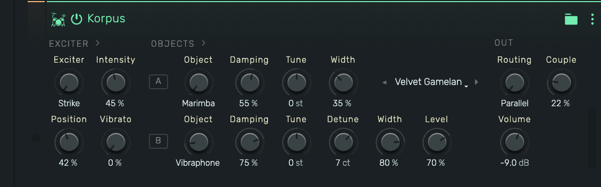

# Korpus — Physical-Modelling Instrument: Concept, DSP Reference & Implementation Guide

The **Korpus** instrument device synthesizes struck, blown, bowed and plucked
sounds entirely from physics — modal resonator banks and waveguides driven by
physical exciter models, with no samples anywhere. Architecturally it follows
the Chromaphone lineage (a patchable exciter feeding two couplable resonator
objects) and extends it with continuous exciters that lineage lacks: a
stick-slip friction bow with a pitch servo, a "living breath" driver, and a
self-oscillating wind pipe.

This document covers the engine end to end: the architecture, each DSP block
and the reasoning behind it, the parameter surface, and how the device is wired
through openDAW's Rust→WASM engine (per `manuals/creating-a-device.md`). The
user-facing manual lives at
`packages/app/studio/public/manuals/devices/instruments/korpus.md`.



## Architecture

```
                        ┌──────────── OBJECT A (modal bank) ───────────┐
  EXCITER ──────────────┤     parallel │ serial │ sympathetic coupling  ├──► OUT
  Strike | Breath       └──────────── OBJECT B (modal bank, opt.) ─────┘
  Bow | Pick | Wind            │ Bow → bowed modal bank (object A material)
                               │ Pick → dual-polarization waveguide string
                               │ Wind → self-oscillating jet + bore pipe (object A = pipe color)
```

- **Strike / Breath** produce a mono excitation signal that continuously drives
  one or two `DrivenBank`s (`engine/driven.rs`).
- **Bow** owns its own bank type (`engine/bow.rs`): friction force and
  resonators form one nonlinear loop and cannot be separated into
  exciter × object.
- **Pick** routes to the dual-polarization plucked string with a commuted
  instrument body (`engine/pluck.rs`).
- Material mode tables (ratios, per-mode amplitude and base-T60 laws) are
  shared by the driven and bowed banks (`engine/tables.rs`): Marimba,
  Vibraphone, Bell, Membrane (Bessel), Plate (stretched + jitter), PianoWire
  (stiff string, `n·√(1+Bn²)`).

## The driven modal bank (`engine/driven.rs`)

Each mode is a constant-skirt bandpass resonator

```
y[n] = (ε·g_in·(x[n] − x[n−2]) − a₁·y[n−1] − a₂·y[n−2]) / a₀
a₀ = 1+ε,  a₁ = −2cos ω,  a₂ = 1−ε,  ε = ln(1000)/(T60·fs)
```

whose peak gain at the design frequency is **exactly** `G·decay` (the undamped
part of the denominator cancels at `ω`), so `G = 1/decay` gives unity peak gain
at every frequency with no `sin ω` approximation, plus DC/Nyquist zeros for
free — important when 60+ driven modes sum coherently.

Injection is normalized per drive type (`Injection`):

- **Strike** (impulse): a unity-peak mode rings at `≈ 2ε` per unit pulse area,
  so strikes inject `0.5 = ε·(1/2ε)` — the ring then follows the material's
  amplitude law, T60-independent.
- **Noise** (breath): unity peak passes noise power ∝ bandwidth ∝ 1/T60, which
  makes choked objects *louder* under sustained noise; injecting `ε·√T60`
  makes broadband-driven loudness T60-neutral.
- **Tonal** (serial ring-through): plain `ε` — unity peak is already
  tonal-neutral, and `√T60` would hand long-ringing objects ≈ +15 dB.

Per-mode extras: strike/bow-position comb on the injection side
(`|sin((k+1)π·pos)|`), alternating per-mode stereo panning with deterministic
jitter, and a slow decorrelated per-mode gain wobble (~0.35 dB RMS below
~1.5 Hz) — partials moving in lockstep read as an organ.

### Coupling (`eigensplit`)

Sympathetic coupling is applied at note-on, not at runtime: A/B mode pairs
within reach move to the coupled-oscillator eigenfrequencies

```
f± = (f_hi + f_lo)/2 ± √(Δ² + k²),   θ = ½·atan2(2k, f_hi − f_lo)
```

with input gains, output gains, pan **and decay rates** rotated by the mixing
angle θ (decay eigenvalues are the plain cos²/sin² blend — no cross term).
This captures doublet beating, the correct doublet amplitude ratio and
piano-style two-stage decay, with zero runtime cost and structural stability.
Pairs are ordered by frequency so θ→0 as k→0 (no mode swap at weak coupling),
and send levels are folded into the drive vector *before* the rotation.
`k = couple² · 8 Hz`; beat period at degeneracy is `1/(2k)`.

## The bowed bank (`engine/bow.rs`)

McIntyre–Schumacher–Woodhouse friction against impulse-invariant
force→displacement modes:

- Per sample: advance all modes force-free, read the bow-point velocity with an
  exact two-tap readout (`v = cv₁·y + cv₂·y₁`, no half-sample lag — first
  differences chatter), then solve one scalar semi-implicit friction equation
  `F = f_bow·λ·Δv / (1 + f_bow·λ·A)` where `A` is the drive-point admittance —
  loop gain stays below one unconditionally, so no stick-slip chatter. The same
  `λ = min(1, (|Δv|·slope + 0.75)⁻⁴)` curve as a waveguide bow.
- **Grip band**: only modes near the played note join the friction loop (dense
  bell partials otherwise pull chaotic multi-mode locks). Near-harmonic
  materials (PianoWire) grip their first 8 harmonics as a comb instead — a
  bowed string entrains its whole series (Helmholtz motion), and single-mode
  gating turns it into a clinical sine.
- **Pitch servo**: the MSW flattening pull depends on material, register and
  pressure, so it is not fitted — the engine counts the anchor mode's
  zero-crossing period (accumulated across blocks) and retunes the gripped
  modes toward f₀ like a player fingering into tune, then freezes. Sub-multiple
  locks (period doubling) are detected (`f_sung/f₀ ∈ 0.25…0.82`) and answered
  by lightening the bow until the note speaks.
- **Living bow**: slow speed drift + 5.3 Hz tremor, bow-change dips every
  ~2.4–3.3 s, attack "dig-in" that relaxes, band-shaped rosin grit in the force
  plus a direct envelope-tracked noise halo at the output, delayed vibrato with
  a wandering rate and per-mode AM phases, per-mode shimmer. These
  micro-motions are the difference between an organ and an instrument.
- On release the bank re-damps from its bowing Q (×3) back to natural T60 —
  the free ring is the instrument's own, and nothing sustains forever.
- Output: velocity/displacement blend for warmth, keyboard-compensated
  (velocity output scales with ω), gentle soft saturation.

## The blown pipe (`engine/wind.rs`)

The Wind exciter is a self-oscillating air column: an air jet (delay + cubic
deflection nonlinearity, slightly biased so even harmonics grow with blowing
pressure) locked to a bore waveguide with a one-pole reflection loss. The jet
loop blows sharp of the passive bore resonance by an amount that moves with
pitch, pressure and loss — instead of fitting it, a zero-crossing pitch servo
(sub-period crossings merged, since a harmonic-rich bore wave crosses several
times per cycle, and a period-doubled regime reads as half pitch — unfolded)
tunes the pipe like a player, then keeps correcting softly below the vibrato
rate; vibrato waits for the lock. Notes start flat and scoop in (per-pipe
meri depth — bright pipes speak straight, a scoop pushes them into bad
regimes). The jet ratio (Position = embouchure) is capped below the 0.5
octave-regime boundary. Breath noise is also blown INTO the bore — air
filtered by the pipe's own resonances is the shakuhachi airiness; hiss beside
the tone never fuses with it. Aliveness follows the bow's recipe: multiplicative
pressure-riding turbulence, an overpressure attack that relaxes, breath drift
and tremor, re-breath dips every ~2.6–3.7 s, delayed wandering vibrato
(pressure-dominant, a few cents of pitch), pitch micro-jitter, and a
decorrelated stereo air halo. Object A selects the pipe color (loss, air,
jet bite); object B, routing and couple are inactive.

## Exciters (`engine/exciter.rs`)

- **Strike**: raised-cosine contact pulse with unit area across the hardness
  range (hardness = contact time, 9 ms felt → ~0.25 ms wood; velocity shortens
  contact — the Hertzian feel), plus contact noise gated by the same window
  (an ungated first sample clicks).
- **Breath**: one-pole breath envelope, low-passed turbulence riding the
  pressure, an attack chiff that outlives the envelope attack, and a sub-Hz
  drift random walk. Only the AC content drives the bank; a small direct bleed
  keeps chiff and air audible through dark objects.

## Parameter surface

Box fields 10–26 (`KorpusDeviceBox`), grouped as the editor shows them:

| # | name | type | notes |
|---|------|------|-------|
| 10 | exciter | int 0–4 | Strike, Breath, Bow, Pick, Wind |
| 11 | intensity | unipolar | hardness / breath brightness / bow pressure / pick color |
| 12 | position | unipolar | strike/bow/pluck point (mode comb) |
| 13 | vibrato | unipolar | Bow only; delayed, ≤ ±15 cents |
| 14–17 | objectA, dampingA, tuneA, widthA | int 0–5, unipolar, ±24 st, unipolar | object A |
| 18–23 | objectB, dampingB, tuneB, detuneB, widthB, levelB | as A + Off, ±25 ct, level | object B (6 = Off) |
| 24 | routing | int 0–1 | Parallel, Serial (A's output drives B) |
| 25 | couple | unipolar | eigensplit strength, k = value²·8 Hz |
| 26 | volume | decibel | default −9 dB |
| 27 | preset-epoch | int (plain field) | bumped by every preset load; the device observes it and hard-cuts its voices (~1.5 ms declick) |

Loudness is a contract, not an accident: every engine path is calibrated to a
common momentary-RMS target at A3 and locked by test (±3 dB across the twelve
reference configurations), with keyboard-flattening laws per engine.

### Live parameters

Continuous knobs act on sounding voices, not just the next note. Each voice
snapshots its knobs at note-on and, once per chunk, smooths the current values
toward the host's (~60 ms settle — no zipper) and re-derives coefficients only
while a knob is actually moving:

- **Driven banks**: every mode keeps its note-on `DrivenSpec` (pan stored as a
  width-independent unit offset); `retune()` rebuilds a₁/a₂/injection/taps —
  damping through the shared `t60_scale` law, tune/detune as a frequency
  ratio, width applied absolutely (so a note started at width 0 still
  spreads), Level B as a send scale (serial `18·level` directly). Injection
  normalization is re-derived per drive kind, so the loudness contract follows
  the knob. With strong coupling, live Level B reaches only the B-bank's share
  of the eigensplit rotation — the note-on path folds the send in pre-rotation.
- **Bow**: pressure re-derives force scale/slope/grit/halo (a `force_trim`
  keeps sub-lock lightening across pressure moves), damping scales per-mode γ,
  tune scales the stored `base_theta` exactly (clamping only at realization,
  so an up-down sweep returns home) with the servo lock intact, width re-pans
  stored unit offsets, vibrato depth is direct. `resync_modes` re-derives
  b₁/b₂/cv outside the servo's gated pass using the servo's last full retune,
  so vibrato keeps running while a knob moves.
- **Wind**: pressure scales the breath target, damping re-derives the loss
  filter and re-opens the pitch servo, tune retargets the bore (servo trim
  carried), width scales the air halo, vibrato depth is direct. **Breath
  release**: on note-off a blown driven bank re-damps to 0.3x its T60 — the
  air stops and the player settles the bars; without it, blown pads rang
  their full struck T60 and stale voices choked the polyphony pool.
- **Pluck**: tune glides the delay lines, interpolated per sample inside
  `tick()` (a chunk-rate length step reads a distant tap and clicks); damping
  retargets loop gain at the shifted pitch; width re-blends the polarization
  mix. The delay length compensates the exact phase delay of the stiffness
  allpass and damping filters at the fundamental (uncompensated it reads as
  flatness growing with pitch, −59c nylon / −94c wire at A4), and the loop
  gain compensates the damping filter's fundamental attenuation so pick color
  is tone, not a hidden decay/volume control. **Breath**: Intensity re-aims
  the turbulence lowpass, damping the release time.

Structural knobs — exciter, objects, routing, couple — stay note-on decisions
(a marimba cannot become a bell mid-ring); they apply from the next note.

## Implementation wiring

Standard device recipe (see `manuals/creating-a-device.md`): schema in
`forge-boxes/.../instruments/KorpusDeviceBox.ts` → generated box → adapter
(`KorpusDeviceBoxAdapter.ts`, value mappings + labeled enums) → Rust crate
`crates/stock-devices/device-korpus` (no_std, `abi::Instrument`, 8-voice
`voicing` pool) → editor (`KorpusDeviceEditor.tsx`, signal-flow layout
EXCITER › OBJECTS › OUT with a state-aware Object-B row) → factory
registrations. Factory presets are in-code
(`adapters/.../KorpusPresets.ts`), since the stock preset catalog is hosted
outside the repository; they load from an on-panel preset strip (step
arrows + dropdown, current patch matched field-by-field via
`KorpusPresets.matches`) and from the device menu, each load one
`editing.modify` transaction.

Engine-side cautions that are easy to trip:

- The wasm shadow stack is 256 KB — voice state lives in the zeroed static
  block and is (re)seeded in place; never construct large engine structs by
  value at note-on.
- `no_std`: all transcendentals via `libm`; `f32::powi` and friends compile
  natively but break the wasm build.
- Voices with slow attacks (bow, breath) must not be freed by silence
  detection while the gate is held.

## Tests

- `crates/stock-devices/device-korpus/tests/render.rs` — twelve reference
  configurations: audibility/stereo/decay/onset, the loudness contract, a
  pitch-range speak guard for sustained exciters at two velocities, and
  release damping. `KORPUS_RENDER_DIR=<dir>` dumps fixed-gain WAVs.
- `packages/studio/core-wasm/test/korpus-render.test.ts` — renders six
  configurations plus a live exciter switch through the real engine +
  `device_korpus.wasm`; native tests cannot catch engine-path or no_std-only
  breaks.
- `packages/studio/core-wasm/test/param-mapping-parity.test.ts` — TS↔Rust
  value-mapping parity for all 17 parameters.
