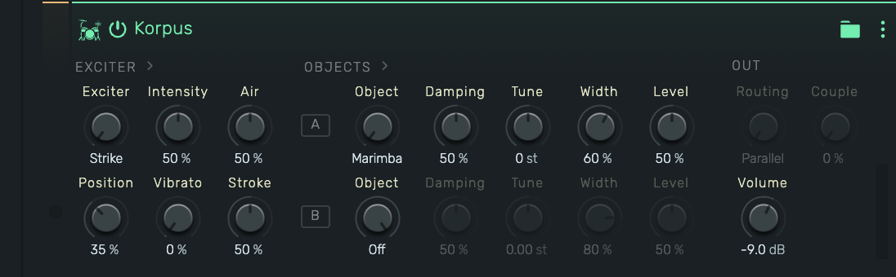

# Korpus — Physical-Modelling Instrument: Concept, DSP Reference & Implementation Guide

The **Korpus** instrument device synthesizes struck, blown, bowed and plucked
sounds entirely from physics — modal resonator banks and waveguides driven by
physical exciter models, with no samples anywhere. Architecturally it follows
the Chromaphone lineage (a patchable exciter feeding two couplable resonator
objects) and extends it with continuous exciters that lineage lacks: a
stick-slip friction bow with a pitch servo, a "living breath" driver, and a
self-oscillating wind pipe.

This document covers the engine end to end: the architecture, each DSP block
and the reasoning behind it, the parameter surface, and how the device is wired
through openDAW's Rust→WASM engine (per `manuals/creating-a-device.md`). The
user-facing manual lives at
`packages/app/manual/public/devices/instruments/korpus.md`.



## Architecture

```
                        ┌──────────── OBJECT A ────────────────────────┐
  EXCITER ──────────────┤     parallel │ serial │ sympathetic coupling  ├──► OUT
  Strike | Breath       └──────────── OBJECT B (driven modal bank, opt.)┘
  Bow | Pick | Wind            │ Strike/Breath → driven modal bank
                               │ Bow → bowed modal bank (object A material)
                               │ Pick → dual-polarization waveguide string (object A = string type)
                               │ Wind → self-oscillating jet + bore pipe (object A = pipe color)
```

- **Strike / Breath** produce a mono excitation signal that continuously drives
  one or two `DrivenBank`s (`engine/driven.rs`).
- **Bow** owns its own bank type (`engine/bow.rs`): friction force and
  resonators form one nonlinear loop and cannot be separated into
  exciter × object.
- **Pick** routes to the dual-polarization plucked string with a commuted
  instrument body (`engine/pluck.rs`).
- **Object B** is a `DrivenBank` for every exciter, owned by the voice. In
  Parallel the exciter plays it: Strike and Breath with their excitation, and
  the self-contained engines with a drive signal from inside their loop (the
  bow force plus rosin noise, the pick excitation, the breath turbulence). In
  Serial, A's rendered sound plays it. B never feeds back into A, so a bowed or
  blown A cannot run away.
- Material mode tables (ratios, per-mode amplitude and base-T60 laws) are
  shared by the driven and bowed banks (`engine/tables.rs`): Marimba,
  Vibraphone, Bell, Membrane (Bessel), Plate (stretched + jitter), PianoWire
  (stiff string, `n·√(1+Bn²)`).

## The driven modal bank (`engine/driven.rs`)

Each mode is a constant-skirt bandpass resonator

```
y[n] = (ε·g_in·(x[n] − x[n−2]) − a₁·y[n−1] − a₂·y[n−2]) / a₀
a₀ = 1+ε,  a₁ = −2cos ω,  a₂ = 1−ε,  ε = ln(1000)/(T60·fs)
```

whose peak gain at the design frequency is **exactly** `G·decay` (the undamped
part of the denominator cancels at `ω`), so `G = 1/decay` gives unity peak gain
at every frequency with no `sin ω` approximation, plus DC/Nyquist zeros for
free — important when 60+ driven modes sum coherently.

Injection is normalized per drive type (`Injection`):

- **Strike** (impulse): a unity-peak mode rings at `≈ 2ε` per unit pulse area,
  so strikes inject `0.5 = ε·(1/2ε)` — the ring then follows the material's
  amplitude law, T60-independent.
- **Noise** (breath): unity peak passes noise power ∝ bandwidth ∝ 1/T60, which
  makes choked objects *louder* under sustained noise; injecting `ε·√T60`
  makes broadband-driven loudness T60-neutral.
- **Tonal** (serial ring-through): plain `ε` — unity peak is already
  tonal-neutral, and `√T60` would hand long-ringing objects ≈ +15 dB.

Per-mode extras: strike/bow-position comb on the injection side
(`|sin((k+1)π·pos)|`), alternating per-mode stereo panning with deterministic
jitter, and a slow decorrelated per-mode gain wobble (~0.35 dB RMS below
~1.5 Hz) — partials moving in lockstep read as an organ.

### Coupling (`eigensplit`)

Sympathetic coupling is applied at note-on, not at runtime: A/B mode pairs
within reach move to the coupled-oscillator eigenfrequencies

```
f± = (f_hi + f_lo)/2 ± √(Δ² + k²),   θ = ½·atan2(2k, f_hi − f_lo)
```

with input gains, output gains, pan **and decay rates** rotated by the mixing
angle θ (decay eigenvalues are the plain cos²/sin² blend — no cross term).
This captures doublet beating, the correct doublet amplitude ratio and
piano-style two-stage decay, with zero runtime cost and structural stability.
Pairs are ordered by frequency so θ→0 as k→0 (no mode swap at weak coupling),
and send levels are folded into the drive vector *before* the rotation.
`k = couple² · 8 Hz`; beat period at degeneracy is `1/(2k)`.

Eigensplit needs both objects as driven banks, so it covers Strike and Breath
in Parallel. Everywhere else — Bow, Pick and Wind, and Serial routing for any
exciter — Couple uses the one-sided form (`repel`): A's partials cannot move (a
sounding engine, or the bank already driving B), so each B mode within reach of
one lands at the same coupled gap `√(Δ² + 4k²)` from it. The engines' partials
are their harmonic series; a driven A offers its mode frequencies. In Parallel
the exciter rings B at the moved frequency, beating against A; in Serial, where
B only hears A, moving it off A's partials also thins its sympathetic ring.

### Object B behind the engines

Level contracts follow the driven pairs: a make-up trim on A when B is on
(0.8 Serial, 0.62 Parallel; 0.72 for the bow, whose near-sine tone lends B less
energy) and per-engine B gains measured with B isolated exactly (A's render is
deterministic, so B = pair − trim·A alone). The pick's excitation is a burst
(`Injection::Strike`); the bow force and the breath turbulence are
noise-normalized. The bow force alone is too tonal to reach modes off its
harmonics, so rosin noise riding `|force|` is added to its drive. In Serial, a
held bow or wind tone only reaches B's modes that coincide with its overtones
(a 6 s vibraphone mode is ~0.4 Hz wide), so their Serial feed adds the rosin or
breath drive to A's sound through the noise injection, at a tenth of the struck
Serial gain; the pick keeps the struck path. Damping B then trades
sympathetic selectivity (high) for a broad body (low).

## The bowed bank (`engine/bow.rs`)

McIntyre–Schumacher–Woodhouse friction against impulse-invariant
force→displacement modes:

- Per sample: advance all modes force-free, read the bow-point velocity with an
  exact two-tap readout (`v = cv₁·y + cv₂·y₁`, no half-sample lag — first
  differences chatter), then solve one scalar semi-implicit friction equation
  `F = f_bow·λ·Δv / (1 + f_bow·λ·A)` where `A` is the drive-point admittance —
  loop gain stays below one unconditionally, so no stick-slip chatter. The same
  `λ = min(1, (|Δv|·slope + 0.75)⁻⁴)` curve as a waveguide bow.
- **Grip band**: only modes near the played note join the friction loop (dense
  bell partials otherwise pull chaotic multi-mode locks). Near-harmonic
  materials (PianoWire) grip their first 8 harmonics as a comb instead — a
  bowed string entrains its whole series (Helmholtz motion), and single-mode
  gating turns it into a clinical sine.
- **Pitch servo**: the MSW flattening pull depends on material, register and
  pressure, so it is not fitted — the engine counts the anchor mode's
  zero-crossing period (accumulated across blocks) and retunes the gripped
  modes toward f₀ like a player fingering into tune, then freezes. Sub-multiple
  locks (period doubling) are detected (`f_sung/f₀ ∈ 0.25…0.82`) and answered
  by lightening the bow until the note speaks.
- **Living bow**: slow speed drift + 5.3 Hz tremor, bow-change dips every
  ~2.4–3.3 s, attack "dig-in" that relaxes, band-shaped rosin grit in the force
  plus a direct envelope-tracked noise halo at the output, delayed vibrato with
  a wandering rate and per-mode AM phases, per-mode shimmer. These
  micro-motions are the difference between an organ and an instrument.
- **Air** scales the rosin: the grit in the force gently (`0.5 + air`, since it
  steers the lock) and the noise halo with the breath's `4·air²` law.
- On release the bank re-damps from its bowing Q (×3) back to natural T60 —
  the free ring is the instrument's own, and nothing sustains forever.
- Output: velocity/displacement blend for warmth, keyboard-compensated
  (velocity output scales with ω), gentle soft saturation.

## The blown pipe (`engine/wind.rs`)

The Wind exciter is a self-oscillating air column: an air jet (delay + cubic
deflection nonlinearity, slightly biased so even harmonics grow with blowing
pressure) locked to a bore waveguide with a one-pole reflection loss. The jet
loop blows sharp of the passive bore resonance by an amount that moves with
pitch, pressure and loss — instead of fitting it, a zero-crossing pitch servo
(sub-period crossings merged, since a harmonic-rich bore wave crosses several
times per cycle, and a period-doubled regime reads as half pitch — unfolded)
tunes the pipe like a player, then keeps correcting softly below the vibrato
rate; vibrato waits for the lock. Notes start flat and scoop in (per-pipe
meri depth — bright pipes speak straight, a scoop pushes them into bad
regimes). The jet ratio (Position = embouchure) is capped below the 0.5
octave-regime boundary. Breath noise is also blown INTO the bore — air
filtered by the pipe's own resonances is the shakuhachi airiness; hiss beside
the tone never fuses with it. Aliveness follows the bow's recipe: multiplicative
pressure-riding turbulence, an overpressure attack that relaxes, breath drift
and tremor, re-breath dips every ~2.6–3.7 s, delayed wandering vibrato
(pressure-dominant, a few cents of pitch), pitch micro-jitter, and a
decorrelated stereo air halo. Object A selects the pipe color (loss, air,
jet bite). The Air knob scales the
breath: the outside halo with air³ (brightening as it rises, +18 dB at full)
and the noise inside the jet and bore linearly, since that noise steers the
oscillation. 0.5 is the calibrated natural balance.

## The plucked string (`engine/pluck.rs`)

Two detuned polarizations (vertical/horizontal waveguides, mixed across the
channels by Width) with a four-stage stiffness allpass and a damping one-pole
in the loop, excited by a synthetic body impulse response read through the
pick filter (commuted synthesis) with a pick-position comb. Object A picks the
string type — stiffness, polarization detune, T60 scale, loop and pick
brightness, and the horizontal polarization's T60 relative to the vertical
one: nylon (Marimba), steel (Vibraphone), chime (Bell), banjo (Membrane),
steel-string acoustic guitar (Plate), stiff wire (Piano Wire). Every string but
the guitar keeps the original 0.72 ratio, so the horizontal polarization dies
first. The guitar reverses it (×2.5 on a shorter 0.9× vertical T60), so the
vertical polarization falls away fast and the horizontal one rings on as a long
quiet tail — the two-stage decay of a steel-string acoustic, where the vertical
motion drains into the top (the model has no top coupling; the T60 ratio stands
in for it). At damping 0.6, A2–A3, that measures about −20 dB/s, then −9 dB/s,
against nylon's steady −21. Higher up the loop gain reaches its cap, the
horizontal polarization first, so the ratio shrinks toward 1 and high guitar
notes decay in one stage like the other strings (from about A4 at damping 0.6).
Damping past 70% opens the string toward a free one — `t60_of` gains an
`open²` term, the loop-gain cap rises from 0.998 toward 0.999 so long targets
survive higher pitches, and the polarization ratio converges (an open string
evens its polarizations). At 100% the guitar rings ~17 s at E2 and ~11 s at
E4, nylon ~15 s, steel 20+ s; at and below 70% the old law holds bit for bit.
Nylon and stiff wire are
the original two; the body table's read rate stays fixed, because shifting the
body resonances onto a note's harmonics swung the level ±8 dB across the
keyboard. **Vibrato** bends both delay lines after the pluck (±20 cents at full,
~5.4 Hz with a wandering rate), and **Air** past 0.5 adds a decaying pick-noise
burst into the string and straight out.

## Exciters (`engine/exciter.rs`)

- **Strike**: raised-cosine contact pulse with unit area across the hardness
  range (hardness = contact time, 9 ms felt → ~0.25 ms wood; velocity shortens
  contact — the Hertzian feel), plus contact noise gated by the same window
  (an ungated first sample clicks). **Air** past 0.5 adds the mallet's own
  contact knock straight to the output: band-limited noise decaying in 2–13 ms,
  shorter and brighter for harder mallets. **Vibrato** is a vibraphone motor
  tremolo: one motor phase lives in `KorpusShared` and the device advances it
  every chunk, so a chord pulses together instead of each note starting its own
  cycle; the knob speeds the motor (3–8 Hz) and deepens it (full depth by 33 %).
- **Breath**: one-pole breath envelope, low-passed turbulence riding the
  pressure, an attack chiff that outlives the envelope attack, and a sub-Hz
  drift random walk. Only the AC content drives the bank; a small direct bleed
  keeps chiff and air audible through dark objects. **Vibrato** pulses the
  whole blown sound at ~5 Hz with a wandering rate, easing in 0.3 s after the
  attack — the resonators' own T60 would smooth a pulse applied only to the
  drive.

## Parameter surface

Box fields 10–31 (`KorpusDeviceBox`), grouped as the editor shows them:

| # | name | type | notes |
|---|------|------|-------|
| 10 | exciter | int 0–4 | Strike, Breath, Bow, Pick, Wind |
| 11 | intensity | unipolar | hardness / breath brightness / bow pressure / pick color |
| 12 | position | unipolar | strike/bow/pluck point (mode comb) |
| 13 | vibrato | unipolar | every exciter: motor tremolo / breath pulse / bow pitch ≤ ±15 ct / string ≤ ±20 ct / pipe breath |
| 14–17, 30 | objectA, dampingA, tuneA, widthA, levelA | int 0–5, unipolar, ±24 st, unipolar, unipolar | object A (Pick: string type, Wind: pipe — the knob then names the string or pipe); levelA 0.5 = unity |
| 18, 19, 29, 22, 23 | objectB, dampingB, tuneB, widthB, levelB | as A + Off; tuneB float ±24 st | object B (6 = Off), every exciter; tuneB cents are its decimals |
| 24 | routing | int 0–1 | Parallel (the exciter plays B), Serial (A's sound plays B) |
| 25 | couple | unipolar | k = value²·8 Hz; eigensplit (Strike/Breath Parallel) or one-sided repel |
| 26 | volume | decibel | default −9 dB |
| 27 | preset-epoch | int (plain field) | bumped by every preset load; the device observes it and hard-cuts its voices (~1.5 ms declick) |
| 28 | air | unipolar | every exciter; 0.5 = natural. Strike/Pick: contact or pick noise above 0.5 only |
| 31 | stroke | unipolar | the stroke behind the note: mallet weight / bow speed / pluck depth; 0.5 = today's stroke, Breath and Wind ignore it |
| 20, 21 | deprecatedTuneB, deprecatedDetuneB | int ±24 st, float ±25 ct | deprecated; `migrateKorpusDeviceBox` folds them into field 29 and moves Tune B automation there. The engine binds neither |

With Object B Off, its row plus Routing and Couple have no effect and the
editor dims exactly those; Stroke likewise dims when the exciter is Breath or
Wind, which ignore it.

Loudness is a contract, not an accident: every engine path is calibrated to a
common momentary-RMS target at A3 and locked by test (±3 dB across the fourteen
reference configurations), with keyboard-flattening laws per engine. Bow, pick
and wind pairs are held within ±4.5 dB of the same patch with B off.
Knob-neutral values keep the pre-existing sound bit for bit: vibrato 0, air
0.5, Level A 0.5, Stroke 0.5, object B Off, couple 0 in Serial, and the nylon and stiff-wire strings.

### Live parameters

Continuous knobs act on sounding voices, not just the next note. Each voice
snapshots its knobs at note-on and, once per chunk, smooths the current values
toward the host's (~60 ms settle — no zipper) and re-derives coefficients only
while a knob is actually moving:

- **Driven banks**: every mode keeps its note-on `DrivenSpec` (pan stored as a
  width-independent unit offset); `retune()` rebuilds a₁/a₂/injection/taps —
  damping through the shared `t60_scale` law, tune as a frequency
  ratio, width applied absolutely (so a note started at width 0 still
  spreads), Level B as a send scale (serial `18·level` directly). Injection
  normalization is re-derived per drive kind, so the loudness contract follows
  the knob. With strong coupling, live Level B reaches only the B-bank's share
  of the eigensplit rotation — the note-on path folds the send in pre-rotation.
- **Bow**: pressure re-derives force scale/slope/grit/halo (a `force_trim`
  keeps sub-lock lightening across pressure moves), damping scales per-mode γ,
  tune scales the stored `base_theta` exactly (clamping only at realization,
  so an up-down sweep returns home) with the servo lock intact, width re-pans
  stored unit offsets, vibrato depth and air are direct. `resync_modes` re-derives
  b₁/b₂/cv outside the servo's gated pass using the servo's last full retune,
  so vibrato keeps running while a knob moves.
- **Object B**: the B row is live for every exciter through the same
  `retune()`; Level B is a send scale in Parallel and the Serial gain directly.
- **Level A**: a gain of 2·level on A's share of the voice, ramped per sample
  across each chunk toward the smoothed value (a chunk-rate step clicks) and
  skipped at exactly unity. It never reaches a serial tap, so B always rings
  from A's full sound; the mallet contact and the breath bleed follow it.
  Eigensplit mixes A and B into shared modes, so every `DrivenSpec` carries
  `gain_out_a`, A's part of its output gain, rotated with `gain_out`; a mixed
  bank scales only that part (a mixed bank off unity costs ~25% more render).
- **Stroke**: Bow only — a stroke move re-derives bow speed, target, slip
  scale, grit, halo and force clamp through the pressure branch (force_trim
  kept); the smoothed value rides the same approach() as the other knobs.
  Strike's mallet weight (a momentum low shelf hinged at the head's release,
  drive = pulse + (J−1)·LP_τ(pulse)) and Pick's pluck depth (level, a first-stage
  bite fading over 120 ms, and a tension twang read through the vibrato bend
  path) are note-on decisions, like Air's knock and scrape.
- **Wind**: pressure scales the breath target, damping re-derives the loss
  filter and re-opens the pitch servo, tune retargets the bore (servo trim
  carried), width scales the air halo, vibrato depth and air are direct; on
  the Breath exciter, air scales the direct breath bleed. **Breath
  release**: on note-off a blown driven bank re-damps to 0.3x its T60 — the
  air stops and the player settles the bars; without it, blown pads rang
  their full struck T60 and stale voices choked the polyphony pool.
- **Pluck**: vibrato depth is direct; tune glides the delay lines, interpolated per sample inside
  `tick()` (a chunk-rate length step reads a distant tap and clicks); damping
  retargets loop gain at the shifted pitch; width re-blends the polarization
  mix. The delay length compensates the exact phase delay of the stiffness
  allpass and damping filters at the fundamental (uncompensated it reads as
  flatness growing with pitch, −59c nylon / −94c wire at A4), and the loop
  gain compensates the damping filter's fundamental attenuation so pick color
  is tone, not a hidden decay/volume control. **Breath**: Intensity re-aims
  the turbulence lowpass, damping the release time.

Structural knobs — exciter, objects, routing, couple — stay note-on decisions
(a marimba cannot become a bell mid-ring); they apply from the next note.

## Implementation wiring

Standard device recipe (see `manuals/creating-a-device.md`): schema in
`forge-boxes/.../instruments/KorpusDeviceBox.ts` → generated box → adapter
(`KorpusDeviceBoxAdapter.ts`, value mappings + labeled enums) → Rust crate
`crates/stock-devices/device-korpus` (no_std, `abi::Instrument`, 16-voice
`voicing` pool) → editor (`KorpusDeviceEditor.tsx`, signal-flow layout
EXCITER › OBJECTS › OUT; Object B Off dims its row plus Routing and Couple) → factory
registrations. Factory presets are in-code
(`adapters/.../KorpusPresets.ts`), since the stock preset catalog is hosted
outside the repository. The list is currently empty; the former set, a knob
reference and restorable entries live in `docs/korpus-presets.md`. With
entries present, presets load from an on-panel preset strip (step arrows +
dropdown, current patch matched field-by-field via `KorpusPresets.matches`)
and from the device menu, each load one `editing.modify` transaction; both
controls are hidden while the list is empty.

Engine-side cautions that are easy to trip:

- The wasm shadow stack is 256 KB — voice state lives in the zeroed static
  block and is (re)seeded in place; never construct large engine structs by
  value at note-on.
- `no_std`: all transcendentals via `libm`; `f32::powi` and friends compile
  natively but break the wasm build.
- Voices with slow attacks (bow, breath) must not be freed by silence
  detection while the gate is held.

## Tests

- `crates/stock-devices/device-korpus/tests/render.rs` — fourteen reference
  configurations plus six bow/pick/wind pairs: audibility/stereo/decay/onset,
  the loudness contract, a pitch-range speak guard for sustained exciters at
  two velocities, release damping, live knobs and click-free sweeps, tuning,
  and one test per newly active knob (object B isolated per engine, Couple,
  Vibrato, the shared tremolo motor, Air, the pick strings, Level A exact against
  B alone and through Couple, and twenty Stroke tests: bit-exact defaults per
  engine, level windows, direction at every pitch, distinctness from Intensity
  and velocity, live bow strokes, twang settle, extremes).
  `KORPUS_RENDER_DIR=<dir>` dumps fixed-gain WAVs.
- `packages/studio/core-wasm/test/korpus-render.test.ts` — renders thirteen
  configurations, one Level A silence check, plus a live exciter switch, a live damping choke and a preset
  cut through the real engine + `device_korpus.wasm`; native tests cannot catch
  engine-path or no_std-only breaks.
- `packages/studio/core-wasm/test/param-mapping-parity.test.ts` — TS↔Rust
  value-mapping parity for all 19 parameters.
