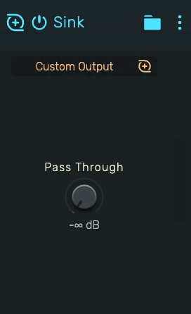

# Sink

A routing device that sends the signal at its position in the chain into an audio bus.

---

---

## 0. Overview

_Sink_ is a 1:1 cable. Whatever arrives at the Sink is summed into the bus you pick, at unity gain. The bus's own channel strip does the mixing.

Because it is an ordinary audio effect, it works anywhere an effect chain exists: on a track, on a bus, inside a Playfield pad, inside an Instrument Composite layer or an FX Composite entry. That is how you group single pads of a drum kit onto their own bus.

Example uses:

- Sending one Playfield pad (the kick, the snare) to its own bus for separate processing
- Pulling a single layer out of an Instrument Composite onto another bus while the other layers keep the track's output
- Splitting a chain at a chosen point: everything before the Sink goes to the bus, everything after it stays on the track

---

## 1. Bus

Picks the bus that receives the signal. The list holds every bus of the project except the main output and the bus the device itself sits on. _New Output Bus..._ creates a bus and assigns it in one step.

With no bus assigned, nothing is sent.

---

## 2. Pass Through

The level at which the signal continues down the chain after the Sink. The bus always receives the full signal.

- **-inf dB** (default): the chain and the track's channel strip go silent from here on. The track is heard only through the bus.
- **0 dB**: an identical copy continues, so the track is heard dry and through the bus.
- Anything in between leaves a scaled dry copy on the track. Automatable.

---

## 3. Bypass

Turning the device off is a plain bypass: the signal passes untouched and nothing is sent. Toggling it is a quick way to audition a track with and without its group.

---

## 4. Solo, Freeze and Stems

Solo treats the Sink like a routing: soloing the track keeps its bus audible, soloing the bus keeps the track audible.

A track containing a Sink cannot be frozen, since a frozen track plays a rendered file and its Sink could no longer feed the bus.

For stem exports the Sink is always active, the sunk signal lands in the bus stem.
