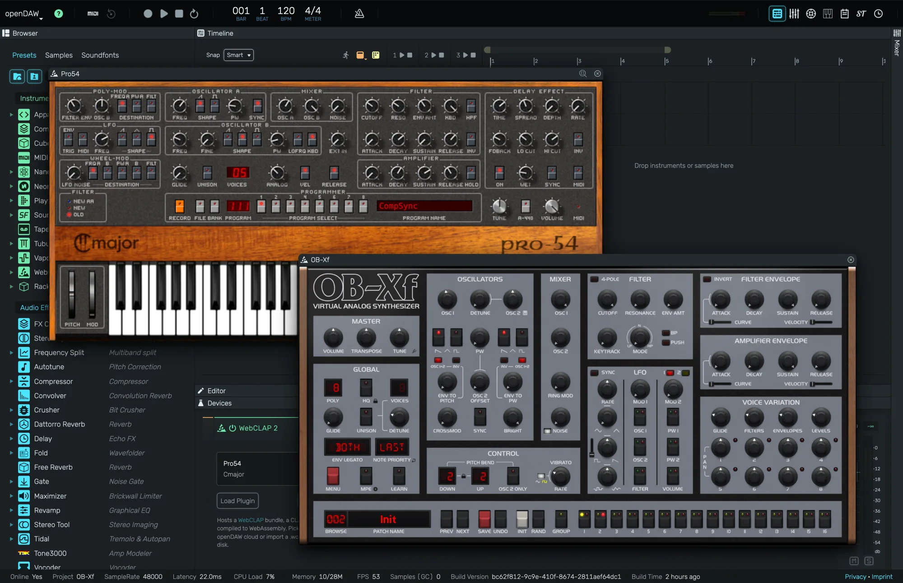
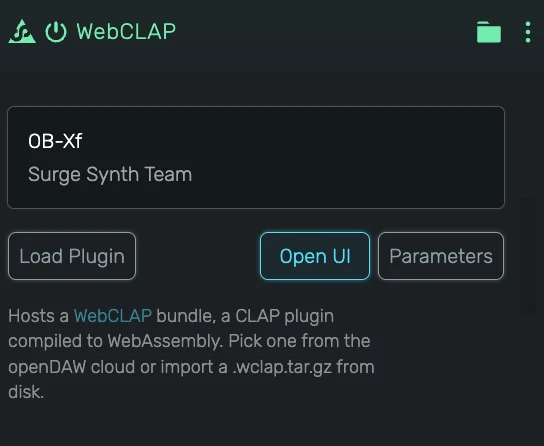

# WebCLAP

Hosts a WebCLAP plugin inside openDAW. A WebCLAP is a CLAP plugin compiled to WebAssembly, so synthesizers and effects built for desktop DAWs run right in the browser, together with their own user interface.

---

---

## 0. Overview

_WebCLAP_ comes in two flavours:

- **WebCLAP** in the _Instruments_ list plays notes like any other instrument
- **WebCLAP** in the _Audio Effects_ list processes the signal of a track or bus

Both share the same editor. The device itself only holds the plugin, every sound related control lives in the plugin's own window, which floats above the studio. Plugins come from the openDAW cloud or from a `.wclap.tar.gz` file on your disk. You can find more plugins and learn about the format at [github.com/free-audio/web-clap](https://github.com/free-audio/web-clap).

---

## 1. The Device

### 1.1 Plugin

The box at the top shows the name and the vendor of the loaded plugin. While a plugin downloads or starts, the second line shows the progress ("Downloading… 42%", "Loading..."). If a plugin cannot be loaded, it reads **Failed** with the reason, and the device passes the audio through unchanged.

### 1.2 Load Plugin

Opens the plugin menu. It only lists plugins that fit the device: instruments in an instrument, effects in an audio effect.

- **Cloud** lists the plugins hosted by openDAW, arranged in folders. A plugin is downloaded the first time you pick it and stays on your computer afterwards.
- **Local** lists the plugins you imported yourself.
- **Import WebCLAP...** loads a `.wclap.tar.gz` file from your disk. If the file holds several plugins, pick one from the dropdown in the dialog that follows, the first plugin is preselected.

### 1.3 Open UI

Shows the plugin's own window. While the window is open the button reads **Close UI**. The button is available once the plugin is ready.

### 1.4 Parameters

Lists every parameter the plugin publishes, grouped the way the plugin groups them. Each parameter offers:

- **Enter Percentage...** to type an exact value
- **Create Automation** to add an automation lane for it
- **Learn Midi Control...** to map a hardware knob or fader
- **Modulate** to connect a modulator
- **Reset Value**

---

## 2. The Plugin Window

Each plugin opens in its own floating window. You can open several at once.

- **Move** the window by dragging its title bar.
- **Resize** it by dragging the right edge, the bottom edge or the bottom right corner. The plugin decides which sizes it accepts. Many plugins keep their proportions and stop at a smallest size, the window follows whatever the plugin allows.
- **Default size** (the magnifier button next to the close button) brings the window back to its default zoom.
- **Bring to front** by clicking a window. The first click on a window in the background only brings it forward, so it never turns a knob by accident.
- **Close** with the × button or with **Close UI** in the device.

### 2.1 Default Zoom

Plugins open at 75% of their own size by default. Change this in **Preferences › WebCLAP › Default plugin window zoom**, anywhere from 25% to 200%. The default size button uses the same value.

### 2.2 Inside the Plugin

Plugins that tell openDAW which control is under the mouse get two extras inside their window:

- **Right-click** a control for the same menu as in **Parameters** (automation, MIDI learn, modulation)
- **Double-click** a control to type a value

Keyboard shortcuts keep working while you use the plugin: key combinations with ⌘ (or Ctrl) reach the studio, so you can save or undo without clicking outside the plugin first. Plain keys reach the plugin and the studio, so the computer keyboard still plays notes.

---

## 3. Saving and Sharing

- The plugin's settings (its sound, its current program) are saved with your project.
- Plugins you load are stored in your browser and listed in the **WebCLAP** tab of the dashboard. Right-click a plugin there to delete it for good. Projects that use a deleted plugin still open, the device then passes the audio through.
- **Save Bundle File to Disk (.odb)** includes the plugins a project uses, so the bundle opens on another computer with everything in place.
- Cloud backup stores your imported plugins along with your projects.
- In a live room, the other participants receive the plugins of the project automatically.
