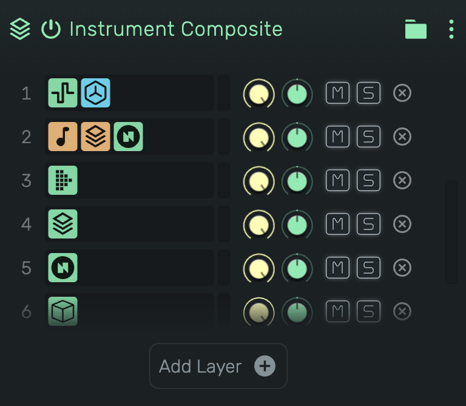

# Composite

Plays several instruments at once from the same notes. Each instrument lives in its own layer with its own effects, volume and panning.

---

---

## 0. Overview

_Composite_ is an instrument that holds other instruments. Every note the track plays reaches every **layer** at the same time, each layer turns it into sound with its own instrument and its own effect chains, and the layers are summed into the track's channel strip.

A layer is a small track inside the track. It has MIDI effects, one instrument, audio effects, and a strip with gain, pan, mute and solo.

Example uses:

- Stack a pad, a pluck and a sub under one set of notes
- Give each part of a sound its own reverb, delay or distortion
- Put an arpeggiator on one layer only, while another layer holds the chord
- Layer a Playfield kit under a synth, or nest a second Composite inside a layer

A new Composite has no layers and makes no sound until you add one.

---

## 1. Layers

Each row in the list is one layer. From left to right a row shows:

**Number**

The layer's position in the list. The layers play in parallel, so reordering them does not change the sound.

**Icons**

The layer's whole chain in order: MIDI effects in orange, the instrument in green, audio effects in blue.

**Peak meter**

The layer's output level, after its own gain, pan and mute.

**Strip**

Gain, pan, mute and solo (see section 2).

**Delete**

Removes the layer with its instrument and its effects.

---

## 2. Layer Strip

**Gain**

The layer's output level in decibels, applied before the layers are summed. Anchored at 0 dB.

**Pan**

Places the layer in the stereo field, from hard left through centre to hard right.

**Mute (M)**

Silences the layer. A muted layer keeps running, so its arpeggiator, its envelopes and its effect tails stay in time, and unmuting is instant.

**Solo (S)**

Plays only the soloed layers and silences the others, like the mixer's solo.

Gain, pan, mute and solo can be automated. Their lanes appear with the track's other automation, at the head of the layer's lanes.

---

## 3. Add Layer

The **Add Layer** button below the list opens a menu of instruments. Picking one creates a new layer that plays it.

Every instrument that plays notes can be a layer, including Playfield and another Composite. Tape and MIDI Output cannot, because they are wired to the track itself.

---

## 4. Editing a Layer

Click a layer to enter it. The device panel then shows that layer on its own: the layer's head at the far left, then its MIDI effects, its instrument and its audio effects.

The head shows the composite's name, the layer's gain, pan, mute and solo, a **back** arrow, and one number per layer. Click a number to jump straight to that layer. Click the arrow to return to the composite.

Inside a layer everything works as on a normal track. Add, remove and reorder effects, open presets for the instrument, or save the layer's instrument as a preset. The instrument's menu also offers **Duplicate layer** and **Delete layer**.

Deleting the instrument leaves an empty layer behind. Drop a new instrument into it, or delete the layer.

---

## 5. Drag & Drop

**An instrument from the Device Browser onto a layer**

Drop it on the top or bottom edge of a layer to create a new layer there. Drop it on the middle to replace that layer's instrument. The layer keeps its strip and its effects.

**An instrument onto Add Layer, or onto an empty composite**

Creates a new last layer.

**An effect onto a layer**

Appends it to that layer's chain. This works for a new effect from the Device Browser and for an effect dragged out of another chain. A MIDI effect needs an instrument in the layer.

**A layer by its icons onto another layer**

Reorders the layers.

**An instrument onto the instrument slot of an entered layer**

Replaces that layer's instrument.

---

## 6. MIDI Effects in Front of the Composite

MIDI effects on the track itself sit in front of every layer. Each layer gets its own copy of them, so an arpeggiator in front of the composite steps identically for every layer, and its settings and automation apply to all of them.

To arpeggiate, shift or groove only one layer, put the MIDI effect inside that layer.

---

## 7. Presets

A preset loaded into a layer's instrument replaces only that instrument. The layer, its strip and its effects stay.

A layer's instrument saves as a normal instrument preset and can be loaded anywhere, on a plain track or into another layer.

Saving the whole track as a rack preset keeps every layer with its instrument and its effects. A rack preset cannot be loaded into a layer.

---

## 8. Technical Notes

- Every layer receives the full note stream. To split by key or velocity, place a note filtering MIDI effect inside the layer.
- One layer with its strip at 0 dB and centre renders exactly what the bare instrument renders.
- Launched clips hand over once per track and at the same bar for every layer.
- Notes with a chance below 100 % are decided per layer. Layers agree as long as they read the notes at the same time. A Zeitgeist inside one layer shifts that layer's timing, so that layer may keep or drop a chance note differently from the others. A Zeitgeist in front of the composite does not have this effect.
- Editing a layer, adding an effect, swapping its instrument or reordering layers never interrupts the other layers.
