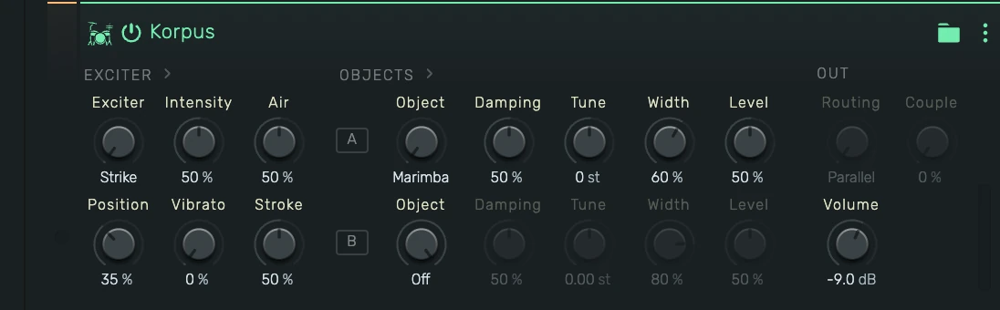

# Korpus

A physical-modelling instrument: an exciter (mallet, breath, bow, pick, or a blown pipe) drives one
or two resonating objects (bars, bells, membranes, plates, wires) that can be layered, coupled
sympathetically, or chained in series. All sound is computed from physics — no samples.

---

---

## 0. Overview

_Korpus_ follows the signal flow of a real acoustic instrument, and the panel reads the same way:
**EXCITER › OBJECTS › OUT**. Choose *how* the instrument is set in motion, choose *what* resonates,
then choose how the two objects combine.

Example uses:

- Mallet keys: marimba, vibraphone, bells, gamelan-style coupled pairs
- Bowed textures: glass-harmonica pads, bowed piano wire, singing friction drums
- Breath-driven tones with chiff and air, from ocarina-like leads to breathing pads
- Blown pipes: shakuhachi, pan and silver flutes that scoop into pitch and breathe
- Struck hybrids: a bar exciting a drumhead, a bell ringing into a cloud of piano wires
- Plucked strings from nylon warmth through steel, chime and banjo to a steel-string acoustic guitar and
  stiff piano wire
- Bowed, plucked and blown sounds ringing a second object: a glass tone with a vibraphone halo,
  a steel string on a plate body, a pipe over a bell

---

## 1. Exciter Section

How the objects are set in motion. The **Intensity** and **Position** controls change meaning with
the exciter type.

### 1.1 Exciter

- **Strike**: a physical mallet contact — a raised-cosine force pulse with contact noise.
- **Breath**: a living breath — filtered turbulence with an attack chiff and slow drift. Sustains
  while the key is held.
- **Bow**: friction bowing with stick-slip physics. The bow finds the note like a player: a short
  scratch, then the tone locks in tune and swells. Sustains while the key is held.
- **Pick**: a plucked dual-polarization string with a resonant instrument body.
- **Wind**: a blown pipe — an air jet locked to a bore, a self-oscillating air column with the
  breath's noise living inside the tone. The pipe tunes itself in like a player, breathes in
  slow pulses, and speaks with a chiff. Sustains while the key is held.

### 1.2 Intensity

- **Strike**: mallet hardness — soft felt (long contact, dark) to hard wood (short contact, bright).
- **Breath**: breath brightness — how much high-frequency air rides the tone.
- **Bow**: bow pressure — light and airy to heavy and raspy. Heavy pressure also pulls the pitch
  slightly flat, like a real bow.
- **Pick**: pick color — dark rounded to bright attack.
- **Wind**: blowing pressure — soft and pure to loud with more air and edge.

### 1.3 Position

Where the exciter meets the object. Moving the position changes which modes speak (the classic
strike/bow/pluck-point comb). At a node of a mode, that mode disappears. For **Wind** it is the
embouchure: the jet's length against the pipe, from round and stable toward a breathier edge.

### 1.4 Vibrato

A living movement for every exciter. At 0 % there is none.

- **Strike**: a vibraphone motor tremolo. All notes share one motor, so a chord pulses together.
  Turning it up spins the motor faster, from a slow 3 Hz swell toward 8 Hz.
- **Breath**: a pulsing breath that eases in shortly after the attack.
- **Bow**: pitch vibrato (up to ±15 cents) that ramps in once the note locks in tune.
- **Pick**: finger vibrato (up to ±20 cents) that comes in after the pluck.
- **Wind**: delayed vibrato, mostly in the breath, with a few cents of pitch.

### 1.5 Air

The noise of the playing itself. 50 % is the natural balance.

- **Strike**: past 50 %, each hit gets the mallet's contact knock — shorter and brighter with
  harder mallets. Below 50 % the strike stays clean.
- **Breath**: more of the air itself over the resonance; 0 % is pure tone.
- **Bow**: rosin hiss — quieter below 50 %, raspy toward 100 %.
- **Pick**: past 50 %, a pick scrape at each pluck. Below 50 % the pluck stays clean.
- **Wind**: breath blowing through the pipe and hissing around it, brighter as it rises; 0 % is
  pure tone.

### 1.6 Stroke

The physical stroke behind the note — how the exciter moves, where Intensity sets what it is
made of. 50 % is today's stroke; Breath and Wind ignore it, and the knob dims there.

- **Strike**: mallet weight, a third of the default head to three times it. A heavy head hands
  the bar more momentum and keeps pushing after the felt lets go — fuller, rounder, louder —
  while the click on top of the note stays with Intensity. A light head sounds small and thin.
  Applies from the next hit.
- **Bow**: bow speed. A fast bow is louder, airier and smoother, changes direction sooner, and
  speaks a touch earlier; a slow bow is quieter, grainier and sits more pressed. Live on a
  sounding note, like bow pressure.
- **Pick**: pluck depth. A deep pluck is louder, drives the body harder, and starts with a
  tension twang — the note lands about 20 cents sharp and relaxes into tune within a few tens of
  milliseconds, strongest on the steel, banjo and guitar strings. A shallow stroke brushes the
  string: softer attack, flatter early decay. Applies from the next pluck.

---

## 2. Objects Section

The resonators. Object **A** is always active; object **B** is optional for every exciter. Set
its Object knob to **Off** for a single-object voice: the rest of the B row, Routing and Couple
dim while it is off, because they only shape the pair.

Object A changes meaning with two exciters:

- **Pick**: object A picks the string, and the knob names it — **Nylon**, **Steel**, **Chime**,
  **Banjo**, **Guitar** (steel-string acoustic) and **Wire** (stiff piano wire). Steel sustains
  strongest, banjo is short and bright, chime shimmers, and the guitar speaks with a bright pick
  attack, falls away quickly, then outlasts them all with a long ringing tail. High guitar notes
  ring out in one stage, like the other strings.
- **Wind**: object A picks the pipe, and the knob names it — **Bamboo**, **Silver**, **Whistle**
  (metal), **Husky**, **Breathy** and **Reed**.

Object B is always a resonating object, whatever the exciter.

### 2.1 Object

The material and geometry, each with its own mode ratios and frequency-dependent decay laws:

- **Marimba**: deep-arch bar tuned 1:4:9.2 — woody, fast highs
- **Vibraphone**: bar tuned 1:4:10 with long, glassy sustain
- **Bell**: minor-third church-bell partials with a deep hum tone
- **Membrane**: circular drumhead (Bessel modes), fast decay
- **Plate**: dense, slightly irregular metallic spectrum
- **Piano Wire**: stiff string with stretched harmonics

### 2.2 Damping

Overall decay time, scaled through each material's own decay-vs-frequency law: low values choke the
object, high values let it ring. Bowing feeds on resonance — with the Bow exciter, higher damping
values make the tone bloom more readily. With the **Pick** exciter, pushing Damping past 70 %
opens the string toward a free one: at 100 % a low guitar note rings out for some fifteen
seconds, like an undamped flat-top.

### 2.3 Tune

Transposes the object in semitones (±24). Tune B an octave up for halo layers, or down for body
and weight.

Tune B also reaches between the semitones: its value is semitones with cents as decimals, so
0.07 st is 7 cents. A few cents against object A produces slow, musical beating — the heart of
gamelan-style pairs. Dragging Tune B pauses at each whole semitone; hold Shift to drag without
the pauses, or Alt for finer steps. MIDI controllers and the scroll wheel move it smoothly, so
double-click it to type an exact value.

### 2.4 Width

Stereo spread of the object's modes. Each mode sits at its own place in the stereo field; width
scales how far they spread. With the **Pick** exciter, Width spreads the string's two
polarizations across the channels instead.

### 2.5 Level

- **Level A**: how loud object A sits in the mix. 50 % is unity, 100 % doubles it, and 0 % leaves
  only object B. In serial routing, object B still rings from A's full sound, so Level A mixes the
  dry object against its resonance. With Couple, the objects share their resonances, and Level A
  turns down A's part of them.
- **Level B**: how strongly the exciter drives object B (parallel routing), or the level of object
  B's response (serial routing).

---

## 3. Out Section

### 3.1 Routing

- **Parallel**: the exciter plays both objects side by side — layering. The bow's rosin rings
  object B at its own pitch, the same pick strikes it, and the breath blows across it.
- **Serial**: the exciter plays object A, and A's sound plays object B — like a string mounted
  on a soundboard, or a bar over a drum. Object B rings on after A decays. With held **Bow** and
  **Wind** notes, B sings where its resonances meet the note: tune B to an interval of the note,
  or lower B's Damping for a broader, body-like response.

### 3.2 Couple

Sympathetic coupling between the two objects. Resonances of B that sit close to A's overtones
are pushed apart from them, so the pair beats instead of doubling.

- **Strike** and **Breath** in Parallel: both objects move — pairs beat, decays become
  two-staged, doublets shimmer. Small amounts (10–25 %) give piano-like slow beating; larger
  amounts give gong-like split partials.
- **Bow**, **Pick** and **Wind**, and **Serial** routing: object B moves away from A's
  overtones (A stays in tune). In Parallel, B then beats against A; in Serial, B also rings
  less in sympathy.

The mallet knock and pick scrape belong to the attack, so Air sets them from the next hit; the
mallet's weight and the pluck's depth apply from the next note the same way.

### 3.3 Volume

Output level in dB.

---

## 4. Presets

Korpus has no built-in presets at the moment. When presets are available, a preset selector
appears beside object A and under **Presets** in the device menu (⋮ in the device header).
Loading a preset is a single undoable edit that silences any sounding notes at once.

---

## 5. Playing Tips

- Knobs are live on sounding notes: Damping chokes or opens a ringing object, Tune glides
  it, Width re-spreads it, Level rides it, Intensity changes the breath's air or
  the bow's pressure mid-note, Stroke hurries or slows a sounding bow, Vibrato deepens or
  stills the movement, and Air breathes a blown or bowed note up or down. The mallet knock
  and pick scrape belong to the attack, so Air sets them from the next hit. The exciter type, Objects, Routing and Couple set the instrument's
  construction, so they apply from the next note.
- Velocity morphs the exciter, not just the level: harder strikes shorten the mallet contact
  (brighter), faster bow strokes speak sooner.
- The engine renders dry. For the classic "in a room" presentation, add a reverb send at roughly
  15–25 % wet.
- Bowed and breath notes have a musical attack — give them a moment to speak, and let releases
  ring: bowed objects return to their natural decay the instant the bow lifts.
