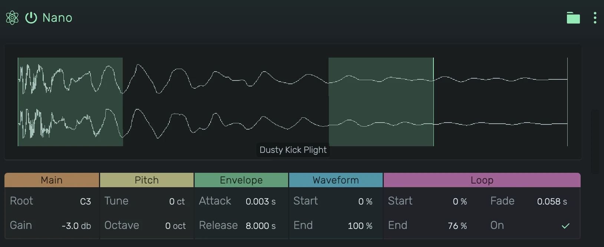

# Nano

A minimal sample playback instrument. Load a single sample and play it chromatically across the keyboard.

---

---

## 0. Overview

_Nano_ turns one audio file into a playable instrument. Every note reads the sample at a rate relative to the root key, so a single sample covers the whole keyboard. A start/end region, a crossfaded loop and an attack/release envelope shape how it plays.

Example uses:

- Quick chromatic sampling of any sound
- Sustained pads from a short sample using the crossfade loop
- Reversed hits and swells
- Placeholder instruments during composition

---

## 1. Waveform

The display shows the loaded sample. The bright part is the region that plays, the dimmed parts are skipped.

- **Drag & drop**: Drop an audio file or a sample from the browser onto the display
- **Click**: Browse for a sample while the display is empty
- **Drag a region edge**: Move the start or end point directly on the waveform
- **Right-click**: Context menu for sample options
- Blue lines show the read position of every playing voice
- With the loop enabled, green lines mark the loop points and the shaded areas show where the crossfade happens

---

## 2. Controls

### 2.1 Attack

Fade-in time after note-on.

### 2.2 Release

Fade-out time after note-off. Longer values let the sample ring out; shorter values cut it quickly. Changes reach notes that are already playing.

### 2.3 Start / End

The part of the sample that plays, as a percentage of its length. Set the start past the end to play the sample backwards. The device menu offers _Reverse_, which swaps the two values.

### 2.4 Root

The note that plays the sample at its original pitch. Every other note transposes relative to it.

### 2.5 Octave

Shifts the whole keyboard up or down by octaves.

### 2.6 Tune

Fine tuning in cents, up to an octave in either direction. 100 cents equal one semitone.

### 2.7 Loop

While enabled, a held note cycles the range between _Loop Start_ and _Loop End_ instead of stopping at the end of the region. The loop points stay inside the region.

### 2.8 Loop Start / Loop End

The loop range, as a percentage of the sample length.

### 2.9 Fade

The crossfade length at the loop point. Longer fades hide the seam on sustained material, shorter fades keep transients sharp.

### 2.10 Gain

Output level in dB.
