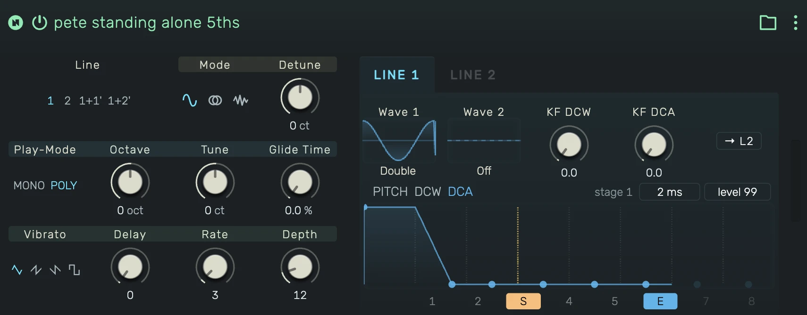

# Neon

A phase-distortion synthesizer in the spirit of the Casio CZ series. Two independent lines, each with its own
wave pair, brightness (DCW) and amplitude (DCA) stages, and three 8-stage envelopes. Ring and noise modulation,
vibrato, glide, wide detune, and native Casio CZ `.syx` preset import.

---



---

## 0. Overview

Phase distortion generates timbre without filters: a cosine wave is read with a bent phase map, and one knob
morph — the DCW amount — sweeps the wave continuously from a pure cosine to its full shape (saw, square, pulse,
resonant sweeps and more). Brightness is therefore an envelope destination, not a filter cutoff.

_Neon_ follows the original architecture:

```
LINE 1:  Pitch Env ──> Oscillator (Wave 1 | Wave 2) ──> DCW Env ──> DCA Env ──┐
                                                                              ├──> Output
LINE 2:  Pitch Env ──> Oscillator (Wave 1 | Wave 2) ──> DCW Env ──> DCA Env ──┘
                (line 2 can also RING-modulate line 1 or become a NOISE source)
```

Example uses:

- Glassy digital keys and bells (ring mode with detuned intervals)
- Percussive basses and drums (short DCW and DCA envelopes, noise mode)
- Evolving pads (slow DCW sweeps, detuned line pairs)
- Authentic CZ-101 patches via `.syx` import

---

## 1. Global Section

### 1.1 Lines

Selects which lines sound:

- **1**: Line 1 alone
- **2**: Line 2 alone
- **1+1'**: Line 1 twice, the second copy detuned
- **1+2'**: Line 1 plus a detuned Line 2

The prime (') marks the line the **Detune** control offsets.

### 1.2 Mode

Combination mode for two-line settings:

- **Off**: The lines simply sum
- **Ring**: Line 2 ring-modulates line 1 (line 1 + line 1 × line 2) — metallic, clangorous spectra
- **Noise**: Line 2 turns into a pitched noise source; its wave, DCW and DCA envelope shape the noise color
  and contour

### 1.3 Play-Mode

- **MONO**: Single voice with note priority — combine with Glide for classic lead lines
- **POLY**: Full polyphony

### 1.4 Octave

Transposes the whole instrument in octaves.

### 1.5 Detune

Pitch offset of the primed line in cents. The range is intentionally wide (±4 octaves): small values give
chorus-like beating, large values set fixed ring-modulation intervals — many classic CZ patches store intervals
of an octave and more here.

### 1.6 Glide Time

Portamento time between notes.

---

## 2. Vibrato Section

A delayed pitch LFO acting on both lines together.

### 2.1 Shape

**Triangle**, **Saw Up**, **Saw Down** or **Square**.

### 2.2 Delay

Time before the vibrato fades in after note-on.

### 2.3 Rate

Vibrato speed.

### 2.4 Depth

Vibrato depth. Detuned pairs keep their beat rate — the vibrato bends both lines together.

---

## 3. Line Section

The **LINE 1 / LINE 2** tabs switch the right half of the editor between the two lines: wave selection,
key follow and the envelopes always show the selected line. The copy button transfers the whole line setup
to the other line.

### 3.1 Wave 1 / Wave 2

Each line plays one of eight panel waves, or an alternating **pair**: with Wave 2 active, the oscillator
alternates Wave 1 and Wave 2 on successive cycles — the hardware's trick for thicker, octave-down hybrids.

- **Saw**: Bright, full harmonic ramp
- **Square**: Hollow odd-harmonic profile
- **Pulse**: Narrow impulse, thin and nasal
- **Double Sine**: Two sine humps per cycle — octave-flavored
- **Saw-Pulse**: Saw with an impulse notch, extra bite
- **Res. Saw / Res. Triangle / Res. Trapezoid**: Windowed-resonance waves — a resonant sweep sound without a
  filter; the DCW amount plays the resonance pitch

### 3.2 KF DCW (Key Follow)

Reduces the DCW brightness toward higher keys (0-9), like a filter tracking down the keyboard. At 0 all keys
share the same brightness.

### 3.3 KF DCA (Key Follow)

Shortens the amplitude envelope toward higher keys (0-9) — high notes decay faster, like acoustic instruments.

---

## 4. Envelopes

Every line has three 8-stage envelopes, selected by tabs:

- **Pitch**: Bends the line's pitch in semitones (up to ~+79 st) — drum sweeps, attack blips
- **DCW**: The brightness contour — this is where phase distortion "plays the filter"
- **DCA**: The amplitude contour

### 4.1 Stages

Each stage has a **rate** (speed, 0-99) and a **level** (target, 0-99). The envelope walks stage by stage
toward each level at its rate. Drag points in the canvas (horizontal = rate, vertical = level, shift = fine),
or click a readout chip to type exact values. The chips show the resulting stage duration in ms/s.

### 4.2 Sustain and End markers

- **S** — the sustain step: the envelope holds there until note-off, then continues with the following stages
- **E** — the end step: the last played stage

Without a sustain marker the envelope is a **one-shot**: it runs its stages once and falls silent regardless
of how long the key is held — the classic CZ percussion trick.

---

## 5. Preset Import

The device menu offers **Load Casio CZ .syx…**: single-tone system-exclusive dumps from a CZ-101/1000 (or
editors that export them) load directly — waves, envelopes, key follows, detune, vibrato, the complete tone.

---

## 6. Signal Flow

```
                 ┌ Pitch Env ┐                      ┌ Vibrato ┐
LINE 1:  Wave 1|2 ──────────> DCW Env ──> DCA Env ──┬──────────> Output
LINE 2:  Wave 1|2 ──────────> DCW Env ──> DCA Env ──┘
           │
           └── MODE: Off = sum · Ring = line1 × line2 · Noise = line 2 as noise source
```
