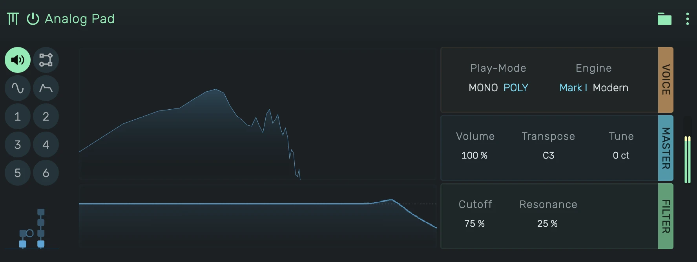
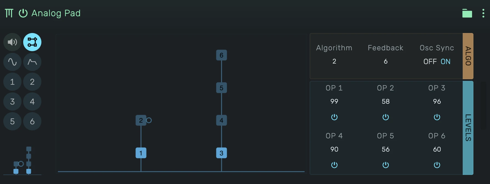
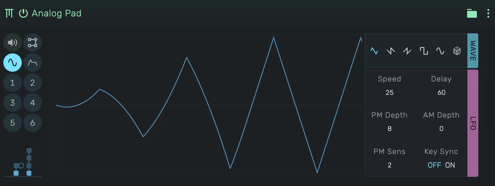
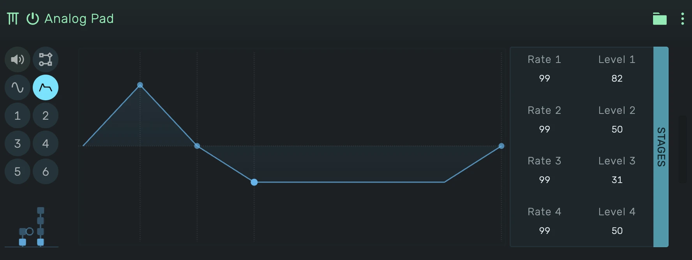
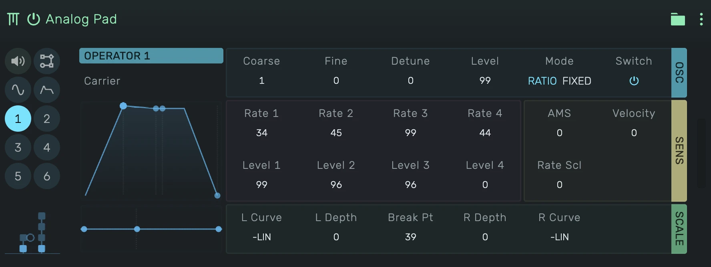

# Tubular

A six-operator FM synthesizer compatible with the Yamaha DX7. The engine is a port of
[Dexed](https://github.com/asb2m10/dexed)'s msfa core, so DX7 cartridges sound the way they do in Dexed and on
the hardware.

---

## 0. Overview

Six sine operators are wired by one of 32 algorithms. Operators feeding another operator are modulators,
operators feeding the output are carriers. Every operator has its own four-stage envelope, keyboard level
and rate scaling, velocity sensitivity and frequency (a ratio of the note or a fixed frequency). One LFO
modulates pitch and amplitude, a pitch envelope bends every operator, and a low-pass filter with resonance
sits on the output.

The editor is split into tabs: Output, Algorithm, LFO, Pitch Envelope and one tab per operator. The
miniature under the tab buttons always shows the current algorithm and jumps to the Algorithm tab.

---

## 1. Output

The display shows the output spectrum with the low-pass response beneath it.

- **Play-Mode**: _Mono_ plays one voice with legato retriggering, _Poly_ up to 16 voices.
- **Engine**: _Mark I_ or _Modern_ operator kernel, see section 7.
- **Volume**, **Transpose** (in semitones, C3 = unchanged), **Tune** (±100 cents).
- **Cutoff** and **Resonance** of the output low-pass. Fully open, the filter is bypassed.

---

## 2. Algorithm

The diagram draws the selected algorithm: carriers (bright) sit on the output line, modulators stack above
the operators they feed, the loop marks the feedback operator.

- **Algorithm** 1 to 32, **Feedback** 0 to 7 (the amount of self-modulation of the feedback operator),
  **Osc Sync** restarts every operator's phase on each key-on.
- The six columns show each operator's **Level** and on/off switch. Click an operator's name to open its tab.

---

## 3. LFO

One LFO modulates pitch and amplitude of all operators.

- **Wave**: triangle, saw down, saw up, square, sine, sample and hold.
- **Speed** and **Delay** (fade-in time after key-on). The display shows the shape and the delay ramp.
- **PM Depth** and **AM Depth**: how much pitch and amplitude modulation the LFO applies. Amplitude
  modulation only reaches operators whose **AMS** (see section 5) is above zero.
- **PM Sens**: the pitch modulation sensitivity 0 to 7, scaling both LFO pitch modulation and the modulation
  wheel.
- **Key Sync** restarts the LFO with every key-on.

---

## 4. Pitch Envelope

A four-stage envelope that bends the pitch of every operator. Level 50 is no shift, 99 about four octaves up,
0 four octaves down. Rates 1 to 3 run from key-on, rate 4 from key-off. Drag the handles in the display
(horizontal = rate, vertical = level, shift for fine steps) or use the labels.

---

## 5. Operators

Each operator tab reads the operator's role in the current algorithm beneath its name (carrier, or modulator
with the operators it feeds, and whether it carries the feedback loop). The envelope display is draggable like
the pitch envelope.

- **OSC**: **Coarse** (frequency ratio 0.5, 1, 2 … 31) and **Fine** (0 to 99 hundredths of the ratio),
  **Detune** -7 to +7, **Level** 0 to 99, **Mode** (_Ratio_ follows the played note, _Fixed_ plays an
  absolute frequency), and the on/off switch.
- **ENV**: **Rate 1** to **4** and **Level 1** to **4** of the amplitude envelope, hardware scale (99 = fastest
  or loudest).
- **SENS**: **AMS** (amplitude modulation sensitivity 0 to 3 for the LFO), **Velocity** (0 to 7), **Rate Scl**
  (rate scaling 0 to 7, higher notes get shorter envelopes).
- **SCALE**: keyboard level scaling. The level falls or rises away from **Break Pt** with **L Depth** and
  **R Depth** along **L Curve** and **R Curve** (-LIN, -EXP, +EXP, +LIN). The display shows the resulting
  level across the keyboard, its three handles drag the break point and the two depths. Dragging a depth
  through the centre line flips its curve between - and +.

---

## 6. Cartridges

Bundled banks (32 voices each) and their credits:

- Tubular Classics, 32 original voices in the classic styles (tine pianos, bells, mallets, basses, brass,
  strings, organs, leads, drums), written for openDAW, CC0.
- Dexed 01 and SynprezFM 01 to 32, the cartridges shipped with Dexed, DX7 programs compiled by Jean-Marc
  Desprez (SynprezFM), GPL-3.0.
- YM2612 ROM 1 to 4 by Nick Culbertson, Sega Genesis style instruments, MIT.

The device menu offers _Load DX7 .syx…_ for a 32-voice bulk dump (4104 or 4096 bytes),
a single voice dump (163 bytes) or a stream of dumps. The Yamaha factory ROMs and the many community banks
found online load this way.

All 156 voice and output parameters are automatable. The values are the hardware's own: rates and levels 0 to
99, algorithm 1 to 32, feedback 0 to 7, detune -7 to +7, transpose around C3.

## 7. Engine

The device menu offers two operator kernels. _Mark I_ (default, as in Dexed) reads 10-bit log-sine and
exponent tables like the original hardware, which adds its characteristic grit. _Modern_ is the
interpolated 24-bit msfa kernel, cleaner and a little quieter in the top end.

## Credits

Engine: the msfa core of music-synthesizer-for-android (Apache-2.0), written by Raph Levien during his time at
Google, as maintained in [Dexed](https://github.com/asb2m10/dexed) by Pascal Gauthier, with Dexed's voice
handling and output filter (GPL-3.0).
Tubular is not affiliated with Yamaha or Dexed.
