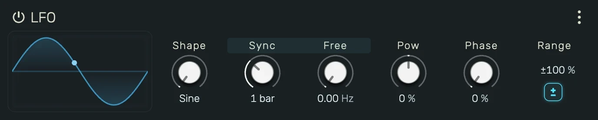
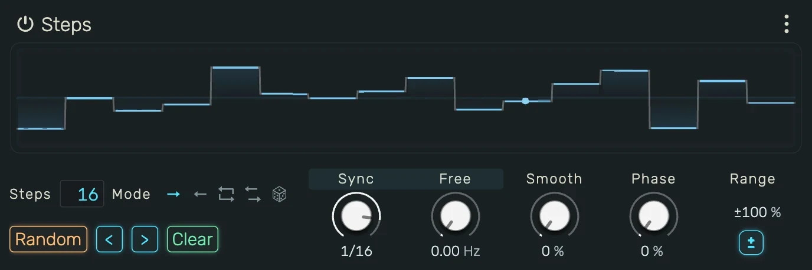
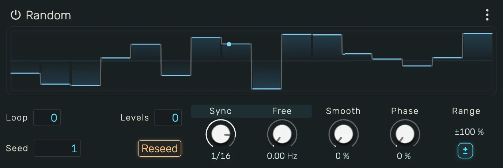
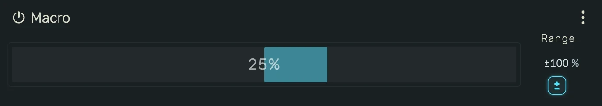

# Modulation

Modulators are project-wide sources that move device parameters on their own. They sit on the **Modulation**
screen (⇧6), and one modulator can drive as many parameters as you like, each with its own depth.

---

## 0. Overview

A modulator offsets a parameter on top of whatever it already does. If the parameter is automated, the curve
still plays and the modulator moves around it. If it is not, the modulator moves around the value you set by
hand. The offset is applied in the parameter's own range, so an integer or a switch steps and flips like any
other value.

Four kinds ship: an **LFO**, a **Steps** sequencer, a **Random** source and a **Macro** fader. All of them
except the Macro run on a clock and keep running while the transport is stopped.

---

## 1. Assigning a Modulator

1. **Right-click** any device control, mixer fader, send or MIDI CC
2. Open **Modulate**
3. Pick **New** and a kind to create one, or pick an existing modulator from the list

Creating one from a control assigns it, switches to the Modulation screen and scrolls the new modulator into
view, so its controls are under the cursor straight away.

Right-clicking the same control again shows a check next to every modulator already assigned to it. Clicking a
checked entry removes that assignment.

---

## 2. The Target List

Each editor carries the list of parameters it drives, on its right. Every row has:

- the parameter's owner and name, click the owner to jump to that device
- a **depth**, dragged like any other control, signed so a negative depth inverts the modulator
- an **enable** toggle for that one assignment

The depth is itself a parameter, so right-clicking it offers the same menu a device control does: **Create
Automation**, **Learn Midi Control** and **Modulate**. It lights up with the same ring, so a depth that is
being driven is visible at a glance.

---

## 3. Modulating a Depth

Because a depth takes **Modulate**, one modulator can set how far another reaches. An LFO on a filter with its
depth driven by a slow second LFO opens and closes the amount of movement over time, rather than the filter
itself.

The assignment shows up in the driving modulator's target list like any other row, named after the whole
chain, so `LFO → Vaporisateur Cutoff` tells you it is the depth of that assignment being moved, not the cutoff.

Depth is the only modulator-side parameter that takes modulation. A modulator's own controls take automation
and MIDI, but not another modulator.

---

## 4. Range and Polarity

Every modulator ends in **Range**, which scales everything it sends. The **±** button under it switches the
polarity.

- **Bipolar** swings both ways around the parameter's current value, printed as `±50 %`
- **Unipolar** only adds, printed as `+50 %`

The shape you see does not change when you flip the polarity, only what it means. A Steps pattern drawn above
the centre line reads as a bipolar sequence with the centre as zero, and as a unipolar one off the bottom.

A Range of zero is silence in both polarities.

---

## 5. Rate

The timed kinds all share the same pair of rate controls, and they add together.

- **Sync** locks to the tempo, from 8 bars down to 1/32. Its first entry, **Off**, stops the synced motion
- **Free** runs in Hz, independent of the tempo

Both keep running while the transport is stopped, and both re-align to the song position when you pause,
resume, locate or hit a loop jump. Between those they free-run, so a loop does not re-phase them and a long
modulator drifts across repeats instead of repeating with them.

**Phase** offsets where the shape starts.

---

## 6. LFO

A repeating shape: **Sine**, **Triangle**, **Saw ↑**, **Saw ↓** or **Square**.

**Pow** bends the shape without adding new ones. At the centre it does nothing. Turned down, the shape swells
towards its extremes. Turned up, it flattens through the middle and sharpens the peaks. It is sign preserving,
so both halves bend by the same amount.

---

## 7. Steps

A drawn sequence of up to 64 steps.

- **Drag** across the display to paint, **⌥ + drag** clears back to the centre
- **Double-click** a step to type a percentage
- **Steps** sets how many are in the pattern. The rate is the length of one step, not of the whole pattern, so
  changing the count keeps the grid and only changes how long the pattern takes to come round
- **Smooth** is the fraction of a step spent gliding from the previous one, so 0 steps hard and 1 ramps the
  whole way
- **Mode** folds the step order: Forward, Backward, Ping-Pong, Alternate or Random

Random reorders per cycle rather than running an endless stream, so it replays identically from the same
position. The display cannot draw a per-cycle order, so it shows a forward pass.

---

## 8. Random

Noise on a rate grid, drawn from the **Seed** rather than a running generator, so the same seed always gives
the same sequence and an offline render matches what you heard. **Reseed** picks a new one.

- **Loop** repeats the sequence after that many steps. At 0 it never repeats
- **Levels** quantises the output to that many values. At 0 it stays continuous
- **Smooth** glides between steps, exactly as on the Steps modulator

---

## 9. Macro

A plain fader with no time base. It moves only when you move it, which makes it the one to reach for when you
want several parameters under a single hand, and it is the natural target for MIDI learn.

---

## 10. Modulator Automation

A modulator's own controls are parameters too, and so is every depth in its target list. Right-click one and
choose **Create Automation** to give it a lane, and the lane appears in the timeline in its own group, after
every audio unit. A depth's lane belongs to the modulator that drives it, so it sits with that modulator's own
lanes and moves with it when the modulator is replaced.

The controls that shape a pattern rather than ride a curve are ordinary fields and carry no lane: the Steps
count and mode, and the Random loop, seed and levels.

---

## 11. The Header Menu

The **⋮** on each editor:

- **Replace with** turns the modulator into another kind in place. The targets, their depths and their depth
  automation all survive. The old kind's own settings do not
- **Duplicate** makes a copy with the same settings and no targets
- **Delete** removes the modulator and every assignment on it

Duplicate and Delete act on the whole selection, not just the editor you opened the menu on. Modulators can be
selected together, copied and pasted with the usual shortcuts, and dragged by their title to reorder them.
