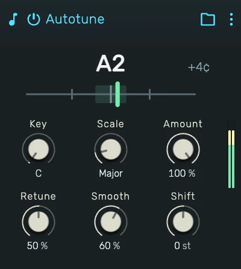

# Autotune

Real-time pitch correction: detects the note you sing, snaps it to a key and scale, and re-pitches the audio, from transparent tuning to the hard robotic effect.

---

---

## 0. Overview

_Autotune_ listens to a monophonic signal, a single voice or instrument, works out its pitch, decides which note of the chosen key and scale it should be, and shifts the audio onto that note in real time. Duration and formants are preserved, so the corrected voice still sounds like the same voice.

The correction ranges from invisible, gently pulling sustained notes toward the grid while leaving vibrato and phrasing alone, to the full hard-tune character where every note locks instantly and vibrato flattens onto the grid.

It is designed for **one voice at a time**: chords or several simultaneous sources cannot be tracked. Place it early in the chain, before reverbs and delays, so it hears the driest possible signal.

## 1. Key & Scale

**Key** picks the root pitch class (C through B), **Scale** the set of allowed notes: Chromatic, Major, Minor, Major and Minor Pentatonic, Blues, Dorian or Mixolydian.

Detected pitches snap to the nearest allowed note. Chromatic corrects to the nearest semitone regardless of key, the other scales keep the correction inside the song's harmony, which also makes the tracking steadier, since fewer target notes means fewer accidental flips between neighbours.

## 2. Amount

How far the pitch is pulled toward the target note. At full amount the note lands on the grid; lower values correct only part of the distance, useful when a voice is nearly in tune and just needs tightening. The taper is fine at the top of the range, where transparent correction lives.

## 3. Retune

The character control, sweeping natural to hard-tune. It sets how fast the pitch glides to a new note (from a relaxed 500 ms down to 2 ms) and, at higher settings, how strongly natural vibrato is flattened onto the target note. Low settings keep the performance human; the top of the range is the instantly locking, vibrato-free robotic effect.

## 4. Smooth

Damps the correction into rounded, S-curved note transitions and settles detection jitter. It shapes how the correction moves between notes without touching the sung vibrato itself.

## 5. Shift

A manual transpose of −12 to +12 semitones, applied after the scale snap. Formants are preserved, so moderate shifts stay natural; extreme settings are an effect of their own.

## 6. The Tuner

The strip shows what the device hears and does: the detected note, the target note it snaps to, and a needle for the distance in cents. If the needle jumps wildly or the detected note flickers, the input is too quiet, too reverberant or not monophonic.

## 7. Tips

- Feed it a **dry, clean signal**: correction before reverb, delay or heavy distortion.
- For transparent tuning: full Amount, low Retune, moderate Smooth, and a scale matching the song.
- For the classic hard-tune vocal: Retune at maximum, scale to the song's key, and sing deliberate note changes.
- Breaths and consonants pass through uncorrected by design, only pitched material is shifted.
