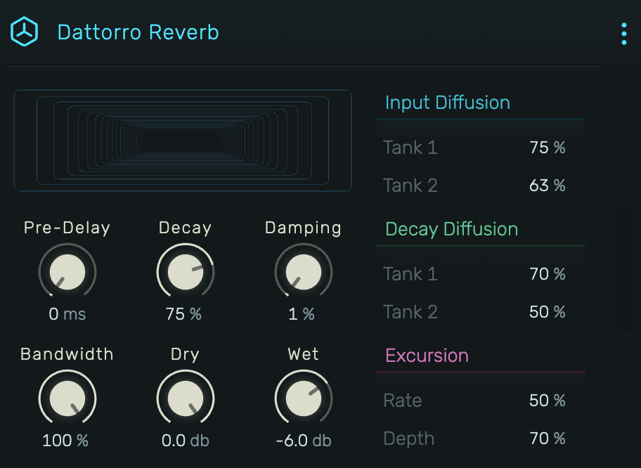

# Dattorro Reverb

A high-quality plate reverb based on Jon Dattorro's classic algorithm with modulated delay lines for lush, evolving tails.

---

---

## 0. Overview

_Dattorro Reverb_ implements the renowned plate reverb algorithm from Jon Dattorro's "Effect Design Part 1" (CCRMA Stanford). Features extensive diffusion control, modulated delay lines for chorus-like movement, and a smooth, dense reverb character.

Example uses:

- Lush vocal reverbs
- Cinematic and orchestral spaces
- Ambient and atmospheric textures
- Plate-style drum reverbs
- Evolving pads with modulation

---

## 1. Main Controls

### 1.1 Pre-Delay

Time before reverb begins. Range: 0 ms to 1000 ms.

Separates the dry signal from the reverb tail for clarity and depth perception.

### 1.2 Decay

Overall reverb decay time. Range: 0% to 100%.

Controls the feedback in the tank sections. Higher values create longer, more sustained tails.

### 1.3 Damping

High-frequency absorption. Range: 0% to 100%.

- **Low values**: Bright, open reverb
- **High values**: Dark, warm reverb with faster high-frequency decay

---

## 2. Bandwidth

Input signal filtering. Range: 0% to 100%.

Controls a lowpass filter on the input before it enters the reverb network. Lower values create a darker, more muffled reverb input. At 100%, the full frequency spectrum enters the reverb.

---

## 3. Input Diffusion

Controls the allpass diffuser network that smears the input signal before entering the tank.

### 3.1 Tank 1

First pair of input diffusers. Range: 0% to 100%.

### 3.2 Tank 2

Second pair of input diffusers. Range: 0% to 100%.

Higher diffusion values create denser, more complex early reflections. Lower values preserve more of the original transient character.

---

## 4. Decay Diffusion

Controls diffusion within the reverberating tank sections.

### 4.1 Tank 1

Diffusion in the first decay stage. Range: 0% to 100%.

### 4.2 Tank 2

Diffusion in the second decay stage. Range: 0% to 100%.

These parameters shape the texture of the reverb tail. Higher values create smoother, more blended tails. Lower values can sound more grainy or metallic.

---

## 5. Excursion

Modulates the delay lines in the tank for a chorusing, shimmering effect.

### 5.1 Rate

Modulation speed. Range: 0% to 100% (maps to 0-2 Hz internally).

### 5.2 Depth

Modulation intensity. Range: 0% to 100%.

The excursion adds subtle pitch variation to the reverb tail, preventing static buildup and creating a more organic, evolving sound. Essential for lush pad reverbs.

---

## 6. Dry / Wet

### 6.1 Dry

Level of the original signal. Range: -72 dB to 0 dB.

### 6.2 Wet

Level of the reverb signal. Range: -72 dB to 0 dB.

---

## 7. Visual Display

The animated display visualizes the reverb's diffusion and decay characteristics, showing the spatial depth of the current settings.

---

## 8. Technical Notes

**Algorithm**: Dattorro Plate Reverb

- 4 cascaded allpass filters for input diffusion
- Two cross-coupled tank sections with feedback
- Modulated delay lines using cubic interpolation
- 14 tap points for stereo output
- Mono sum input, true stereo output

Reference: "Effect Design Part 1: Reverberator and Other Filters" - Jon Dattorro, CCRMA Stanford
