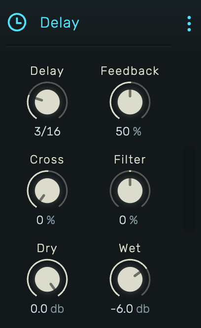

# Delay

A tempo-synced stereo delay with crossfeed for ping-pong effects and filtering in the feedback loop.

---

---

## 0. Overview

_Delay_ creates echo effects synchronized to the project tempo. Features stereo crossfeed for ping-pong patterns and a filter in the feedback path for evolving repeats.

Example uses:

- Rhythmic echoes synced to tempo
- Ping-pong delay effects
- Filtered dub delays
- Spatial enhancement

---

## 1. Delay Time

Tempo-synced delay time as a musical fraction. Available values:

| Long | Medium | Short |
|------|--------|-------|
| 1/1 | 1/6 | 1/32 |
| 1/2 | 1/8 | 1/48 |
| 1/3 | 3/32 | 1/64 |
| 1/4 | 1/12 | 1/96 |
| 3/16 | 1/16 | 1/128 |
|  | 3/64 | |
|  | 1/24 | |

Delay time updates smoothly when changed, interpolating over 0.5 seconds to avoid clicks.

---

## 2. Feedback

Amount of delayed signal fed back into the delay line. Range: 0% to 100%.

- **0%**: Single echo, no repeats
- **50%**: Moderate decay, several repeats
- **High values**: Long decay, many repeats

Note: Internal gain staging prevents runaway feedback, but high values with certain filter settings can produce sustained oscillation.

---

## 3. Cross

Stereo crossfeed amount. Range: 0% to 100%.

- **0%**: No crossfeed. Left input echoes on left, right on right.
- **50%**: Partial crossfeed. Creates stereo movement.
- **100%**: Full crossfeed. Classic ping-pong effect where echoes alternate between left and right.

---

## 4. Filter

Filter applied to the feedback signal. Range: -100% to +100%.

- **Negative values**: Low-pass filter. Repeats get progressively darker (tape/analog character).
- **0%**: No filtering. Clean repeats.
- **Positive values**: High-pass filter. Repeats get progressively thinner/brighter.

The filter uses an exponential frequency mapping from 20 Hz to 20 kHz, applied within the feedback loop so each repeat is filtered again.

---

## 5. Dry

Level of the original unprocessed signal. Range: -72 dB to 0 dB.

Set to -72 dB for a 100% wet signal, useful on send/return configurations.

---

## 6. Wet

Level of the delayed signal. Range: -72 dB to 0 dB.

Adjust relative to Dry for the desired effect intensity.

---

## 7. Technical Notes

- Delay time is recalculated when tempo changes
- Maximum delay time is 1/1 note at 30 BPM
- Interpolation prevents clicks when changing delay time during playback
