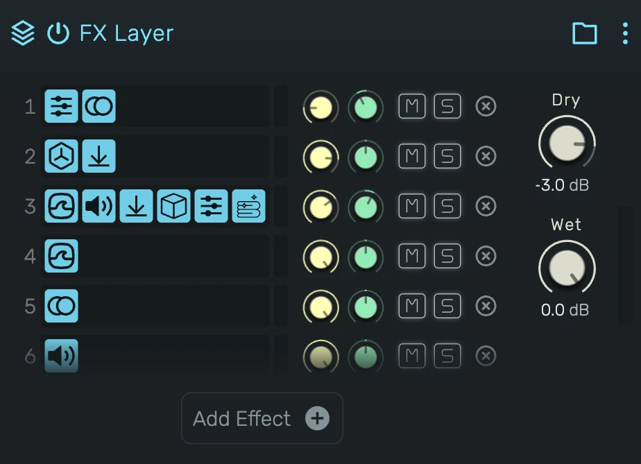

# FX Composite

Runs several effect chains in parallel and mixes them back together with a dry/wet control.

---

---

## 0. Overview

_FX Composite_ is a container that splits your signal into any number of parallel **branches**. The incoming signal is sent to every branch at once, each branch processes it through its own serial chain of effects, and their outputs are summed back into one wet signal. A dry/wet control blends that summed result against the untouched input.

Because the branches run side by side rather than one after another, you can process the same source several different ways and layer the results, without one effect feeding into the next.

Example uses:

- Parallel (New York) compression: one clean branch, one heavily compressed branch
- Layering several reverbs or delays on the same source
- Multi-tap or multi-character delays running at once

An **empty** FX Composite passes the signal through untouched, so dropping one into a chain never changes the sound until you add a branch.

---

## 1. Branches

Each row in the list is one parallel branch. A branch is a full serial effect chain: the devices inside it run one after another, and the branch as a whole runs in parallel with the others.

Every branch shows, from left to right:

- **Number** — its position in the list (1, 2, 3 …). Order is purely for your arrangement; since the branches sum in parallel, reordering them does not change the sound.
- **Device icons** — the effects currently in the branch, in chain order. An empty branch shows an empty slot.
- **Peak meter** — the branch's output level, after its own gain, pan and mute.
- **Channel controls** — gain, pan, mute and solo (see below).

Drag a branch by its icon area to reorder it.

---

## 2. Branch Controls

Each branch has its own small channel strip, matching a track header:

**Gain** — the branch's output level in decibels, applied before it enters the wet sum. Anchored at 0 dB.

**Pan** — places the branch in the stereo field, from hard left through centre to hard right.

**Mute (M)** — silences this branch's contribution to the wet sum. The other branches are untouched.

**Solo (S)** — plays only the soloed branch and silences every other branch, exactly like the mixer's solo. Solo more than one to hear several at once.

---

## 3. Add Effect

The **Add Effect** button below the list opens a menu of audio effects. Picking one creates a **new branch** holding just that effect.

You can also build branches by drag and drop (see section 6).

---

## 4. Editing a Branch

Click a branch to enter it. The device panel then shows that branch's serial chain on its own, and the header shows the composite's name as a **back** button with an arrow. Add, remove, reorder and edit devices inside the branch just like any other effect chain, then click the back button to return to the composite.

---

## 5. Dry

Level of the original, unprocessed input signal, in decibels. Turn it down to −∞ for a fully wet result, or blend some in to keep the untouched source under the parallel branches.

By default Dry is off (−∞), so you hear only the branches.

---

## 6. Wet

Level of the summed branch outputs, in decibels. This is the combined result of every branch after its own gain, pan and mute.

By default Wet is at 0 dB.

Set Dry and Wet to taste for parallel-processing blends (for example, a low Wet under a full Dry for subtle parallel compression).

---

## 7. Drag & Drop

The composite is built almost entirely by dragging:

- **From the Device Browser onto a branch** — drop on the middle of a branch to add the effect to that branch's chain; drop on its top or bottom edge to create a new branch holding it.
- **From the Device Browser onto an empty composite** — the whole body is a drop zone; the effect becomes the first branch.
- **An existing effect onto a branch** — moves that effect out of wherever it was and into the branch.
- **An effect onto the back button (inside a branch)** — moves the effect out of the branch and onto the parent chain, next to the composite.

To move an effect between two branches, move it out to the parent chain and then into the other branch.

---

## 8. Technical Notes

- The input is broadcast to every branch identically; branches never feed one another.
- Each branch's output passes through its own channel strip (gain, pan, mute) before it is summed; solo is resolved across all branches, like the mixer.
- The output is `dry · input + wet · Σ(branches)`. With Dry at −∞ and Wet at 0 dB (the default), the output is exactly the sum of the branches.
- An empty composite is a unity pass-through, so inserting one — or emptying it — never kills the chain.
- Adding, removing or muting a branch is de-clicked, so edits during playback do not pop.
- **Stereo Split** is a sibling device with the same layout, but its two fixed branches receive the left and right input channels separately instead of the full signal.
