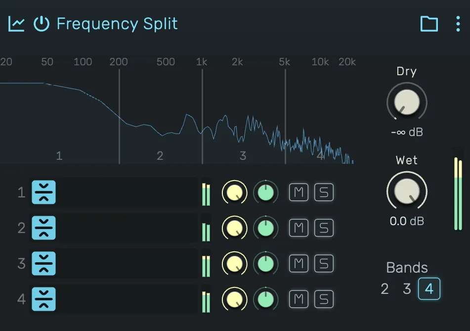

# Frequency Split

Splits the signal into frequency bands and processes each on its own effect chain, then sums them back together.

---

---

## 0. Overview

_Frequency Split_ separates the incoming signal into up to four frequency **bands**, low to high, and gives each band its own serial chain of effects. The bands are set apart by **crossovers**, the frequencies where one band ends and the next begins, and the processed bands are summed back into one signal.

The split uses Linkwitz-Riley crossovers, so with empty bands the sum reconstructs the input with a flat frequency response. That makes it the natural way to treat different parts of the spectrum independently without colouring the parts you leave alone.

Example uses:

- **Multiband compression** — a compressor on each band, so the low end can be tamed without the highs pumping, and vice versa
- Distorting or saturating only the mids while the bass and air stay clean
- Widening or panning only the high band while the low band stays mono and centred
- De-essing, band-limited delays, or reverb on a single band

Unlike the FX Composite, the bands are **fixed**: they are the frequency ranges themselves, so you cannot reorder them, and you choose how many there are (2, 3 or 4) rather than adding and removing them freely.

---

## 1. The Spectrum

The top of the device shows the input spectrum on a logarithmic frequency scale, with the range labelled above it from 20 Hz to 20 kHz.

Each **crossover** is a vertical line across the spectrum. The number at the bottom of each region is the band it belongs to, counting up from **1** (the lowest) to the highest.

- **Drag a crossover line** left or right to move that split point. The lines cannot cross each other and keep a small minimum spacing, so the bands always stay in order.
- **Double-click a crossover line** to type an exact frequency.

Moving a crossover changes where the two bands on either side of it divide the spectrum.

---

## 2. Bands

Each row in the list is one band, ordered low to high, and named by its place in the spectrum (Low, Mid, High …). A band is a full serial effect chain: the devices inside it run one after another, and the band only ever receives its own slice of the frequency range.

Every band shows its device icons, a peak meter, and its own channel controls. Because the bands are fixed there is no Add-Effect button and no reordering. You fill each band with effects and set its range with the crossovers instead.

---

## 3. Band Count

The **Bands** control below the dry/wet knobs chooses how many bands the signal is split into:

- **2** — one crossover (low / high).
- **3** — two crossovers (low / mid / high).
- **4** — three crossovers.

Adding a band introduces a new crossover and a new empty chain. Removing bands drops the highest ones. The number of crossovers is always one less than the number of bands.

---

## 4. Band Controls

Each band has its own small channel strip, matching a track header:

**Gain** — the band's output level in decibels, applied before it re-joins the sum. Anchored at 0 dB.

**Pan** — places the band in the stereo field. Useful for widening one part of the spectrum while leaving the rest centred.

**Mute (M)** — drops that band from the output entirely.

**Solo (S)** — plays only the soloed band and silences the others, so you can audition one range of the spectrum on its own.

---

## 5. Editing a Band

Click a band to enter it. The device panel then shows that band's chain on its own, with the composite's name as a **back** button in the header. Add, remove, reorder and edit devices inside the band like any other effect chain, then click the back button to return.

---

## 6. Dry

Level of the original, unprocessed input signal, in decibels. Turn it down to −∞ for a fully wet result, or blend some in to keep the untouched source under the split bands.

By default Dry is off (−∞), so you hear only the summed bands.

---

## 7. Wet

Level of the summed band outputs, in decibels, after each band's own gain, pan and mute.

By default Wet is at 0 dB.

---

## 8. Drag & Drop

- **From the Device Browser onto a band** — the effect is added to that band's chain. Because the bands are fixed, a drop never creates a new band, it always goes into the band you drop on.
- **An existing effect onto a band** — moves that effect into that band's chain.
- **An effect onto the back button (inside a band)** — moves the effect out of the band and onto the parent chain, next to the composite.

---

## 9. Technical Notes

- The bands are separated by fourth-order Linkwitz-Riley crossovers. Each already-separated lower band is passed through an allpass at every higher crossover, so the bands stay phase-aligned and their sum has a flat magnitude response.
- With empty bands the summed output is a flat, uncoloured version of the input (the split itself adds no level change).
- Each band's output passes through its own channel strip (gain, pan, mute) before the sum. Solo is resolved across all bands.
- The output is `dry · input + wet · (sum of bands)`. With Dry at −∞ and Wet at 0 dB (the default), the output is the summed bands.
- Crossover frequencies run on a fixed 20 Hz to 20 kHz scale, independent of the project sample rate.
