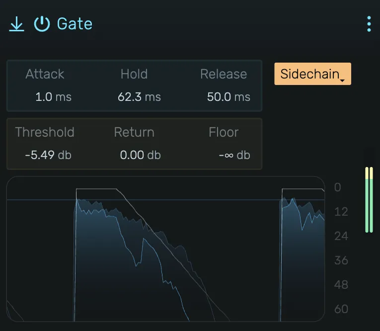

# Gate

A noise gate with hysteresis, hold time, and sidechain support for clean signal control.

---

---

## 0. Overview

_Gate_ attenuates signals that fall below a threshold, effectively silencing unwanted noise during quiet passages. Features hysteresis (return level) to prevent chattering, hold time to preserve natural decays, and external sidechain for creative gating effects.

Example uses:

- Removing background noise between vocal phrases
- Tightening drum tracks by cutting bleed
- Creating rhythmic pumping effects with sidechain
- Cleaning up guitar amp hiss during pauses

---

## 1. How It Works

The gate operates with a **dual-threshold system** (hysteresis):

1. **Opening**: When the input level rises above the **Threshold**, the gate opens
2. **Staying open**: The gate remains open as long as the level stays above **(Threshold − Return)**
3. **Closing**: The gate closes only when the level falls below **(Threshold − Return)**

This hysteresis prevents rapid opening/closing (chattering) when the signal hovers near the threshold.

### Detection Envelope

The gate uses a **peak envelope follower** for level detection:

- **Instant attack**: Transients are detected immediately with no delay
- **10ms decay**: The detection level decays smoothly, bridging the zero-crossings of the audio waveform

This ensures the gate responds to the amplitude envelope of your signal rather than individual sample values.

### Gain Envelope

When the gate opens or closes, the gain transitions smoothly according to the Attack and Release settings, preventing clicks and preserving natural dynamics.

---

## 2. Timing Controls

### 2.1 Attack

How quickly the gate opens after the signal exceeds the threshold. Range: 0 ms to 50 ms.

- **Fast (0-5 ms)**: Immediate response, preserves sharp transients
- **Slow (10+ ms)**: Gradual fade-in, softens the onset

### 2.2 Hold

Minimum time the gate stays open after triggering. Range: 0 ms to 500 ms.

Hold prevents the gate from closing during brief dips in level (like the space between drum hits). It ensures the gate stays open for at least the specified duration after opening.

- **0 ms**: Gate can close immediately when level drops
- **50-100 ms**: Good for drums, catches the full hit
- **200+ ms**: Preserves longer decays

### 2.3 Release

How quickly the gate closes after the signal falls below the return threshold. Range: 1 ms to 2000 ms.

- **Fast (1-50 ms)**: Tight gating, cuts off quickly
- **Medium (50-200 ms)**: Natural decay, good for most material
- **Slow (200+ ms)**: Gradual fade-out, preserves ambience

---

## 3. Level Controls

### 3.1 Threshold

Level above which the gate opens. Range: -60 dB to 0 dB.

Set this just above the noise floor but below the quietest signal you want to pass through.

### 3.2 Return

Hysteresis amount in dB. Range: 0 dB to 24 dB.

The gate closes when the signal falls below **(Threshold − Return)**. Higher values keep the gate open longer as the signal decays.

- **0 dB**: No hysteresis (gate closes at same level it opened)
- **6 dB**: Standard setting, prevents chattering
- **12+ dB**: Very forgiving, good for signals with wide dynamic range

### 3.3 Floor

The attenuation level when the gate is closed. Range: -∞ to 0 dB.

- **-∞**: Complete silence when closed
- **-20 to -40 dB**: Reduces noise while maintaining some ambience
- **0 dB**: Gate has no effect (bypass)

Using a floor above -∞ creates a more natural sound by allowing some bleed through rather than complete silence.

---

## 4. Sidechain

Routes an external signal to control the gate. Click to select any track's output as the detection source.

When active, the gate opens and closes based on the sidechain signal rather than the input. The input audio still passes through—only the detection is external.

Classic uses:

- Gating a synth pad with a kick drum for rhythmic pumping
- Tightening a bass guitar using the kick drum as trigger
- Creating "talkbox" effects by gating instruments with vocals

---

## 5. Visual Display

Shows the input signal level (filled area) and the gate envelope (line). The envelope visualization helps you see when the gate is open or closed and how the attack/release shapes the gain.

---

## 6. Tips

- **Start with the threshold**: Play the material and adjust threshold until the gate opens only for the sounds you want
- **Use hold for drums**: A short hold time (50-100 ms) prevents the gate from cutting off the body of drum hits
- **Return prevents chattering**: If the gate is flickering, increase the return value
- **Floor for naturalness**: Setting floor to -20 dB instead of -∞ often sounds more natural
- **Sidechain for creativity**: Try gating pads or strings with a rhythmic element for instant movement
