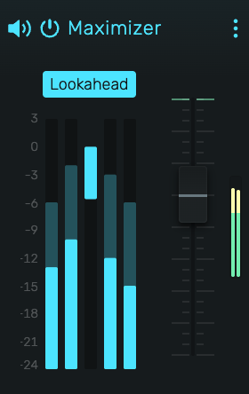

# Maximizer

A brickwall limiter with automatic makeup gain for loudness maximization.

---

---

## 0. Overview

_Maximizer_ is a peak limiter that prevents audio from exceeding -0.1 dB. It applies gain reduction when peaks exceed the threshold, then automatically boosts the output to reach the ceiling.

Example uses:

- Final limiting on the master bus
- Loudness maximization for streaming platforms
- Taming transient peaks on individual tracks

---

## 1. Threshold

Level above which limiting begins. Range: **-24 dB to 0 dB**.

Lower threshold = more limiting = louder output. Maximizer automatically applies makeup gain to bring the output up to the -0.1 dB ceiling.

---

## 2. Lookahead

Enables 5ms lookahead for the envelope detector.

- **Enabled** (default): Gain reduction begins before peaks arrive. No overshoots. Introduces 5ms latency (automatically compensated).
- **Disabled**: Zero latency. Fast transients may briefly exceed the ceiling.

---

## 3. Meters

- **Left pair**: Input level (peak and RMS)
- **Center bar**: Gain reduction (**0 dB to -24 dB**)
- **Right pair**: Output level (peak and RMS)

---

## 4. Preparing Your Mix

For Maximizer to be effective, your mix needs headroom before the limiter.

### 4.1 Peak Headroom

- **-6 dB peaks**: Good headroom for moderate limiting
- **-3 dB peaks**: Minimal headroom, aggressive limiting required
- **0 dB peaks**: No headroom, limiter cannot help

### 4.2 Spectral Separation

When multiple elements compete for the same frequencies, they stack and create peaks. A clean mix gives each element its own space:

- Use EQ to carve frequency space for each instrument
- High-pass filter elements that don't need low frequencies
- Avoid boosting the same frequencies on multiple tracks
- Pan elements to create stereo separation

---

## 5. Technical Notes

- Attack time: 5ms linear ramp (matches lookahead)
- Release time: 200ms exponential decay
- Output ceiling: -0.1 dB (prevents inter-sample clipping)
