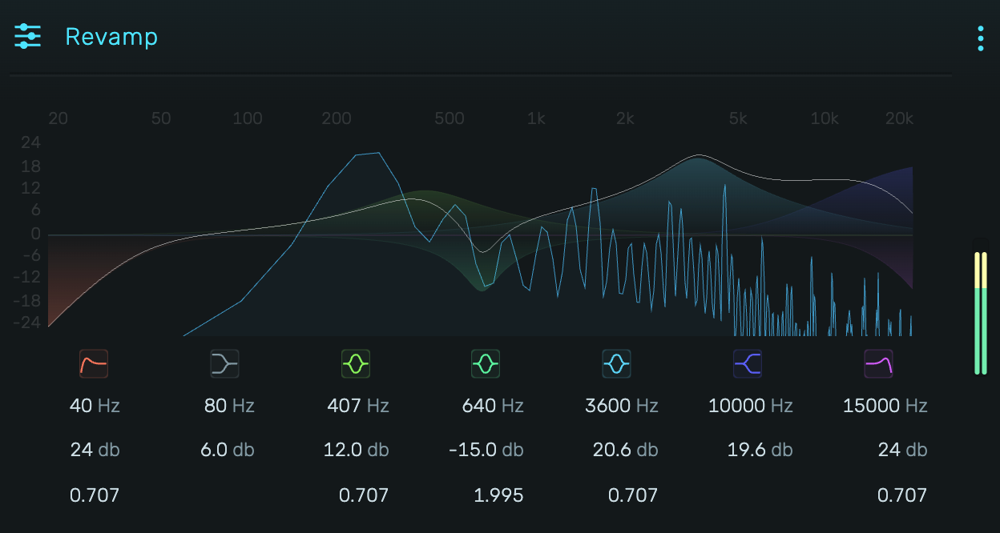

# Revamp

A 7-band parametric equalizer with real-time spectrum analysis.

---

---

## 0. Overview

_Revamp_ is a precise parametric EQ featuring a high-pass filter, low shelf, three bell filters, high shelf, and low-pass filter. Each band uses biquad IIR filtering with configurable frequency, gain, and Q parameters.

Example uses:

- Surgical frequency correction
- Tonal shaping and coloration
- Removing rumble with high-pass
- Taming harshness with high shelf
- Presence boost with bell filters

---

## 1. Band Structure

The seven bands are processed in series, left to right:

| Band | Type | Parameters |
|------|------|------------|
| 1 | High-Pass | Frequency, Q, Order |
| 2 | Low Shelf | Frequency, Gain |
| 3 | Low Bell | Frequency, Gain, Q |
| 4 | Mid Bell | Frequency, Gain, Q |
| 5 | High Bell | Frequency, Gain, Q |
| 6 | High Shelf | Frequency, Gain |
| 7 | Low-Pass | Frequency, Q, Order |

Click a band's icon to enable or disable it. Disabled bands are bypassed with zero CPU cost.

---

## 2. Parameter Ranges

### 2.1 Frequency

All bands: **20 Hz to 20,000 Hz** (exponential scaling)

### 2.2 Gain

Shelf and Bell filters: **-24 dB to +24 dB** (linear scaling)

### 2.3 Q (Resonance)

Pass and Bell filters: **0.01 to 10.0** (exponential scaling)

- **Low Q (0.01-0.5)**: Wide, gentle curves
- **Q = 0.707**: Butterworth response (maximally flat)
- **High Q (2.0-10.0)**: Narrow, surgical cuts/boosts

### 2.4 Order (Pass Filters Only)

Slope steepness for high-pass and low-pass filters:

- **12 dB/oct**: Gentle slope (1 biquad)
- **24 dB/oct**: Standard slope (2 cascaded biquads)
- **36 dB/oct**: Steep slope (3 cascaded biquads)
- **48 dB/oct**: Very steep slope (4 cascaded biquads)

---

## 3. Filter Types

### 3.1 High-Pass

Attenuates frequencies below the cutoff. Use to remove rumble, proximity effect, or unwanted low-frequency content.

### 3.2 Low Shelf

Boosts or cuts all frequencies below the cutoff by the specified gain amount. No Q parameter—uses a fixed gentle slope.

### 3.3 Bell (Peaking)

Boosts or cuts a band of frequencies centered at the cutoff frequency. The Q parameter controls bandwidth: higher Q = narrower band.

Three bell filters allow shaping low, mid, and high frequency regions independently.

### 3.4 High Shelf

Boosts or cuts all frequencies above the cutoff by the specified gain amount. No Q parameter—uses a fixed gentle slope.

### 3.5 Low-Pass

Attenuates frequencies above the cutoff. Use to tame harshness, remove hiss, or create darker tones.

---

## 4. Visual Display

### 4.1 Frequency Response Curve

The main display shows the combined frequency response of all enabled bands. The horizontal axis spans 20 Hz to 20 kHz (logarithmic). The vertical axis spans -24 dB to +24 dB.

### 4.2 Spectrum Analyzer

A real-time spectrum analyzer overlays the frequency response, showing the actual frequency content of the output signal.

### 4.3 Output Meter

The right-side meter displays the output level.

---

## 5. Technical Notes

- All filters use biquad (second-order IIR) implementation
- Pass filters cascade up to 4 biquads for steeper slopes
- Coefficients update in real-time without clicks
- Stereo processing with matched left/right channels
- Minimal latency (no linear-phase mode)
