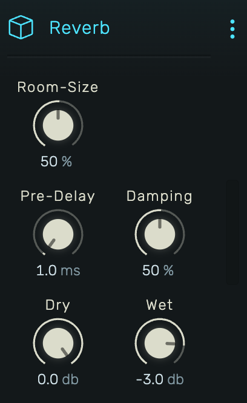

# Cheap Reverb

A lightweight algorithmic reverb based on the classic Freeverb design.

---

---

## 0. Overview

_Reverb_ adds spatial ambience using the Freeverb algorithm—a computationally efficient design using parallel comb filters and allpass diffusers. Good for general-purpose room simulation with low CPU usage.

Example uses:

- Adding room ambience to dry recordings
- Creating depth and space in a mix
- Short ambiences for drums and percussion
- Longer decays for pads and atmospheric effects

---

## 1. Room-Size

Controls the decay time of the reverb. Range: 0% to 100%.

Internally maps to feedback coefficients ranging from 0.7 to 0.98:

- **Low values (0-30%)**: Short, tight spaces
- **Medium values (30-60%)**: Natural room sizes
- **High values (60-100%)**: Large halls, long decay tails

---

## 2. Pre-Delay

Time before the first reverb reflections. Range: 1 ms to 500 ms (exponential scaling).

Pre-delay separates the dry sound from the reverb tail, helping maintain clarity:

- **Short (1-20 ms)**: Immediate ambience, sounds "attached" to the source
- **Medium (20-80 ms)**: Natural room feel, source stays distinct
- **Long (80+ ms)**: Pronounced separation, audible gap before reverb

---

## 3. Damping

High-frequency absorption in the reverb tail. Range: 0% to 100%.

Simulates how real rooms absorb high frequencies over time:

- **0%**: Bright, metallic reverb (no damping)
- **50%**: Natural room character
- **100%**: Dark, muffled reverb (heavy damping)

Higher damping values create warmer, more natural-sounding decay.

---

## 4. Dry

Level of the original unprocessed signal. Range: -72 dB to 0 dB.

---

## 5. Wet

Level of the reverb signal. Range: -72 dB to 0 dB.

For send/return configurations, set Dry to minimum and adjust Wet to taste.

---

## 6. Technical Notes

**Algorithm**: Freeverb (Jezar at Dreampoint)

- 8 parallel comb filters per channel with lowpass damping in feedback
- 4 cascaded allpass filters for diffusion
- Slightly different delay times for left and right channels create stereo width
- True stereo processing (independent L/R paths)

This is a "cheap" reverb in terms of CPU usage—ideal when you need many instances or are working on limited hardware.
