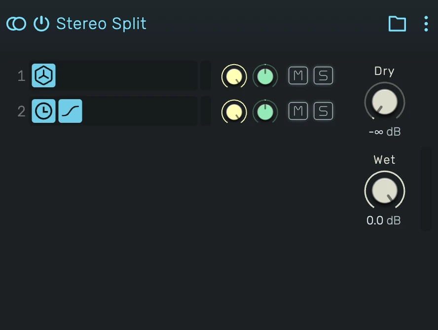

# Stereo Split

Processes the left and right channels through their own effect chains, then recombines them.

---

---

## 0. Overview

_Stereo Split_ separates the incoming stereo signal into its two channels and gives each its own serial chain of effects. The **left** input channel feeds the **L** branch, the **right** input channel feeds the **R** branch, and the two branches are summed back into one stereo signal.

Unlike the FX Composite, the branches are **fixed**: there are always exactly two, L and R, and they cannot be added, removed or reordered. Each branch is otherwise a full effect chain you build and edit yourself.

Example uses:

- Treating the left and right channels differently (different delay, filtering or drive per side)
- Asymmetric stereo effects and widening
- Fixing or exaggerating an imbalance between channels
- Per-channel distortion or saturation for an unusual stereo image

A Stereo Split with no effects in either branch recombines the channels exactly, so an empty one is a transparent pass-through.

---

## 1. Branches (L and R)

The list always holds two branches:

- **L** — the left input channel's chain.
- **R** — the right input channel's chain.

Each shows its device icons, a peak meter, and its own channel controls. Because the two are fixed, there is no Add-Effect button and no reordering — you fill each branch with effects instead.

---

## 2. Branch Controls

Each branch has its own small channel strip, matching a track header:

**Gain** — the branch's output level in decibels, applied before it re-joins the sum. Anchored at 0 dB.

**Pan** — places the branch in the stereo field. Since L and R start hard-separated, panning lets you narrow, widen or swap the sides.

**Mute (M)** — drops that channel from the output entirely (solo the other side).

**Solo (S)** — plays only the soloed branch and silences the other, so you can audition one channel's processing on its own.

---

## 3. Editing a Branch

Click the L or R branch to enter it. The device panel then shows that branch's chain on its own, with the composite's name as a **back** button in the header. Add, remove, reorder and edit devices inside the branch like any other effect chain, then click the back button to return.

---

## 4. Dry

Level of the original, unprocessed input signal, in decibels. Turn it down to −∞ for a fully wet result, or blend some in to keep the untouched source under the split channels.

By default Dry is off (−∞), so you hear only the two branches.

---

## 5. Wet

Level of the recombined branch outputs, in decibels — the summed result of the L and R chains after their own gain, pan and mute.

By default Wet is at 0 dB.

---

## 6. Drag & Drop

- **From the Device Browser onto a branch** — the effect is added to that branch's (L or R) chain. Because the two branches are fixed, a drop never creates a new branch; it always goes into the branch you drop on.
- **An existing effect onto a branch** — moves that effect into the L or R chain.
- **An effect onto the back button (inside a branch)** — moves the effect out of the branch and onto the parent chain, next to the composite.

---

## 7. Technical Notes

- The distributor feeds the L branch the left input channel and the R branch the right input channel; the branches are then summed.
- Each branch's output passes through its own channel strip (gain, pan, mute) before the sum; solo is resolved across the two branches.
- The output is `dry · input + wet · (L + R)`. With Dry at −∞ and Wet at 0 dB (the default), the output is the recombined channels.
- With empty branches the recombination is bit-identical to the input, so an empty Stereo Split is a true bypass.