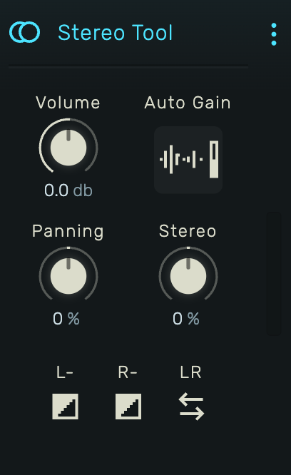

# Stereo Tool

A utility effect for adjusting volume, panning, stereo width, and channel manipulation.

---

---

## 0. Overview

_Stereo Tool_ provides essential mixing controls in one device: gain staging, stereo positioning, width adjustment, and channel operations like phase inversion and swapping.

Example uses:

- Gain staging and level matching
- Panning instruments in the stereo field
- Widening or narrowing stereo content
- Fixing phase issues
- Swapping accidentally reversed channels

---

## 1. Volume

Output gain control. Range: -72 dB to +12 dB.

Snaps to common values (0 dB, -6 dB, -12 dB, etc.) for precise gain staging.

---

## 2. Auto Gain

Automatic gain normalization. Press and hold the button while audio plays.

**How it works:**

1. Hold the button to start measuring (minimum 1 second)
2. The effect tracks the peak level during measurement
3. On release, adjusts Volume to normalize peaks to -0.1 dB
4. Maximum boost is limited to +12 dB for safety

Useful for quickly matching levels between tracks or normalizing a mix.

---

## 3. Panning

Stereo balance control. Range: -100% (full left) to +100% (full right), center at 0%.

**Panning modes** (available in device menu):

- **Linear**: Simple gain-based panning. One side gets quieter as the other gets louder.
- **Equal Power**: Maintains perceived loudness when panning. Uses sine/cosine curves for natural movement.

---

## 4. Stereo

Stereo width control. Range: -100% to +100%.

- **-100%**: Full mono (left and right summed to center)
- **0%**: Original stereo width unchanged
- **+100%**: Maximum width enhancement

Negative values narrow the stereo image toward mono. Positive values widen it by increasing the difference between left and right channels.

---

## 5. Channel Operations

### 5.1 L- (Invert Left)

Inverts the phase of the left channel (multiplies by -1). Useful for:

- Fixing out-of-phase recordings
- Creative effects when combined with other processing

### 5.2 R- (Invert Right)

Inverts the phase of the right channel.

### 5.3 LR (Swap)

Swaps left and right channels. Use to correct accidentally reversed stereo recordings or for creative mirroring effects.
