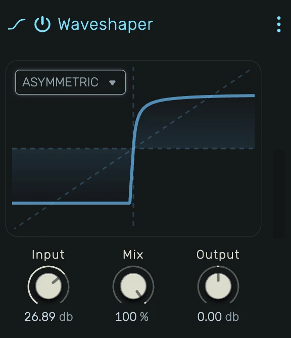

# Waveshaper

A nonlinear waveshaping distortion effect with selectable transfer functions.

---

---

## 0. Overview

_Waveshaper_ applies a nonlinear transfer function to the audio signal, reshaping its waveform to add harmonics and saturation. Unlike simple clipping, each equation produces a distinct harmonic character by bending the signal in mathematically different ways.

[Interactive graph of all equations on Desmos](https://www.desmos.com/calculator/04tpdtpkfy)

---

## 1. Equation

Transfer function selector. Choose from six waveshaping curves:

- **Hardclip**: Simple hard clipping at ±1.0. Produces odd harmonics with a harsh, buzzy character.
- **CubicSoft**: Soft clipping using a cubic polynomial. Smooth saturation with gentle harmonic content.
- **Tanh**: Hyperbolic tangent saturation. A natural-sounding soft clip widely used in analog modeling.
- **Sigmoid**: Exponential soft clipping. Similar to tanh but with a slightly different harmonic profile.
- **Arctan**: Arctangent saturation. Very smooth with a gradual onset of clipping.
- **Asymmetric**: Different behavior for positive and negative signal. Positive side saturates softly, negative side stays linear until a cubic soft-clip transition near -1.0. Produces even harmonics due to the asymmetry.

The display shows the selected transfer curve in real-time, updating as you change the equation and input gain.

---

## 2. Input Gain

Pre-gain before waveshaping. Range: **-18 dB to 18 dB**.

Controls how hard the signal is driven into the transfer function:

- **Negative values**: Signal stays in the linear center of the curve, producing subtle harmonic coloring
- **0 dB**: Unity gain, moderate saturation depending on signal level
- **Positive values**: Signal is pushed deeper into the nonlinear region, producing heavier distortion

---

## 3. Mix

Dry/wet blend. Range: **0% to 100%**.

- **0%**: Fully dry signal (bypassed)
- **50%**: Equal blend of clean and shaped signal
- **100%**: Fully processed signal

Useful for parallel distortion, where blending a small amount of shaped signal preserves dynamics while adding harmonics.

---

## 4. Output Gain

Post-gain after waveshaping. Range: **-18 dB to 18 dB**.

Compensates for level changes caused by the waveshaping and input gain. Use to match the output level to the bypassed signal.

---

## 5. Visual Display

Shows the transfer function—how input amplitude (horizontal axis) maps to output amplitude (vertical axis). The dashed diagonal line represents unity (no processing). As input gain increases, the curve deviates further from the diagonal, visualizing the amount of distortion being applied.

---

## 6. Technical Notes

- All equations map the signal symmetrically except Asymmetric, which produces even harmonics
- Smooth parameter ramping prevents clicks during automation
- Stereo processing with matched left/right channels
