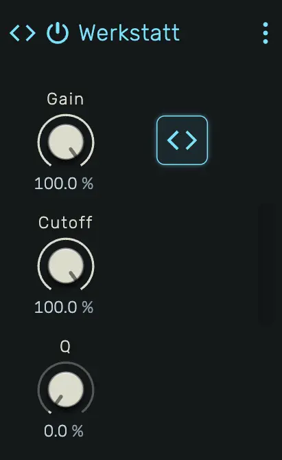

# Werkstatt

A programmable audio effect that lets you write custom DSP code in JavaScript. Define your own signal processing, declare parameters with knobs, and hot-reload changes in real time.

---



---

## 0. Overview

_Werkstatt_ is a scriptable audio effect device. You write a `Processor` class in JavaScript that receives stereo audio buffers and outputs processed audio sample by sample. Parameters declared in the code appear as automatable knobs on the device panel.

Example uses:

- Custom distortion or waveshaping
- Experimental stereo effects
- Granular or glitch processing
- Ring modulation
- Prototyping new effect ideas

---

## 1. Editor

Click the **Editor** button on the device panel to open the full-screen code editor. The editor uses Monaco (the engine behind VS Code) with JavaScript syntax highlighting.

The status bar at the bottom shows the current state:

- **Idle** — No compilation attempted yet
- **Successfully compiled** — Code compiled and loaded into the audio engine
- **Error message** — Syntax error or runtime error details

---

## 2. Parameters

Declare parameters using `// @param` comments at the top of your code:

```javascript
// @param gain 1.0
// @param mix 0.5
// @param drive 0.0
```

Each `@param` directive creates an automatable knob on the device panel. The syntax is:

```
// @param <label> [default]
```

- **label** — Parameter name (single word, no spaces). Appears on the knob.
- **default** — Optional default value between 0.0 and 1.0. Defaults to 0.0 if omitted.

Parameters are reconciled on each compile: new parameters are added, removed parameters are deleted, and existing parameters keep their current value.

---

## 3. Keyboard Shortcuts

| Shortcut            | Action                              |
|---------------------|-------------------------------------|
| `Alt+Enter`         | Compile and run                     |
| `Ctrl+S` / `Cmd+S` | Compile, run, and save to project   |

---

## 4. Safety

The engine validates your output on every audio block:

- **NaN detection** — If any output sample is NaN, the processor is silenced and the error is reported.
- **Overflow protection** — If any sample exceeds ~60 dB (amplitude > 1000), the processor is silenced.
- **Runtime errors** — If `process()` throws an exception, the processor is silenced and the error is shown.

When silenced, the device outputs silence until the next successful compile.

---

## 5. API Reference

Your code must define a `class Processor` with a `process` method. Optionally implement `paramChanged` to receive parameter updates.

### Globals

| Variable     | Type     | Description                              |
|--------------|----------|------------------------------------------|
| `sampleRate` | `number` | Audio sample rate in Hz (e.g. 44100, 48000) |

### Processor class

```javascript
class Processor {
    process(io, block) {
        // io.src[0], io.src[1] — input Float32Arrays (left, right)
        // io.out[0], io.out[1] — output Float32Arrays (left, right)
        //
        // block.s0    — first sample index to process (inclusive)
        // block.s1    — last sample index to process (exclusive)
        // block.index — block counter (increments each audio callback)
        // block.bpm   — current project tempo in beats per minute
        // block.p0    — start position in ppqn (pulses per quarter note, 480 ppqn)
        // block.p1    — end position in ppqn
        // block.flags — bitmask:
        //   1 (transporting) — transport is active
        //   2 (discontinuous) — position jumped (seek, loop restart)
        //   4 (playing)       — playback is active
        //   8 (bpmChanged)    — tempo changed this block
    }
    paramChanged(label, value) {
        // label — string matching the @param name
        // value — number between 0.0 and 1.0
    }
}
```

---

## 6. Example: Stereo Tremolo

```javascript
// @param speed 0.3
// @param depth 0.5

class Processor {
    phase = 0
    speed = 0.3
    depth = 0.5
    paramChanged(label, value) {
        if (label === "speed") this.speed = value
        if (label === "depth") this.depth = value
    }
    process({src, out}, {s0, s1}) {
        const [srcL, srcR] = src
        const [outL, outR] = out
        const freq = 0.5 + this.speed * 19.5
        const increment = freq / sampleRate
        for (let i = s0; i < s1; i++) {
            const mod = 1.0 - this.depth * (0.5 + 0.5 * Math.sin(this.phase * Math.PI * 2))
            outL[i] = srcL[i] * mod
            outR[i] = srcR[i] * mod
            this.phase += increment
            if (this.phase >= 1.0) this.phase -= 1.0
        }
    }
}
```

---

## 7. AI Prompt

Copy the following prompt into an AI assistant to get help writing Werkstatt processors:

```
You are helping the user write a DSP processor for the openDAW Werkstatt audio effect.
The user writes plain JavaScript (no imports, no modules). The code runs inside an AudioWorklet.

The code MUST define a class called `Processor` with the following interface:

class Processor {
    process(io, block) { }       // required
    paramChanged(label, value) { } // optional
}

## process(io, block)
Called on every audio block. Must fill the output buffers between s0 and s1.

io (audio buffers):
- io.src[0] — Float32Array, left input channel
- io.src[1] — Float32Array, right input channel
- io.out[0] — Float32Array, left output channel (write to this)
- io.out[1] — Float32Array, right output channel (write to this)

block (timing and transport):
- block.s0    — first sample index to process (inclusive)
- block.s1    — last sample index to process (exclusive)
- block.index — block counter (increments each audio callback)
- block.bpm   — current project tempo in beats per minute
- block.p0    — start position in ppqn (pulses per quarter note, 480 ppqn)
- block.p1    — end position in ppqn
- block.flags — bitmask of transport state:
    1 = transporting (transport is active)
    2 = discontinuous (position jumped, e.g. seek or loop restart)
    4 = playing (playback is active)
    8 = bpmChanged (tempo changed this block)

You MUST only read/write indices from s0 to s1 (exclusive). Do NOT assume the arrays
start at index 0 or that the full length is available.
Use block.bpm and block.p0/p1 for tempo-synced effects. Use block.flags to detect
transport state changes (e.g. reset phase on discontinuous).

## paramChanged(label, value)
Called when a parameter knob changes value.

- label — string, matches the name from the @param comment
- value — number between 0.0 and 1.0

## Declaring parameters
Parameters are declared as comments at the top of the file:

// @param <name> [default]

- name: single word, no spaces
- default: optional float, defaults to 0.0

Each @param creates an automatable knob on the device UI.

Examples:
// @param gain 1.0
// @param mix 0.5
// @param rate

## Globals
- sampleRate — number, the audio sample rate in Hz (e.g. 44100, 48000).
  Always use this instead of hardcoding a sample rate.

## Constraints
- Output is validated every block. NaN or amplitudes > 1000 will silence the processor.
- Do not use import/export/require. No access to DOM or fetch.
- The code runs in an AudioWorklet thread. Only AudioWorklet-safe APIs are available
  (Math, typed arrays, basic JS). No console, no setTimeout, no DOM.
- You can define and use helper classes alongside the Processor class.
- Performance matters: this runs at audio rate. Avoid allocations inside process().
  Pre-allocate buffers in the constructor or as class fields.

## Template

// @param gain 1.0

class Processor {
    gain = 1.0
    paramChanged(label, value) {
        if (label === "gain") this.gain = value
    }
    process({src, out}, {s0, s1}) {
        const [srcL, srcR] = src
        const [outL, outR] = out
        for (let i = s0; i < s1; i++) {
            outL[i] = srcL[i] * this.gain
            outR[i] = srcR[i] * this.gain
        }
    }
}
```
