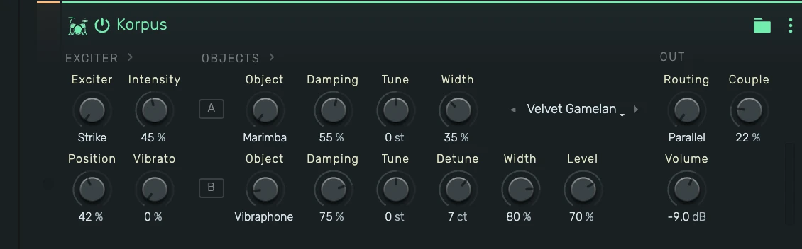

# Korpus

A physical-modelling instrument: an exciter (mallet, breath, bow, pick, or a blown pipe) drives one
or two resonating objects (bars, bells, membranes, plates, wires) that can be layered, coupled
sympathetically, or chained in series. All sound is computed from physics — no samples.

---

---

## 0. Overview

_Korpus_ follows the signal flow of a real acoustic instrument, and the panel reads the same way:
**EXCITER › OBJECTS › OUT**. Choose *how* the instrument is set in motion, choose *what* resonates,
then choose how the two objects combine.

Example uses:

- Mallet keys: marimba, vibraphone, bells, gamelan-style coupled pairs
- Bowed textures: glass-harmonica pads, bowed piano wire, singing friction drums
- Breath-driven tones with chiff and air, from ocarina-like leads to breathing pads
- Blown pipes: shakuhachi, pan and silver flutes that scoop into pitch and breathe
- Struck hybrids: a bar exciting a drumhead, a bell ringing into a cloud of piano wires
- Plucked strings from nylon warmth to stiff piano wire

---

## 1. Exciter Section

How the objects are set in motion. The **Intensity** and **Position** controls change meaning with
the exciter type.

### 1.1 Exciter

- **Strike**: a physical mallet contact — a raised-cosine force pulse with contact noise.
- **Breath**: a living breath — filtered turbulence with an attack chiff and slow drift. Sustains
  while the key is held.
- **Bow**: friction bowing with stick-slip physics. The bow finds the note like a player: a short
  scratch, then the tone locks in tune and swells. Sustains while the key is held.
- **Pick**: a plucked dual-polarization string with a resonant instrument body.
- **Wind**: a blown pipe — an air jet locked to a bore, a self-oscillating air column with the
  breath's noise living inside the tone. The pipe tunes itself in like a player, breathes in
  slow pulses, and speaks with a chiff. Sustains while the key is held.

### 1.2 Intensity

- **Strike**: mallet hardness — soft felt (long contact, dark) to hard wood (short contact, bright).
- **Breath**: breath brightness — how much high-frequency air rides the tone.
- **Bow**: bow pressure — light and airy to heavy and raspy. Heavy pressure also pulls the pitch
  slightly flat, like a real bow.
- **Pick**: pick color — dark rounded to bright attack.
- **Wind**: blowing pressure — soft and pure to loud with more air and edge.

### 1.3 Position

Where the exciter meets the object. Moving the position changes which modes speak (the classic
strike/bow/pluck-point comb). At a node of a mode, that mode disappears. For **Wind** it is the
embouchure: the jet's length against the pipe, from round and stable toward a breathier edge.

### 1.4 Vibrato

Delayed vibrato for the **Bow** and **Wind** exciters: after the note locks in tune, vibrato
ramps in with a naturally wandering rate — bowed as pitch (±15 cents), blown mostly as breath.
No effect on other exciters.

---

## 2. Objects Section

The resonators. Object **A** is always active; object **B** is optional (set its Object knob to
**Off** for a single-object voice — the rest of the B row dims while off). The **Bow** plays
object A only. For **Wind**, object A picks the pipe's construction instead — bamboo (Marimba),
silver (Vibraphone), metal whistle (Bell), husky (Membrane), breath-forward (Plate), reedy
(Piano Wire) — and object B is inactive.

### 2.1 Object

The material and geometry, each with its own mode ratios and frequency-dependent decay laws:

- **Marimba**: deep-arch bar tuned 1:4:9.2 — woody, fast highs
- **Vibraphone**: bar tuned 1:4:10 with long, glassy sustain
- **Bell**: minor-third church-bell partials with a deep hum tone
- **Membrane**: circular drumhead (Bessel modes), fast decay
- **Plate**: dense, slightly irregular metallic spectrum
- **Piano Wire**: stiff string with stretched harmonics

### 2.2 Damping

Overall decay time, scaled through each material's own decay-vs-frequency law: low values choke the
object, high values let it ring. Bowing feeds on resonance — with the Bow exciter, higher damping
values make the tone bloom more readily.

### 2.3 Tune / Detune

- **Tune**: transposes the object in semitones (±24). Tune B an octave up for halo layers, or down
  for body and weight.
- **Detune** (B only): offsets object B in cents (±25). A few cents against object A produces slow,
  musical beating — the heart of gamelan-style pairs.

### 2.4 Width

Stereo spread of the object's modes. Each mode sits at its own place in the stereo field; width
scales how far they spread. With the **Pick** exciter, Width spreads the string's two
polarizations across the channels instead.

### 2.5 Level (B only)

How strongly the exciter drives object B (parallel routing), or the level of object B's response
(serial routing).

---

## 3. Out Section

### 3.1 Routing

- **Parallel**: the exciter drives both objects side by side — layering.
- **Serial**: the exciter drives object A, and A's vibration drives object B — like a string
  mounted on a soundboard, or a bar over a drum. Object B rings on after A decays.

### 3.2 Couple

Sympathetic coupling between the two objects (parallel routing). Modes of A and B that are close in
frequency repel and exchange character — pairs beat, decays become two-staged, doublets shimmer.
Small amounts (10–25 %) give piano-like slow beating; larger amounts give gong-like split partials.

### 3.3 Volume

Output level in dB.

---

## 4. Factory Presets

The preset strip on the panel browses eighteen factory patches covering every exciter and
routing: step with the ◂ ▸ arrows, or click the name to pick from the full list (the current
patch is checked). The same list lives in the device menu (⋮ in the device header) under
**Presets**: _Velvet Gamelan_, _Log & Skin_, _Foundry Kit_, _Twin Nylon_, _Rosin & Ivory_,
_Glass Chapel_, _Ocarina Moon_, _Cathedral of Wires_, _Seance Drum_ and _Vesper Choir_, the
blown pipes _Pan Flute_, _Shakuhachi_ and _Silver Flute_, plus _Koto Steps_, _Tank Drum_,
_Whistle Wind_, _Moon Bow_ and _First Frost_. Loading a preset is
a single undoable edit that silences any sounding notes at once, and the strip reads _Custom_ as
soon as any knob leaves the preset.

---

## 5. Playing Tips

- Knobs are live on sounding notes: Damping chokes or opens a ringing object, Tune and Detune
  glide it, Width re-spreads it, Level rides object B, and Intensity changes the breath's air or
  the bow's pressure mid-note. The exciter type, Objects, Routing and Couple set the instrument's
  construction, so they apply from the next note.
- Velocity morphs the exciter, not just the level: harder strikes shorten the mallet contact
  (brighter), faster bow strokes speak sooner.
- The engine renders dry. For the classic "in a room" presentation, add a reverb send at roughly
  15–25 % wet.
- Bowed and breath notes have a musical attack — give them a moment to speak, and let releases
  ring: bowed objects return to their natural decay the instant the bow lifts.
