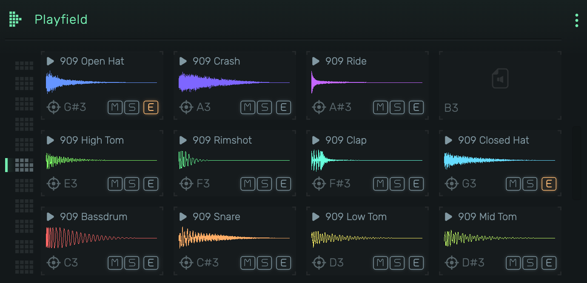
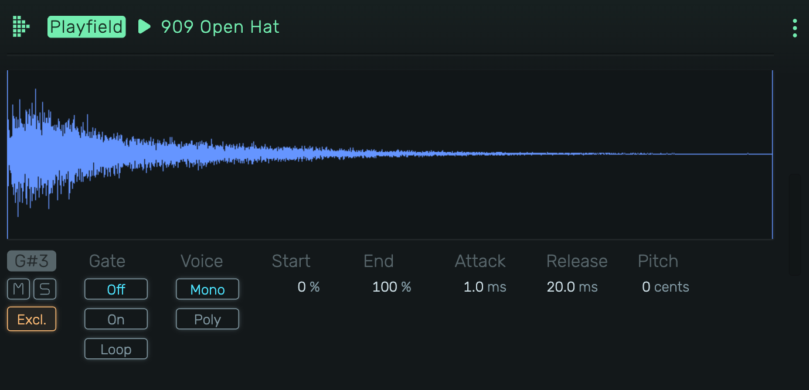

# Playfield

A sample-based drum machine and sampler with a grid of pads, each mapped to a MIDI note. Load samples, trigger them via MIDI or mouse, and shape each sound individually.

---

---

## 0. Overview

_Playfield_ organizes samples in a grid layout, with each pad assigned to a specific MIDI note. Drag samples onto pads, preview them with a click, and fine-tune playback parameters in the sample editor.

Example uses:

- Drum kits with per-sample control
- One-shot sound effects and stingers
- Chromatic sampling across multiple notes
- Layered percussion with exclusive groups

---

## 1. Grid View

The main interface showing all sample pads in a 4x3 grid (one octave).

### 1.1 Sample Pad

Each pad displays:

- **Header**: Play icon and sample name (click to preview)
- **Waveform**: Visual representation of the sample with playback position
- **Note**: MIDI note assignment (e.g., C3, D#4)
- **M** (Mute): Silences the pad
- **S** (Solo): Solos the pad, muting all others
- **E** (Exclusive): Enables exclusive group mode. When active, triggering this pad stops other exclusive pads.
- **Target icon**: Opens the sample editor. Highlighted orange when audio effects are applied.

### 1.2 Loading Samples

- **Drag & drop**: Drop audio files directly onto empty or occupied pads
- **Move samples**: Drag a sample from one pad to another to rearrange
- **Move to another octave**: Drag a sample over the octave dots on the left, hold until the octave switches, then drop on any pad
- **Context menu**: Right-click a pad to browse for samples
- **Delete**: Select a pad and press Delete to remove the sample

### 1.3 Previewing

Click the header area (play icon + name) to trigger the sample. Release to stop (respects gate settings).

### 1.4 Octave Navigation

Use the octave selector to view different octave ranges. Each octave shows 12 pads (C through B).

---

## 2. Sample Editor

Click the {icon:Focus} icon on any pad to open the detailed sample editor.

---

---

### 2.1 Waveform Display

Large waveform view with draggable start and end markers. The colored vertical line shows the current playback position.

- **Drag left marker**: Adjust sample start point
- **Drag right marker**: Adjust sample end point

### 2.2 Note Assignment

Displays the MIDI note this pad responds to (e.g., G#3). This is determined by the pad's position in the grid.

### 2.3 Mute / Solo

- **M** (Mute): Silences this sample
- **S** (Solo): Solos this sample, muting all other pads

### 2.4 Excl. (Exclusive Group)

When enabled, this sample belongs to an exclusive group. Triggering any sample in the group stops all other samples in the same group. Classic use: open and closed hi-hats.

### 2.5 Gate

Controls how the sample responds to note-on/note-off:

- **Off**: Sample plays to completion regardless of note length
- **On**: Sample stops when note is released
- **Loop**: Sample loops while note is held

### 2.6 Voice

- **Mono**: Only one instance plays at a time (re-triggering restarts)
- **Poly**: Multiple overlapping instances can play simultaneously

### 2.7 Start

Sample start position as percentage (0-100%). Use to skip the beginning of a sample.

### 2.8 End

Sample end position as percentage (0-100%). Use to cut off the tail of a sample.

### 2.9 Attack

Fade-in time when the sample starts. Prevents clicks and creates smoother entrances.

### 2.10 Release

Fade-out time when the sample stops (via gate or reaching the end). Smooths out the tail.

### 2.11 Pitch

Pitch adjustment in cents (-100 to +100). Use for fine-tuning or subtle detuning effects.
