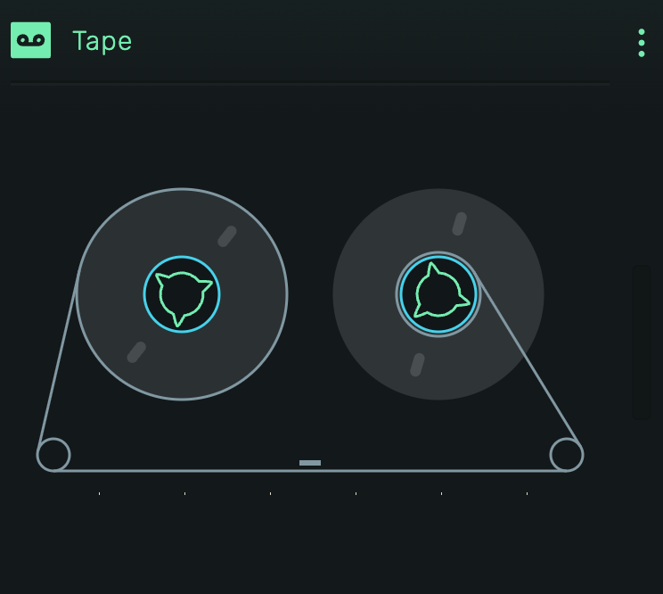

# Tape

A tape machine playback instrument that visualizes audio regions from the track as a vintage reel-to-reel recorder.

---

---

## 0. Overview

_Tape_ plays audio regions placed on its track, displaying the playback as a classic tape machine with spinning reels. Unlike MIDI-triggered instruments, Tape responds to audio clips in the timeline.

Example uses:

- Visual feedback for audio playback
- Nostalgic tape machine aesthetic
- Audio region visualization

---

## 1. Display

### 1.1 Reels

Two tape reels that rotate during playback. The left reel (supply) decreases in size as the right reel (take-up) grows, simulating tape transfer.

### 1.2 Tape Path

The tape runs from the left reel, through guide pins at the bottom, past the playback head, and onto the right reel.

### 1.3 Playback Head

The small horizontal bar between the reels. Lights up when an audio region is currently playing.

---

## 2. Usage

1. Add audio regions to the Tape track in the timeline
2. Press play to watch the tape machine animate
3. The reels rotate in sync with the transport position
