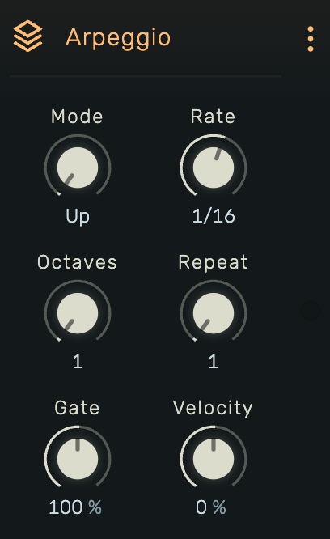

# Arpeggio

A tempo-synced arpeggiator that cycles through held notes in various patterns.

---

---

## 0. Overview

_Arpeggio_ transforms held chords into rhythmic note sequences. Hold any combination of notes and the arpeggiator plays them one at a time in the selected pattern, synced to the project tempo.

Example uses:

- Classic synth arpeggios
- Rhythmic chord breakups
- Sequenced bass lines from held notes
- Trance gates and rhythmic patterns

---

## 1. Mode

Arpeggio playback direction. Options: **Up**, **Down**, **UpDown**.

- **Up**: Plays notes from lowest to highest pitch, then repeats
- **Down**: Plays notes from highest to lowest pitch, then repeats
- **UpDown**: Plays up then down in a ping-pong pattern (top and bottom notes are not repeated at the turn)

---

## 2. Rate

Step rate as a tempo-synced fraction. Available values:

| Long | Medium | Short |
|------|--------|-------|
| 1/1 | 1/6 | 1/32 |
| 1/2 | 1/8 | 1/48 |
| 1/3 | 3/32 | 1/64 |
| 1/4 | 1/12 | 1/96 |
| 3/16 | 1/16 | 1/128 |
|  | 3/64 | |
|  | 1/24 | |

---

## 3. Octaves

Octave range extension. Range: **1 to 5**.

- **1**: Plays only the held notes
- **2-5**: Extends the pattern across multiple octaves

With Octaves set to 2 and Mode set to Up, the arpeggiator plays through all held notes, then shifts up an octave and plays them again, then repeats from the original octave.

---

## 4. Repeat

Note repetition count. Range: **1 to 16**.

How many times each note plays before the arpeggiator advances to the next note in the sequence:

- **1**: Each note plays once
- **2+**: Each note repeats before moving to the next

Useful for creating stuttering or rhythmic emphasis patterns.

---

## 5. Gate

Note length as a percentage of the step rate. Range: **0% to 200%**.

- **< 100%**: Staccato, notes are shorter than the step
- **100%**: Notes fill exactly one step (legato)
- **> 100%**: Notes overlap into the next step

---

## 6. Velocity

Velocity scaling. Range: **-100% to +100%** (displayed as 0% to 100%).

Controls how the output velocity relates to the input note velocities:

- **-100% (displayed 0%)**: All notes play at full velocity (127), ignoring input
- **0% (displayed 50%)**: Blend of fixed and original velocity
- **+100% (displayed 100%)**: Notes retain their original input velocity

---

## 7. Technical Notes

- Arpeggio pattern syncs to transport position
- Notes are sorted by pitch for consistent pattern ordering
- UpDown mode sequence length: `(notes × octaves × 2) - 2` to avoid repeating endpoints
