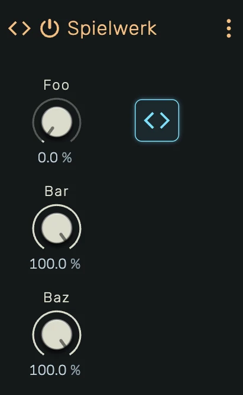

# Spielwerk

A programmable MIDI effect that lets you write custom note transformations in JavaScript. Filter, reshape, generate, or delay notes — declare parameters with knobs and hot-reload changes in real time.

---



---

## 0. Overview

_Spielwerk_ is a scriptable MIDI effect device. You write a `Processor` class in JavaScript that receives incoming notes and yields transformed or new notes. Parameters declared in the code appear as automatable knobs on the device panel.

Example uses:

- Custom velocity curves and mapping
- Pitch transposition and micro-tuning
- Chord generators
- Arpeggiators and step sequencers
- Probability-based note filtering
- Note echo and delay
- Humanization and timing randomization

---

## 1. Editor

Click the **Editor** button on the device panel to open the full-screen code editor. The editor uses Monaco (the engine behind VS Code) with JavaScript syntax highlighting.

The status bar at the bottom shows the current state:

- **Idle** — No compilation attempted yet
- **Successfully compiled** — Code compiled and loaded into the engine
- **Error message** — Syntax error, runtime error, or validation failure

---

## 2. Parameters

Declare parameters using `// @param` comments at the top of your code:

```javascript
// @param amount 0.5
// @param chance 1.0
// @param offset
```

Each `@param` directive creates an automatable knob on the device panel. The syntax is:

```
// @param <label> [default]
```

- **label** — Parameter name (single word, no spaces). Appears on the knob.
- **default** — Optional default value between 0.0 and 1.0. Defaults to 0.0 if omitted.

Parameters are reconciled on each compile: new parameters are added, removed parameters are deleted, and existing parameters keep their current value.

---

## 3. Keyboard Shortcuts

| Shortcut            | Action                              |
|---------------------|-------------------------------------|
| `Alt+Enter`         | Compile and run                     |
| `Ctrl+S` / `Cmd+S` | Compile, run, and save to project   |

---

## 4. Safety

The engine validates every note your code yields:

- **Pitch range** — Must be 0–127. Out-of-range values silence the processor.
- **Velocity range** — Must be 0.0–1.0. Out-of-range values silence the processor.
- **Duration** — Must be positive. Zero or negative durations silence the processor.
- **Position** — Must not be in the past (before block start). Past positions silence the processor.
- **NaN detection** — If any note property is NaN, the processor is silenced.
- **Note flood** — Maximum 128 notes per block. Exceeding this silences the processor.
- **Scheduler overflow** — Maximum 128 future-scheduled notes. Exceeding this silences the processor.
- **Runtime errors** — If `processNotes()` throws, the processor is silenced.

When silenced, all active notes are released and the device passes nothing until the next successful compile.

---

## 5. API Reference

Your code must define a `class Processor` with a generator method `processNotes`. Optionally implement `paramChanged` to receive parameter updates.

### Processor class

```javascript
class Processor {
    * processNotes(block, notes) {
        // block.from  — start position in ppqn (inclusive)
        // block.to    — end position in ppqn (exclusive)
        // block.bpm   — current project tempo in BPM
        // block.flags — bitmask:
        //   1 (transporting)  — transport is active
        //   2 (discontinuous) — position jumped (seek, loop restart)
        //
        // notes — iterator of upstream note starts in [from, to)
        // Each note: { position, duration, pitch, velocity, cent }
        //
        // Yield notes with: { position, duration, pitch, velocity, cent }
        // - position in [from, to) → emitted immediately
        // - position >= to → held in scheduler, emitted in a future block
        // - position < from → ERROR (note in the past)
        for (const note of notes) {
            yield note // passthrough
        }
    }
    paramChanged(label, value) {
        // label — string matching the @param name
        // value — number between 0.0 and 1.0
    }
    reset() {
        // optional — called on transport jump (seek, loop restart)
        // use to clear accumulated state like held note arrays
    }
}
```

### Note properties

| Property   | Type     | Range     | Description                           |
|------------|----------|-----------|---------------------------------------|
| `position` | `number` | ppqn      | Start position (480 ppqn per quarter) |
| `duration` | `number` | ppqn      | Note length                           |
| `pitch`    | `number` | 0–127     | MIDI note number                      |
| `velocity` | `number` | 0.0–1.0   | Note velocity                         |
| `cent`     | `number` | any       | Fine pitch offset in cents            |

### Future scheduling

Notes with `position >= block.to` are not emitted immediately. They are held in an internal scheduler and emitted automatically when the transport reaches their position in a later block. This enables effects like echo/delay and humanizers that shift notes across block boundaries.

### State across blocks

Your processor instance persists across blocks. Use class fields to track state:

```javascript
class Processor {
    held = []    // survives between blocks
    counter = 0  // survives between blocks
    * processNotes(block, notes) { ... }
}
```

State is reset when the code is recompiled (a new instance is created).

---

## 6. Examples

### Passthrough

```javascript
class Processor {
    * processNotes(block, notes) {
        for (const note of notes) {
            yield note
        }
    }
}
```

### Velocity Curve

```javascript
// @param target 0.5
// @param strength 0.0
// @param mix 1.0

class Processor {
    target = 0.5
    strength = 0
    mix = 1
    paramChanged(label, value) {
        if (label === "target") this.target = value
        if (label === "strength") this.strength = value
        if (label === "mix") this.mix = value
    }
    * processNotes(block, notes) {
        for (const note of notes) {
            const magnet = note.velocity + (this.target - note.velocity) * this.strength
            const velocity = note.velocity * (1 - this.mix) + Math.max(0, Math.min(1, magnet)) * this.mix
            yield { ...note, velocity }
        }
    }
}
```

### Pitch Shift

```javascript
// @param semitones 0.5

class Processor {
    semitones = 0
    paramChanged(label, value) {
        if (label === "semitones") this.semitones = Math.round(value * 24 - 12)
    }
    * processNotes(block, notes) {
        for (const note of notes) {
            yield { ...note, pitch: note.pitch + this.semitones }
        }
    }
}
```

### Chord Generator

```javascript
// @param mode 0.0

class Processor {
    chords = [[0, 4, 7], [0, 3, 7], [0, 4, 7, 11], [0, 3, 7, 10]]
    mode = 0
    paramChanged(label, value) {
        if (label === "mode") this.mode = Math.floor(value * this.chords.length * 0.999)
    }
    * processNotes(block, notes) {
        for (const note of notes) {
            for (const interval of this.chords[this.mode]) {
                yield { ...note, pitch: note.pitch + interval }
            }
        }
    }
}
```

### Probability Gate

```javascript
// @param chance 0.5

class Processor {
    chance = 0.5
    paramChanged(label, value) {
        if (label === "chance") this.chance = value
    }
    * processNotes(block, notes) {
        for (const note of notes) {
            if (Math.random() < this.chance) {
                yield note
            }
        }
    }
}
```

### Echo / Note Delay

```javascript
// @param repeats 0.25
// @param delay 0.25
// @param decay 0.7

class Processor {
    repeats = 3
    delay = 120
    decay = 0.7
    paramChanged(label, value) {
        if (label === "repeats") this.repeats = Math.round(value * 7) + 1
        if (label === "delay") this.delay = Math.round(24 + value * 456)
        if (label === "decay") this.decay = value
    }
    * processNotes(block, notes) {
        for (const note of notes) {
            for (let i = 0; i < this.repeats; i++) {
                yield {
                    ...note,
                    position: note.position + i * this.delay,
                    velocity: note.velocity * Math.pow(this.decay, i)
                }
            }
        }
    }
}
```

Future repeats are automatically scheduled and emitted in the correct block.

### Humanizer

```javascript
// @param timing 0.2
// @param velRange 0.3

class Processor {
    timing = 10
    velRange = 0.1
    paramChanged(label, value) {
        if (label === "timing") this.timing = value * 50
        if (label === "velRange") this.velRange = value * 0.3
    }
    * processNotes(block, notes) {
        for (const note of notes) {
            yield {
                ...note,
                position: note.position + Math.random() * this.timing,
                velocity: Math.max(0, Math.min(1, note.velocity + (Math.random() - 0.5) * this.velRange))
            }
        }
    }
}
```

### Arpeggiator

```javascript
// @param rate 0.25
// @param gate 0.8

class Processor {
    rate = 120
    gate = 0.8
    held = []
    paramChanged(label, value) {
        if (label === "rate") this.rate = Math.round(24 + value * 456)
        if (label === "gate") this.gate = 0.1 + value * 0.9
    }
    reset() {
        this.held = []
    }
    activeAt(position) {
        return this.held
            .filter(note => note.position <= position && position < note.position + note.duration)
            .sort((noteA, noteB) => noteA.pitch - noteB.pitch)
    }
    * processNotes(block, notes) {
        for (const note of notes) {
            this.held.push(note)
        }
        this.held = this.held.filter(note => note.position + note.duration > block.from)
        const duration = Math.max(1, Math.floor(this.rate * this.gate))
        let index = Math.ceil(block.from / this.rate)
        let position = index * this.rate
        while (position < block.to) {
            const stack = this.activeAt(position)
            if (stack.length > 0) {
                const source = stack[index % stack.length]
                yield { position, duration, pitch: source.pitch, velocity: source.velocity, cent: source.cent }
            }
            position = ++index * this.rate
        }
    }
}
```

---

## 7. AI Prompt

Copy the following prompt into an AI assistant to get help writing Spielwerk processors:

```
You are helping the user write a MIDI effect processor for the openDAW Spielwerk device.
The user writes plain JavaScript (no imports, no modules). The code runs inside an AudioWorklet.

The code MUST define a class called `Processor` with the following interface:

class Processor {
    * processNotes(block, notes) { }   // required, generator function
    paramChanged(label, value) { }     // optional
    reset() { }                        // optional, called on transport jump
}

## processNotes(block, notes)
A generator function called on every audio block. Receives upstream notes and yields output notes.

block (timing and transport):
- block.from  — start position in ppqn, inclusive (480 ppqn = 1 quarter note)
- block.to    — end position in ppqn, exclusive
- block.bpm   — current project tempo in beats per minute
- block.flags — bitmask of transport state:
    1 = transporting (transport is active)
    2 = discontinuous (position jumped, e.g. seek or loop restart)

notes (upstream note starts):
- An iterator of note objects in the range [block.from, block.to)
- Each note has: { position, duration, pitch, velocity, cent }
  - position: number (ppqn) — when the note starts
  - duration: number (ppqn) — how long the note lasts
  - pitch: number (0–127) — MIDI note number
  - velocity: number (0.0–1.0) — note velocity
  - cent: number — fine pitch offset in cents

You MUST yield note objects with the same shape: { position, duration, pitch, velocity, cent }

Position rules:
- position >= block.from and < block.to → emitted immediately
- position >= block.to → held in an internal scheduler and emitted in the correct future block
- position < block.from → ERROR, the processor will be silenced

You can yield zero notes (filter), the same note modified (transform), or multiple notes
per input (generator). You can also yield notes not derived from any input.

## paramChanged(label, value)
Called when a parameter knob changes value.
- label — string, matches the name from the @param comment
- value — number between 0.0 and 1.0

## Declaring parameters
Parameters are declared as comments at the top of the file:

// @param <name> [default]

- name: single word, no spaces
- default: optional float between 0.0 and 1.0, defaults to 0.0

Each @param creates an automatable knob on the device UI.

Examples:
// @param amount 0.5
// @param chance 1.0
// @param rate

## reset()
Optional. Called when the transport jumps (seek, loop restart — discontinuous flag).
Use to clear accumulated state like held note arrays. If not implemented, the host
still clears its own internal state (retainer, scheduler), but YOUR state persists.

## State
The Processor instance persists across blocks. Use class fields to store state
(e.g., held notes for an arpeggiator, counters, buffers). State is reset on recompile.
Implement reset() to clear state on transport jumps.

## Constraints
- Notes are validated every block. Invalid pitch (outside 0-127), velocity (outside 0-1),
  NaN values, negative duration, or position in the past will silence the processor.
- Maximum 128 notes per block. Exceeding this will silence the processor.
- Maximum 128 scheduled (future) notes. Exceeding this will silence the processor.
- Do not use import/export/require. No access to DOM or fetch.
- The code runs in an AudioWorklet thread. Only AudioWorklet-safe APIs are available
  (Math, typed arrays, basic JS). No console, no setTimeout, no DOM.
- You can define and use helper classes alongside the Processor class.

## Template

// @param amount 0.5

class Processor {
    amount = 0.5
    paramChanged(label, value) {
        if (label === "amount") this.amount = value
    }
    * processNotes(block, notes) {
        for (const note of notes) {
            yield { ...note, velocity: note.velocity * this.amount }
        }
    }
}
```
