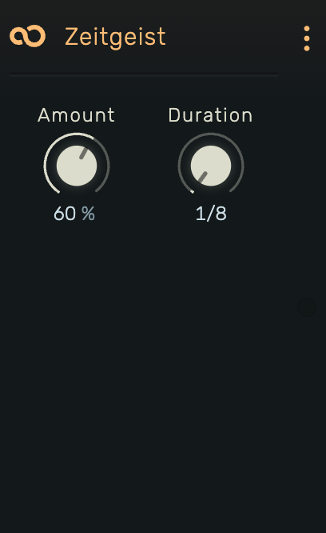

# Zeitgeist

A groove/shuffle effect that applies swing timing to MIDI notes.

---

---

## 0. Overview

_Zeitgeist_ applies shuffle or swing feel to MIDI notes by time-warping their positions. Offbeat notes are pushed later in time, creating the characteristic "swing" or "groove" feel found in jazz, funk, and electronic music.

Example uses:

- Adding swing to quantized drums
- Creating shuffle feel on hi-hats
- Humanizing rigid sequences
- Genre-specific groove patterns

---

## 1. Amount

Shuffle intensity. Range: **0% to 100%**.

Controls the timing shift of offbeat notes:

- **0%**: Maximum pull (offbeats shifted earlier)
- **50%**: No change (straight timing)
- **60-70%**: Classic shuffle/swing feel
- **100%**: Maximum push (offbeats delayed toward the following beat)

Values below 50% pull offbeats earlier, values above 50% push them later. The timing curve uses smooth easing for natural-feeling grooves.

---

## 2. Duration

Grid size for the shuffle pattern. Available values:

**1/8**, **1/4**, **1/2**, **1/1**, **2/1**, **4/1**, **8/1**, **16/1**

Determines which notes are considered "offbeats":

- **1/8**: Shuffles eighth notes (most common for swing)
- **1/4**: Shuffles quarter notes
- **1/2**: Shuffles half notes
- **Larger values**: Affects longer time spans

For example, with Duration set to 1/8, the offbeat semiquaver (16th note) within each eighth note gets shifted.

---

## 3. Technical Notes

- Uses Möbius easing function for smooth time warping
- Only note positions are affected, durations remain unchanged
- Works with any MIDI source (clips, live input, other MIDI effects)
- Groove is applied in real-time during playback
