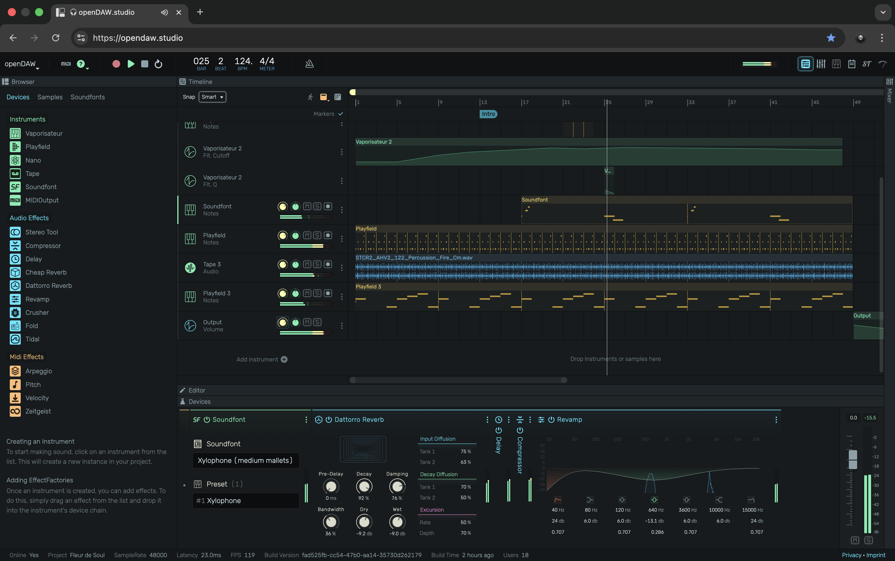

# openDAW

openDAW ist eine browserbasierte Digital Audio Workstation, die mit klarem Fokus auf Bildung, Datenschutz und Offenheit
entwickelt wurde.
Sie ermöglicht professionelle Musikproduktion im Unterricht ohne Account, ohne Registrierung, ohne Tracking und ohne
Abhängigkeit von kommerziellen Plattformen.

## Vorteile von openDAW

### Open-Source Musikproduktion für Bildungseinrichtungen

openDAW ist Open Source und kann vollständig unter eigener Kontrolle betrieben werden. Damit eignet sich die Plattform
besonders für Musikschulen, Verbände und öffentliche Bildungsträger, die Wert auf Datenschutz, Nachhaltigkeit und
technische Souveränität legen.

### Pädagogische Kernfeatures von openDAW

openDAW wurde so gestaltet, dass musikalische Konzepte sichtbar, hörbar und nachvollziehbar werden.
Der Fokus liegt nicht auf Presets oder Abkürzungen, sondern auf Verstehen, Experimentieren und Gestalten.

### Open Source, Datenschutz und Kontrolle

* Open Source (AGPL), Quellcode vollständig einsehbar und auditierbar
* Keine Benutzerkonten erforderlich
* Keine personenbezogenen Daten
* Keine Tracking- oder Analyse-Dienste
* Betrieb unter eigener Infrastruktur möglich

### Projektbasiertes Arbeiten

* Musik entsteht in klar abgegrenzten Projekten
* Projekte lassen sich speichern, teilen und weiterentwickeln
* Ideal für Aufgaben, Workshops und Gruppenarbeit

### Keine Ablenkung durch soziale oder kommerzielle Mechaniken

* Keine Social-Feeds
* Keine Likes, Rankings oder Veröffentlichungszwang
* Kein Gamification-Druck

### Vergleichstabelle zu anderer Musikproduktions-Software

| Kriterium                                          | openDAW | BandLab | Soundtrap | Ableton Live |
|----------------------------------------------------|---------|---------|-----------|--------------|
| Einstieg ohne Account möglich                      | ✓       | –       | –         | –            |
| Sofort arbeitsfähig im Browser                     | ✓       | ✓       | ✓         | –            |
| Keine personenbezogenen Daten nötig                | ✓       | –       | –         | △            |
| DSGVO-freundlich im Unterricht einsetzbar          | ✓       | △       | –         | △            |
| Volle Datensouveränität                            | ✓       | –       | –         | ✓            |
| Open Source                                        | ✓       | –       | –         | –            |
| Self-hosting möglich                               | ✓       | –       | –         | –            |
| Integration in bestehende Systeme (z.B. Nextcloud) | ✓       | –       | –         | –            |
| Keine Installation oder Lizenzverwaltung           | ✓       | –       | –         | –            |
| Plattformunabhängig (Browser)                      | ✓       | ✓       | ✓         | –            |
| Für Bildungsarbeit konzipiert                      | ✓       | △       | △         | –            |

### Legende

* ✓ = voll erfüllt
* △ = eingeschränkt / abhängig vom Setup
* – = nicht vorgesehen