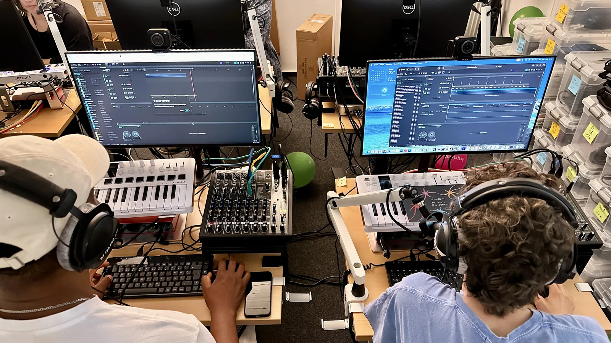

# Education

openDAW is built with a strong focus on education. It is free to use, needs no account, and runs on any modern browser, which makes it well suited for classrooms and self-study.

## For learners

Start from an empty project or take apart one of the demo tracks to see how a finished piece is put together. Because the whole studio is open, you can inspect every device and setting as you go.

## For educators

There is nothing to install or license, and no student data leaves the device. Read more about the education program at [opendaw.org/education](https://opendaw.org/education).
