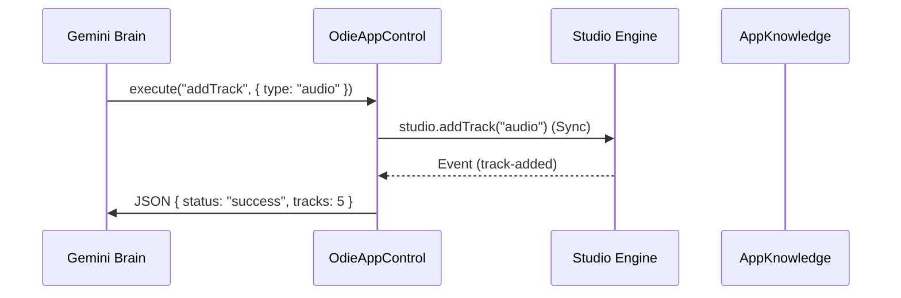

# 🎮 App Control Interface (OdieAppControl)

> **Package**: `@app/studio/ui/odie/services`
> **Stability**: 🟢 Stable
> **Complexity**: High
> **Last Audit**: 2026-01-05

The `OdieAppControl` service is the verified command execution layer for the Odie AI subsystem. It serves as the "Hands" of the AI, translating natural language intent into precise, verifiable state mutations within the OpenDAW Studio engine.

---

## 📘 1. Concepts & Architecture

### The "Command & Event" Loop
Odie operates on a high-velocity **Command & Event** architecture. While early alpha versions used polling (waiting for state to change), the modern system (v2.0+) relies on **Optimistic Execution** and **Event Notification**.

#### Architecture Model


### Optimistic Execution
Most Studio actions (like adding a track or changing BPM) are **Synchronous** in the engine core. This means we don't need to "wait" for them to happen—they happen instantly. We simply fire the command and notify the user.

---

## 📖 2. API Reference

### A. Track Management

#### `addTrack(type: TrackType, name?: string)`
Creates a new track in the main sequencer.
*   **Verification**: Implicit (Synchronous).
*   **Event**: Emits `track-added` notification to `odieEvents`.

#### `deleteTrack(target: number | "selected")`
Removes a track.
*   **Verification**: Implicit.

### B. Transport Control

#### `setTransport(state: TransportState)`
Controls the global playback engine.
*   **Behavior**: Idempotent.

### C. Region Editing

#### `splitRegion(time?: number)`
Splits the **currently selected** region.
*   **Verification**: Implicit.

---

## 💪 3. Task: Adding a New Tool

To add a new tool, you simply implement the logic and ensure it notifies the Nervous System.

```typescript
async reverseRegion(): Promise<string> {
    return this.safeguard(async () => {
        if (!this.studio.selection.hasAudioRegion) throw new Error("Select audio.");

        this.studio.audio.processReverse();
        odieEvents.notify("region.reversed"); // The Nervous System

        return this.success("Region reversed.");
    });
}
```
