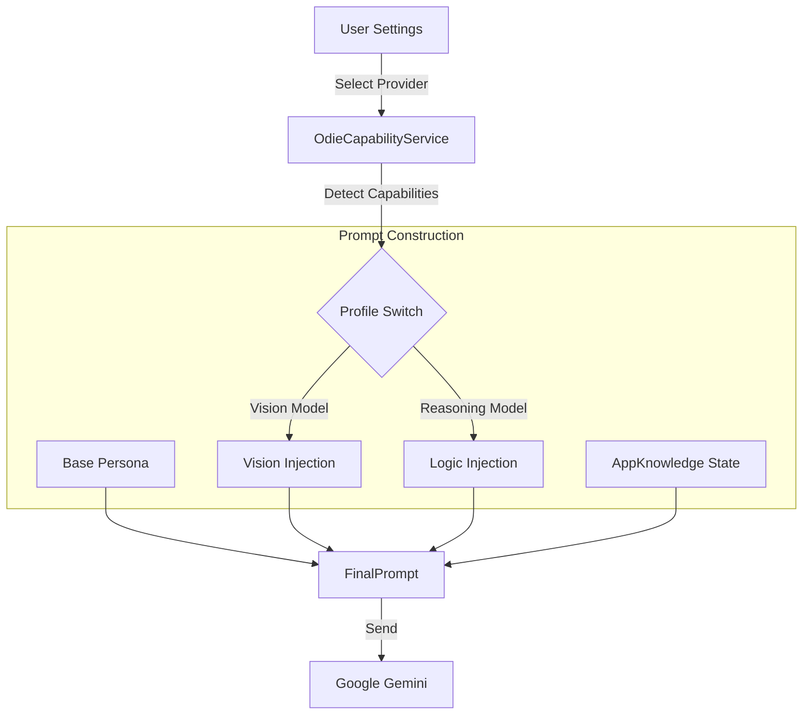

# 🧠 Dual-Brain Architecture (OdieCapabilityService)

> **Package**: `@app/studio/ui/odie/services`
> **Concept**: Dynamic Persona Injection
> **Complexity**: High
> **Last Audit**: 2025-12-21

The **Dual-Brain** architecture allows Odie to shapeshift its personality and capabilities based on the underlying AI model's strengths. It is not a static chatbot; it is a context-aware agent that reconfigures its "System Prompt" on every initialization.

---

## 📘 1. Concepts & Architecture

### The "Three-Layer" Prompt Stack
Every message sent to the LLM is constructed from three distinct layers of context.

1.  **Base Layer (Immutable)**: The core identity ("You are Odie..."). Defined in `OdiePersonaService.ts`.
2.  **Capability Layer (Configurable)**: The "Brain Profile". Injected based on the selected provider.
3.  **Context Layer (Dynamic)**: The "Ground Truth". Injected by `AppKnowledge.ts` at the moment of inference.

### Architecture Diagram


---

## 📖 2. Reference: The Brain Profiles

The system currently supports two distinct profiles (mapped internally to `OdieCapabilities` flags).

### Profile A: "The Artist" (Vision-Centric)
**Trigger**: Provider config includes `canGenImages: true`.
**Typical Models**: `gemini-2.0-flash-exp`, `gemini-1.5-flash`.
**Injected Instructions**:
> "You have eyes. You can generate art. Use the `image_gallery` widget to visualize concepts. reliability is lower, creativity is higher."
**Tool Access**:
*   `generate_image`: **ENABLED**.
*   `image_gallery` widget: **ENABLED**.

### Profile B: "The Engineer" (Reasoning-Centric)
**Trigger**: Provider config includes `canReasonDeeply: true`.
**Typical Models**: `gemini-2.0-flash-thinking-exp`, `gemini-1.5-pro`.
**Injected Instructions**:
> "You are a senior systems engineer. Prioritize code correctness and complex chain-of-thought. Do not hallucinate tools. If unsure, ask for clarification."
**Tool Access**:
*   `generate_image`: **DISABLED** (to prevent hallucinations).
*   `analyze_project`: **ENHANCED** (allows deeper recursive scans).

---

## 💪 3. Task: Configuring a New Provider

To add a new AI model and map it to a Brain Profile:

### Step 1: Update the Provider Config
### Step 1: Register the Provider
Edit `src/ui/odie/services/AIService.ts` (Note: The service is `AIService`, not `OdieAIService`).

Since providers are initialized in the constructor, you must add your new provider class to the array.

```typescript
constructor() {
    // ...
    this.providers.push(new GeminiProvider())
    // Add your new provider here
    this.providers.push(new MyNewProvider())
}
```

Then, ensure your provider's `id` string maps to the capabilities in `OdieCapabilityService.ts`.

### Step 2: Define New Capabilities (Optional)
If you need a new capability (e.g., "Audio Hearing"), edit `OdieCapabilityService.ts`:

1.  Add the flag: `canListen: boolean`.
2.  Add the injection logic:

```typescript
if (caps.canListen) {
    systemPrompt += `\n[CAPABILITY: AUDIO_INPUT]\nYou can hear the user's microphone stream via the 'audio_buffer' tool. Analyze the prosody and tone.`;
}
```

### Step 3: Verify
Run the app, select the new provider, and type `/debug`.
Check the console output for `[System Prompt]` to verify the new text block was injected.
