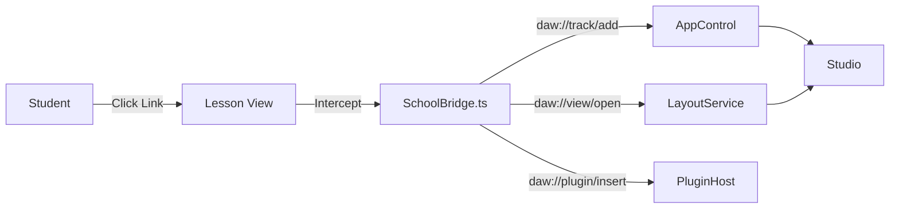

# 🎓 Odie School (LMS Architecture)

> **Package**: `@app/studio/ui/odie/services`
> **Role**: Learning Management System & Interactive Help
> **Last Audit**: 2025-12-21

**Odie School** is an embedded educational engine that delivers interactive lessons directly within the Studio interface. Unlike static PDFs, the School can execute commands, verify user actions, and generate dynamic curriculum on the fly.

---

## 📘 1. Concepts & Architecture

### The "Magic Link" Protocol (`daw://`)
Standard web links navigate to new pages. OpenDAW links navigate to *app states*.
The `SchoolBridge.ts` service intercepts clicks on anchors starting with `daw://` and routes them to the Studio Engine.

**Architecture Diagram**


### The Validation Engine (Mocked)
> **⚠️ IMPLEMENTATION STATUS**: **PARTIALLY IMPLEMENTED**
> The infrastructure for validation exists (`SchoolBridge.validate(lessonId)`), but the current internal logic is **Mocked**.
> *   **Current Behavior**: Returns a randomized Pass/Fail result for demonstration.
> *   **Target Behavior**: Should query the Studio State directly to verify specific conditions (e.g., "Is the Kick Drum peaked at -6dB?").

---

## 📖 2. API Reference

### Protocol Spec: `daw://`

#### `daw://track/add`
Adds a new track to the session.
*   **Params**: `?type=audio|midi`
*   **Example**: `[Add Audio Track](daw://track/add?type=audio)`

#### `daw://plugin/insert`
Inserts a device into the selected track chain.
*   **Params**: `?id=[plugin_id]`
*   **Example**: `[Load Reverb](daw://plugin/insert?id=reverb-pro)`

#### `daw://view/open`
Switches the main workspace view.
*   **Params**: `?panel=mixer|arranger|piano-roll`
*   **Example**: `[Open Mixer](daw://view/open?panel=mixer)`

### Data Schema: `SchoolLesson`

```typescript
interface SchoolLesson {
    id: string;          // Unique ID (e.g., "mix-1")
    title: string;       // Display Title
    category: "workflow" | "mixing" | "theory";
    desc: string;        // Short blurb
    tags: string[];      // For search
    content: string;     // Markdown Body (supports daw:// links)
}
```

---

## 💪 3. Task: Creating a Custom Lesson

### Step 1: Create a Markdown File
Create a new file in `public/manuals/` (e.g., `volume.md`).

```markdown
---
title: Mastering Volume
category: workflow
tags: ["volume", "gain"]
desc: Don't touch that fader!
---

# Value vs Gain
Did you know that **Gain** is input, and **Volume** is output?

## Try it
1. [Add an Audio Track](daw://track/add?type=audio)
2. [Open the Mixer](daw://view/open?panel=mixer)
```

### Step 2: Register in Manuals.ts
Add your new manual to the `Manuals` registry in `src/ui/pages/Manuals.ts`.

```typescript
{ type: "page", label: "Mastering Volume", path: "/manuals/volume" }
```

### Step 3: Implement Validation (Optional)
If your lesson requires checking the user's work, update `SchoolBridge.ts`.


```typescript
public async validate(lessonId: string): Promise<Result> {
    if (lessonId === "workflow-volume") {
        // Real logic: Check if fader is at 0dB
        return this.studio.mixer.faderValue === 0 
            ? { passed: true, message: "Perfect!" }
            : { passed: false, message: "Reset fader to 0dB." };
    }
}
```
