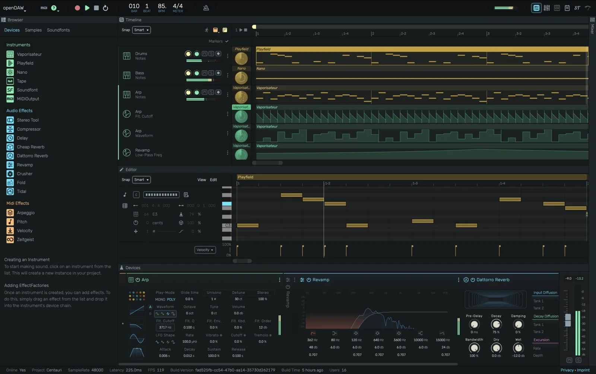

# Your Studio

openDAW is a full music studio that runs entirely in your browser. There is nothing to install and no account to create.

## Features

|  |  |  |  |
|---|---|---|---|
| MIDI In / Out | Audio In / Out | Audio Buses | Aux Send FX |
| Automation | Audio Recording | MIDI Recording | MIDI Learn |
| Undo / Redo | Mixer | Device Panel | Note Editor |
| Shadertoy Visualizer | Scriptable Devices | Script Editor | Monitoring with FX |
| STEM In / Out | Cloud Backup | Soundfonts | Live Rooms |
| Shortcut Manager | DAWproject In / Out | Piano Tutorial Mode | Video Export |
| Tempo Automation | Signature Automation | Marker Track | Preset Management |

## Getting started

Click **New Project** on the dashboard to open an empty timeline, or open one of the demo projects to see a finished track you can take apart. From there, add a track, drop in an instrument, and start writing.

Everything you make is saved locally on your device.
